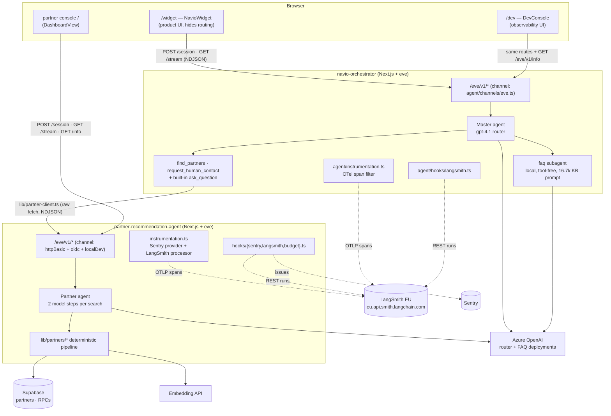
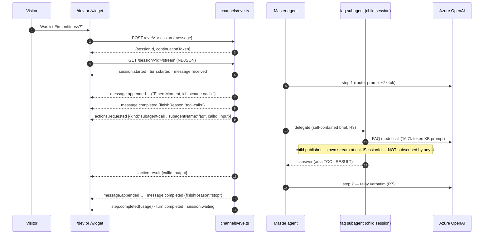
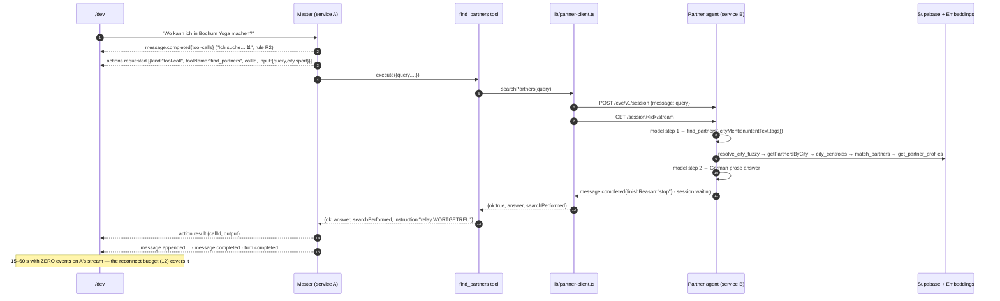
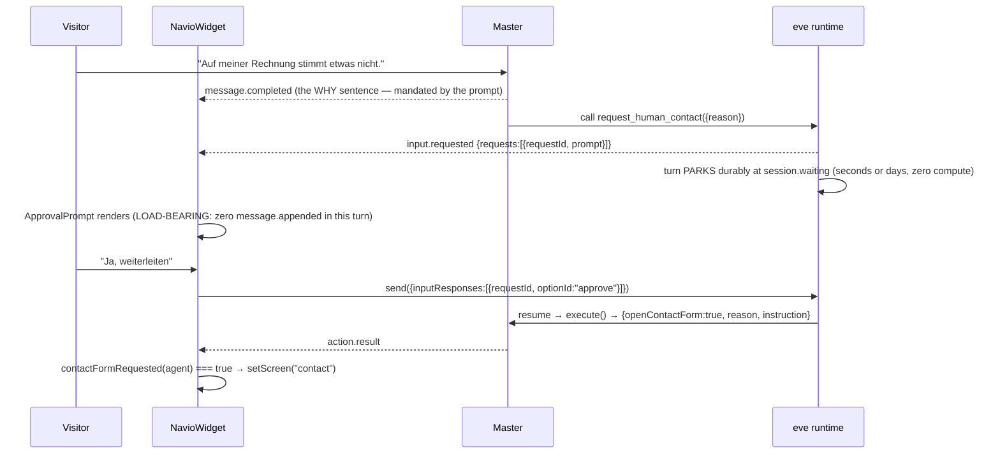
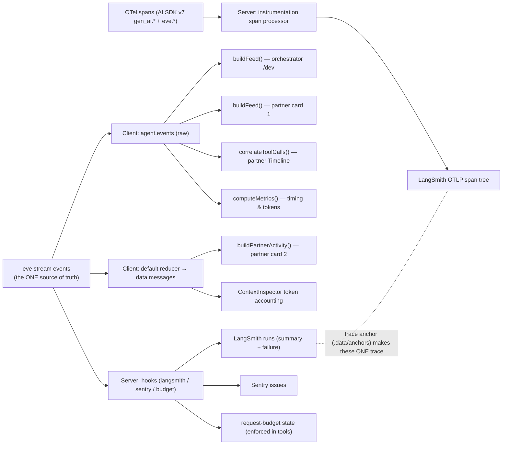
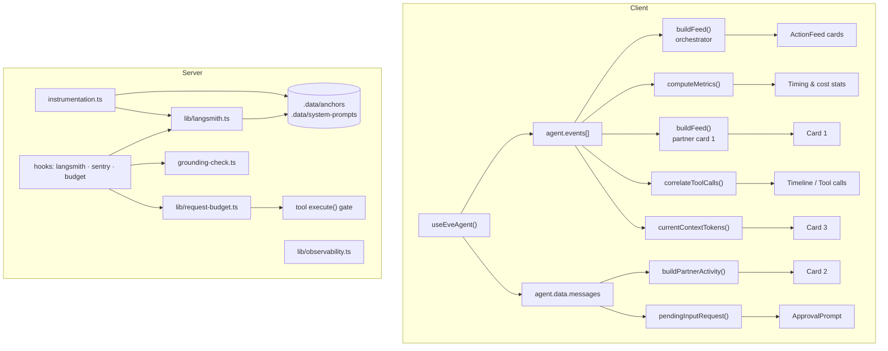
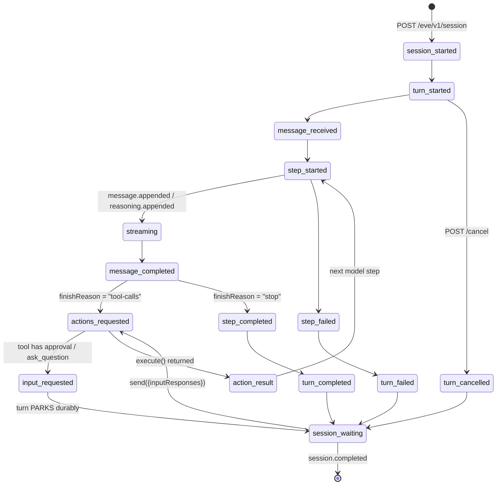
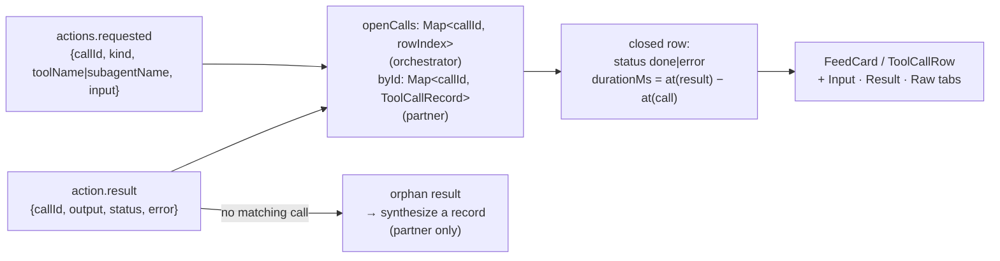
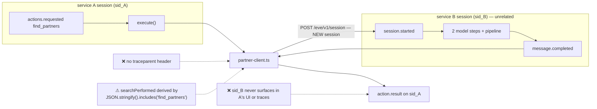

# ARCHITECTURE_AND_AGENT_TRACKING.md

**How the Navio dev UIs work, how agent actions are tracked end to end, and how the
observability pipeline fits together.**

Scope: the two repositories

| # | Path | Role |
|---|---|---|
| A | `navio-orchestrator/` | **Navio Orchestrator** — master/router agent + `/dev` console + `/widget` |
| B | `SportnaviPartnerRecomandationBot/partner-recommendation-agent/` | **Partner Agent** — RAG partner search + its own dashboard console |

Everything below was read from source on 2026-08-10. Claims are tagged:

- **[C]** Confirmed from code that I read.
- **[I]** Strong inference (follows from code + framework docs, not directly asserted anywhere).
- **[?]** Could not be verified from the repositories.

Framework docs quoted are the version-exact copies vendored at
`navio-orchestrator/node_modules/eve/docs/` (eve `^0.25.2`).

---

## 1. Executive Summary

Both projects are **eve** agents (Vercel's durable-agent framework) hosted inside a
**Next.js 15 App Router** application via `withEve()`. eve runs the agent in its **own
process**; Next.js serves the UI and proxies a fixed HTTP surface at `/eve/v1/*`. **[C]**
(`navio-orchestrator/next.config.mjs`, `…/partner-recommendation-agent/next.config.mjs`,
`node_modules/eve/docs/guides/instrumentation.md` as cited in
`partner-recommendation-agent/agent/instrumentation.ts:1-10`)

There is **no bespoke orchestration runtime, no message broker, no database of runs, and no
WebSocket layer.** The entire "agent execution tracking" story is built on one primitive:

> **eve's durable, replayable NDJSON event stream**, one per session, at
> `GET /eve/v1/session/<sessionId>/stream`. **[C]**
> (`node_modules/eve/docs/concepts/sessions-runs-and-streaming.md`)

Everything else is a *lens* over that stream:

| Lens | Where it lives | Consumer |
|---|---|---|
| React projection (`data.messages`) | eve's default reducer inside `useEveAgent` | chat surfaces |
| Raw event array (`agent.events`) | `useEveAgent` | both dev consoles |
| Human-language feed | `navio-orchestrator/lib/dev-console/events.ts` | `/dev` |
| Technical feed + tool correlation | `…/partner-recommendation-agent/lib/dev-console/events.ts` | dashboard |
| Domain projection (partner resolution) | `…/lib/dev-console/partner-activity.ts` | dashboard card 2 |
| OTel spans → LangSmith EU | `agent/instrumentation.ts` (both) | LangSmith |
| Failure + turn-summary runs | `agent/hooks/langsmith.ts` (both) | LangSmith |
| Failure issues | `agent/hooks/sentry.ts` (partner only) | Sentry |
| Per-turn budget state | `…/lib/request-budget.ts` + `agent/hooks/budget.ts` (partner only) | the tools themselves |
| Structured resolution log line | `…/lib/observability.ts` (partner only) | stdout |

The two services are **not** a single traced system. The orchestrator calls the partner
agent over plain HTTP from *inside a tool*, creating a **second, unrelated eve session**
with no trace/session correlation carried across. **[C]**
(`navio-orchestrator/lib/partner-client.ts`) That boundary is the single biggest
observability gap in the architecture (§16.2).

---

## 2. Repository Overview

### 2.1 `navio-orchestrator` (service 3)

The multi-agent replacement for the older three-card Navio widget. One visitor-facing
assistant; a master model routes. **[C]** (`navio-orchestrator/CLAUDE.md` §1, and the
agent graph asserted in `tests/agent-graph.test.ts`)

```
agent/
├── agent.ts                     master/router agent (defineAgent)
├── instructions.md              routing prompt R1–R9, escalation, hard limits (~200 lines)
├── channels/eve.ts              public HTTP auth walk: size cap → BotID → origin → localDev
├── instrumentation.ts           OTel span processor → LangSmith EU (+ trace anchors)
├── hooks/langsmith.ts           failure runs + per-turn summary run
├── tools/
│   ├── find_partners.ts         HTTP call to service B (via lib/partner-client.ts)
│   ├── request_human_contact.ts approval-gated escalation (approval: always())
│   └── ×10 disableTool()        every built-in EXCEPT ask_question
└── subagents/faq/
    ├── agent.ts                 local subagent; description IS the routing contract
    ├── instructions.md          ~16.7k-token knowledge base
    └── tools/ ×11 disableTool() the isolation boundary
app/
├── dev/page.tsx                 → DevConsole  (the observability UI)
├── widget/page.tsx              → NavioWidget (the product UI)
└── page.tsx                     dev landing page
components/
├── dev/DevConsole.tsx           3-column console
├── dev/ActionFeed.tsx           per-step cards + full payload inspector
└── navio/{NavioWidget,ApprovalPrompt,KontaktForm}.tsx
lib/
├── dev-console/events.ts        THE event→human-language translation layer
├── partner-client.ts            raw fetch + NDJSON reader to service B  ← swap point
├── langsmith.ts                 714 lines: region, filters, anchors, journal, payloads
└── llm.ts, load-env.ts
scripts/verify-e2e.ts            Node-side routing + latency harness
tests/agent-graph.test.ts        asserts eve's COMPILED manifest (tool surface)
.data/{anchors,system-prompts}/  file-backed cross-bundle store (see §7.6)
```

### 2.2 `partner-recommendation-agent` (service 2)

A single-agent RAG search over a Supabase partner directory. Two live tools; the LLM never
counts, ranks, or retrieves. **[C]** (`SportnaviPartnerRecomandationBot/CLAUDE.md` §4,
`lib/partners/*`)

```
agent/
├── agent.ts                     model + session token limits
├── instructions.md              ~18 KB grounding-first system prompt
├── channels/eve.ts              size cap → httpBasic(shared secret) → vercelOidc → localDev
├── instrumentation.ts           Sentry.init + LangSmith span processor ON SENTRY'S provider
├── hooks/{sentry,langsmith,budget}.ts
├── config/partner-injection.config.ts
└── tools/{find_partners,get_partner_details}.ts + 9 disableTool() (incl. ask_question)
lib/
├── partners/                    deterministic pipeline (resolve → gap-fill → rank → hydrate)
├── dev-console/{events,partner-activity,observability,use-agent-info}.ts
├── observability.ts             one PII-free JSON line per resolution
├── request-budget.ts            per-turn execution budget (the enforcement point)
└── langsmith.ts, sentry-agent.ts, supabase.ts, embeddings.ts, cache.ts, timeout.ts
app/page.tsx                     → the dashboard console (the ONLY page)
components/
├── dashboard/{DashboardView,DashboardHeader,Sidebar,AgentActionsFeed,
│              PartnerResolution,ContextInspector,ConversationDock}.tsx
├── ChatPanel.tsx (+ MessageList), Timeline.tsx, AgentInfoPanel.tsx,
└── SessionBar.tsx, DetailsOverlay.tsx, JsonView.tsx, Tooltip.tsx
```

### 2.3 Relationship between the two

```
navio-orchestrator          agent/tools/find_partners.ts
                                    │  execute()
                                    ▼
                            lib/partner-client.ts
                                    │  POST  {PARTNER_AGENT_HOST}/eve/v1/session
                                    │  GET   …/session/<id>/stream   (NDJSON, read to turn end)
                                    │  POST  …/session/<id>/cancel   (on timeout only)
                                    ▼
partner-recommendation-agent  agent/channels/eve.ts → its own agent, own session
```

**[C]** `navio-orchestrator/lib/partner-client.ts:105-218`. The browser never touches
service B; there is deliberately **no `/api/partner` proxy** in the orchestrator
(`app/widget/page.tsx:12-15`, `.env.example` "Partner agent" block).

---

## 3. High-Level Architecture



**Key structural facts**

1. **One transport, three consumers.** Both UIs and the cross-service tool call all speak
   the same `/eve/v1/*` NDJSON contract. **[C]**
2. **The dev consoles are not privileged.** They call exactly the routes the product UI
   calls, plus a read-only `GET /eve/v1/info`. Nothing about tracking requires a backend
   endpoint that the widget doesn't already hit. **[C]**
   (`lib/dev-console/use-agent-info.ts`, `components/AgentInfoPanel.tsx`)
3. **Tracking is layered, not centralized.** Client-side derived views, server-side OTel
   spans, and hook-authored LangSmith runs are three independent pipelines observing the
   same events. Deleting any one leaves the others working. **[C]** (explicit in
   `agent/instrumentation.ts:14-18` and `agent/hooks/langsmith.ts:1-7`)

---

## 4. Dev UI Architecture

### 4.1 Framework and shared stack

Both UIs: **Next.js 15 App Router**, **React 19**, **Tailwind CSS 4** (`@tailwindcss/postcss`),
**framer-motion**, **lucide-react**, **react-markdown**, all rendered as **client components**
(`"use client"`). No state library, no data-fetch library, no server components in the
console paths. **[C]** (both `package.json`, all console components)

State management is **entirely inside `useEveAgent()` from `eve/react`** plus a handful of
`useState`/`useRef`/`useMemo` locals. There is no Redux/Zustand/Context store anywhere. **[C]**

### 4.2 `useEveAgent` — the single integration point

```ts
const agent = useEveAgent({ maxReconnectAttempts: 12 });   // navio-orchestrator
const agent = useEveAgent();                               // partner agent
```

**[C]** `navio-orchestrator/components/dev/DevConsole.tsx:67`,
`navio-orchestrator/app/widget/page.tsx:69`,
`partner-recommendation-agent/app/page.tsx:11`.

The hook surface actually used across both repos (per
`node_modules/eve/docs/guides/frontend/overview.mdx:67-75,198-199`):

| Member | Type / meaning | Used by |
|---|---|---|
| `status` | `"ready" \| "submitted" \| "streaming" \| "error"` | every composer, every "live" pill |
| `data.messages` | default reducer projection (`EveMessageData`) | all chat surfaces, `partner-activity.ts`, `ContextInspector` |
| `events` | **raw, authoritative eve stream events** | both feed builders, all metrics |
| `error` | `Error \| undefined` | error bubbles |
| `session` | `{ sessionId, continuationToken, streamIndex }` | connection pills, `SessionBar` copy-id |
| `send({message})` | start / continue a turn | composers, quick replies, presets |
| `send({inputResponses:[…]})` | **answer a parked HITL request** | `ApprovalPrompt`, `DevConsole.answer`, `ToolCallCard` |
| `stop()` | abort the client's in-flight stream | partner console only |
| `reset()` | clear local events/data/session cursor | both |
| `maxReconnectAttempts` | stream reconnection budget per turn (default 3) | orchestrator raises to **12** |

**Why 12.** A partner search emits **no stream events for 15–60 s**; browsers drop the idle
connection and surface `network error` mid-turn. eve's stream is durable and replayable by
event index, so reconnecting is the correct fix rather than injecting keep-alive traffic.
**[C]** (verbatim rationale in `components/dev/DevConsole.tsx:14-19` and
`app/widget/page.tsx:63-68`; the same failure class is recorded in the workspace
`CLAUDE.md` §10.3.)

### 4.3 Communication mechanisms — exhaustively

| Mechanism | Present? | Detail |
|---|---|---|
| HTTP POST/GET to `/eve/v1/*` | ✅ | the only agent transport |
| **NDJSON event stream** (`GET …/stream`) | ✅ | one JSON object per line; `startIndex` for replay/reconnect **[C]** |
| SSE | ❌ | not used by either project (the *older* service 1 had an SSE keep-alive proxy; deliberately removed here) **[C]** (`lib/partner-client.ts:38-41`) |
| WebSockets | ❌ | none |
| Polling | ❌ for agent data. `GET /eve/v1/info` is fetched **once on mount** **[C]** (`use-agent-info.ts`, `AgentInfoPanel.tsx`) |
| `setInterval` | ⚠️ one, UI-only: `DevConsole` ticks every 500 ms **while streaming** purely to re-render the elapsed/silence clocks — it fetches nothing **[C]** (`DevConsole.tsx:87-91`) |
| Message broker / queue | ❌ | none |
| Server-side push to UI | ❌ | the UI is always the initiator |

### 4.4 The Orchestrator console — `/dev`

Entry: [`app/dev/page.tsx`](navio-orchestrator/app/dev/page.tsx) → `DevConsole`. Marked
*dev only, "block it at the edge before launch"* in its own header comment. **[C]**

Three columns, deliberately mapping to three questions:

```
┌────────────────────┬──────────────────────────────┬─────────────────────┐
│ Conversation       │ What Navio is doing          │ Who answered        │
│ (what the visitor  │ (ActionFeed — every decision │ + Timing & cost     │
│  sees, verbatim)   │  in plain language + raw JSON)│                    │
└────────────────────┴──────────────────────────────┴─────────────────────┘
```

**Header + presets.** Eight canned routing probes, each declaring the capability it *must*
reach (`expect: "faq" | "find_partners" | "request_human_contact" | "ask_question" | "none"`),
including an injection attempt that must refuse. **[C]** `DevConsole.tsx:43-52`. After the
turn, `routeOk` compares `metrics.routes` to the expectation and renders a green/red verdict
**[C]** `DevConsole.tsx:133-138, 344-353`.

**Timing instrumentation is client-side.** The console keeps its own arrival stamps because
it wants the gaps a *browser* actually experiences:

```ts
const stamps = useRef<number[]>([]);   // stamps[i] ↔ agent.events[i]
const t0     = useRef<number|null>(null);
useEffect(() => {                       // on every new event
  const now = Date.now();
  while (stamps.current.length < eventCount) stamps.current.push(now);
  tick(n => n + 1);
}, [eventCount]);
```
**[C]** `DevConsole.tsx:73-84`.

**HITL rendering.** The pending request is pulled off the latest message's parts at
`part.toolMetadata.eve.inputRequest`; approve/deny call
`agent.send({ inputResponses: [{ requestId, optionId }] })`. **[C]**
`DevConsole.tsx:102-124`, and the widget's version in
[`components/navio/ApprovalPrompt.tsx`](navio-orchestrator/components/navio/ApprovalPrompt.tsx).

**ActionFeed cards.** Each row renders icon + title + status chip + `took Xs` + `+Xs` offset,
a plain-language description, and a collapsible **Input / Result / Raw event** tab set that
is explicitly **never truncated** ("a debugger that hides bytes is useless"). It also shows
`toolName` and the first 12 chars of the **eve `callId`** so a call and its result can be
matched by eye. **[C]** `components/dev/ActionFeed.tsx:158-275`.

### 4.5 The Partner console — `/`

Entry: [`app/page.tsx`](SportnaviPartnerRecomandationBot/partner-recommendation-agent/app/page.tsx).
Layout: `Sidebar | DashboardView | ConversationDock (floating) | DetailsOverlay (modal)`.

Three cards, numbered in the UI:

| Card | Component | Source of truth |
|---|---|---|
| 1 — Real-Time Agent Actions | `AgentActionsFeed.tsx` | `agent.events` (own `buildFeed`) |
| 2 — Partner Resolution | `PartnerResolution.tsx` | `agent.data.messages` → `buildPartnerActivity()` |
| 3 — Active Context Window Inspector | `ContextInspector.tsx` | `agent.events` usage + `GET /eve/v1/info` |

Plus a full-screen `DetailsOverlay` with two tabs:
- **Activity** → `Timeline.tsx`: the *complete* raw event log, filterable by 8 categories and
  free text, each row expandable to the full JSON event; plus a **Tool calls** tab driven by
  `correlateToolCalls()`. **[C]**
- **Agent** → `AgentInfoPanel.tsx`: model, mode, context window, discovery errors/warnings,
  tools (with `origin`), skills, subagents, channels — straight from `/eve/v1/info`. **[C]**

**Card 2 is the domain-specific one and the most interesting design decision.** It shows what
the *search pipeline* did (home count, borrowed count, cities used, `minMet` /
`cappedAtMax` / `citiesExhausted` flags, disclosure text, and an expandable "All N found
(before shortlisting)" list with each partner's full `llm_profile`). It needs **no backend
route**, because:

> eve hands channel/UI code the **full structured `execute()` return value** on the
> dynamic-tool part's `output`; only `toModelOutput` trims what the LLM itself sees.
> **[C]** (`lib/dev-console/partner-activity.ts:1-12`, and the producing side in
> `agent/tools/find_partners.ts:256-276, 307-322`)

So `find_partners` deliberately attaches a `resolution` block (counts, flags, `allFound[]`
with hydrated profiles) that **costs zero prompt tokens** and exists purely for this card.
**[C]** `agent/tools/find_partners.ts:36-54, 211-255`.

### 4.6 Authentication / authorization in the UIs

**There is none in either console.** **[C]**

- Partner console: the only page is `/`; `next.config.mjs` redirects `/` → `/eve/v1/health`
  **in production only** (`VERCEL_ENV === "production"`). The API behind it is gated by
  `agent/channels/eve.ts` (`httpBasic` shared secret → `vercelOidc` → `localDev`). **[C]**
- Orchestrator: `next.config.mjs` redirects `/` → `/widget` in production but **`/dev` is not
  redirected, blocked, or authenticated**. The API is gated by request-size cap → optional
  BotID → origin allowlist → `localDev`, accepting an **anonymous principal**. **[C]**
  (`next.config.mjs:22-33`, `agent/channels/eve.ts:224-239`)
- `DashboardHeader` renders a hard-coded avatar labelled "Local dev session". **[C]**

### 4.7 Configuration the UIs depend on

| Variable | Consumed by | Effect if unset |
|---|---|---|
| `NEXT_PUBLIC_BOTID_ENABLED` | `app/widget/page.tsx` `useBotId()` | no client challenge injected |
| `NEXT_PUBLIC_PRIVACY_URL`, `NEXT_PUBLIC_WIDERRUF_URL` | `NavioWidget`, `KontaktForm` | fall back to live sportnavi.de URLs |
| `WIDGET_FRAME_ANCESTORS` | `next.config.mjs` CSP on `/widget` | defaults to `'self' + sportnavi.de` |
| `WIDGET_ALLOWED_ORIGINS` | `agent/channels/eve.ts` (also enables CORS block) | same-origin only |
| `NAVIO_MAX_REQUEST_BYTES` | `agent/channels/eve.ts` | 16 000 |

Everything else the consoles show (model id, tools, context window) comes from
`/eve/v1/info` at runtime, not from env. **[C]**

---

## 5. Navio Orchestrator Architecture

### 5.1 What it is responsible for

1. **Intent detection and delegation.** It owns almost no knowledge of its own; its job is to
   pick a route and relay. **[C]** `agent/agent.ts:8-28`
2. **Being the single visitor-facing session.** The widget mounts exactly one
   `useEveAgent()`; the master decides who answers, so there is one conversation history and
   one place for context. **[C]** `app/widget/page.tsx:7-15`
3. **Owning the human-escalation gate** as a *runtime* control, not a prompt rule. **[C]**
4. **Owning the cross-service call to the Partner Agent**, server-side, inside a tool. **[C]**

It is **not** a generic orchestration engine: there is no scheduler, no plan/executor loop,
no agent registry service, no queue. "Orchestration" here means *an eve agent whose tools are
other agents.* **[I]**

### 5.2 How agents/capabilities are registered

eve resolves the agent graph from the **filesystem at compile time**. **[C]** (confirmed by
`tests/agent-graph.test.ts` reading `.eve/compile/compiled-agent-manifest.json`)

| Capability | Registration | Reaches |
|---|---|---|
| `faq` | directory `agent/subagents/faq/` with its own `agent.ts` | local child session |
| `find_partners` | `agent/tools/find_partners.ts` (`defineTool`) | HTTP → service B |
| `request_human_contact` | `agent/tools/request_human_contact.ts` (`defineTool` + `approval: always()`) | HITL pause |
| `ask_question` | a framework built-in, **left enabled** | HITL pause |
| 10 other built-ins | `agent/tools/*.ts` exporting `disableTool()` | disabled |

Adding an agent N = a new `subagents/<id>/` directory + its own disable sentinels + one line
in the master's capability map. **No framework code.** Tool and subagent names share one
namespace, so a collision fails the build. **[C]** (`navio-orchestrator/CLAUDE.md` §6; the
manifest shape is asserted by the test)

**The routing contract is the `description` string.** The FAQ subagent's description carries
an explicit negative clause ("NICHT für die Suche nach konkreten Studios…"), and the test
asserts both its length (>80) and the presence of `NICHT`. **[C]**
`agent/subagents/faq/agent.ts:38-43`, `tests/agent-graph.test.ts:112-119`.

**The isolation boundary.** A declared subagent inherits **nothing** from the root; an absent
tool slot falls back to the *framework default*, not the parent's version. That is why
`agent/subagents/faq/tools/` carries its **own full set of 11 `disableTool()` sentinels**, and
why the test asserts the resolved manifest rather than the directory listing. **[C]**
`tests/agent-graph.test.ts:1-20, 97-110`.

### 5.3 How a request is routed

Routing is a **prompt decision executed by the model**, not code. `agent/instructions.md`
encodes it as rules R1–R9 plus an escalation protocol:

- **R1** never answer a Sportnavi factual question yourself — always call `faq`.
- **R2** speak *before* delegating (a partner search takes 30–60 s; without a sentence the
  visitor sees an empty bubble).
- **R3** every delegation must carry a **self-contained brief** — the child never sees the
  parent's history, including the requested reply language.
- **R5** at most two delegations per message; **R7** relay the specialist's answer **verbatim**.
- Hard limit #7: never claim to have done something without calling the matching tool.

**[C]** `agent/instructions.md`. R3 is the direct consequence of eve's subagent isolation and
is enforced only by the prompt — **not by code**. **[C]** (`CLAUDE.md` §2.3)

### 5.4 How lifecycle events are generated

**The application generates none of them.** Every lifecycle event (`session.started`,
`turn.started`, `step.started/completed/failed`, `actions.requested`, `action.result`,
`input.requested`, `subagent.called/completed`, `message.*`, `turn.*`, `session.*`,
`compaction.*`, `authorization.*`) is emitted by the **eve runtime**. **[C]**
(`node_modules/eve/docs/concepts/sessions-runs-and-streaming.md`)

The application only ever **observes** them, in three places:
- **hooks** (`defineHook`) — observe-only, receive `(event, ctx)` with `ctx.session.id`;
- **instrumentation `events`** (`defineInstrumentation({ events: { "step.started"(input) {…} } })`)
  — the one place that can *return* something, namely extra `runtimeContext` metadata that
  rides onto AI spans; **[C]** `agent/instrumentation.ts:207-229`
- **the client**, via `agent.events`.

**Hooks cannot block, edit, or abort anything.** Both projects state this explicitly and
design around it. **[C]** (`partner-recommendation-agent/lib/request-budget.ts:1-22`,
`lib/partners/grounding-check.ts:1-24`)

### 5.5 How tools are invoked

Standard eve flow: model emits tool calls → `actions.requested` (with `callId`, `input`,
`kind`) → eve executes `execute()` → `action.result` (with the same `callId`, `output`,
`status`). Approval-gated tools interpose an `input.requested` + durable park before
`execute()` runs. **[C]** (docs + `agent/tools/request_human_contact.ts:5-37`)

Two application-level conventions matter for tracking:

1. **Tools return failures, they don't throw.** `find_partners` returns
   `{ ok:false, error, instruction }` so the model can recover honestly inside the same turn
   rather than inventing studios. **[C]** `agent/tools/find_partners.ts:40-51`
2. **Tools carry an `instruction` field** telling the model what to do with the payload
   (relay verbatim; don't ask for PII). **[C]** both tools.

### 5.6 The cross-service call — `lib/partner-client.ts`

This is the most carefully-reasoned file in the orchestrator, and it is the **swap point**
for a future `defineRemoteAgent`. **[C]** `lib/partner-client.ts:1-42`.

Documented findings baked into its design:

> The first version used `eve/client`'s typed `Client`/`ClientSession`. From a **script** it
> worked (~10–15 s). Called from inside a tool's `execute`, the same code **hung
> indefinitely** — one measured turn ran 321 s — and critically **the 90 s `setTimeout` guard
> never fired.** A timeout that does not fire is the tell: tool execution runs inside eve's
> durable workflow engine, which owns suspension and replay, so wall-clock JS timers are not
> a reliable escape hatch. **[C]** `lib/partner-client.ts:18-41`

Hence the current implementation:

| Step | Code | Notes |
|---|---|---|
| deadline | `AbortSignal.timeout(TIMEOUT_MS)` (`PARTNER_AGENT_TIMEOUT_MS`, default 90 000) | enforced by the network layer, not a JS timer |
| host | `resolveHost()` — bare host gets `https://` prepended, trailing slashes stripped | avoids `new URL()` throwing on a config typo |
| auth | `x-navio-proxy-secret: <PARTNER_PROXY_SECRET>` header, only if set | ⚠️ see §16.1 |
| 1 | `POST {host}/eve/v1/session` `{message: query}` → `sessionId` (body or `x-eve-session-id`) | `redirect: "manual"` |
| 2 | `GET {host}/eve/v1/session/<id>/stream`, hand-rolled NDJSON line reader | reads to the **turn boundary** |
| stop | on `session.waiting` / `session.completed` / `turn.cancelled` / `turn.failed` / `session.failed` | `settled = true` |
| answer | last `message.completed` whose `finishReason !== "tool-calls"` | interim narration is skipped |
| work-performed | `searchPerformed = JSON.stringify(actions.requested.data).includes("find_partners")` | §10.4 hallucination guard |
| timeout | fire-and-forget `POST …/cancel` so service B stops burning tokens | courtesy |

Failure is always `{ ok:false, error }`; an **empty answer is treated as a failure**, because
a turn ending with zero assistant text is the signature of the `ask_question` bug. **[C]**
`lib/partner-client.ts:194-204`.

### 5.7 Reusable infrastructure (for other agents/projects)

**[I]** — assessed, not claimed by the repos:

| Asset | Location | Reusability |
|---|---|---|
| Event→human-language translator | `navio-orchestrator/lib/dev-console/events.ts` | high; only `CAPABILITIES` + `summarizeOutput` are domain-specific |
| Feed card UI with raw-payload inspector | `components/dev/ActionFeed.tsx` | high |
| Tool-call correlator | `partner-recommendation-agent/lib/dev-console/events.ts` `correlateToolCalls()` | very high; pure function over events |
| Event categorizer + colors | same file, `eventCategory()` / `categoryColor()` | very high |
| LangSmith module (region, span filter, anchors, turn journal, failure payloads) | `lib/langsmith.ts` in **both** repos | high — but already **forked**; see §16.7 |
| Ancestor-preserving span filter (`SpanFilterState`) | `lib/langsmith.ts` | very high; solves a real LangSmith OTLP ingestion trap |
| Per-turn budget with tool-side enforcement | `partner-recommendation-agent/lib/request-budget.ts` + `agent/hooks/budget.ts` | high; the pattern generalizes to any eve agent |
| Compiled-manifest assertion test | `navio-orchestrator/tests/agent-graph.test.ts` | high |
| HITL renderer | `components/navio/ApprovalPrompt.tsx` | high |

---

## 6. Agent Execution Lifecycle

### 6.1 Where an execution starts

| Trigger | Code |
|---|---|
| User submits in `/dev` | `DevConsole.send()` → `agent.send({ message })` **[C]** `DevConsole.tsx:111-119` |
| User submits in `/widget` | `NavioWidget.send()` → `agent.send({ message })` **[C]** `NavioWidget.tsx:135-140` |
| Quick reply / preset | same paths |
| HITL answer | `agent.send({ inputResponses: [{ requestId, optionId }] })` **[C]** |
| Partner console | `ChatPanel.submit()` / `ConversationDock.submit()` → `agent.send({ message })` **[C]** |
| Cross-service | `searchPartners()` → `POST /eve/v1/session` **[C]** |
| Node harness | `scripts/verify-e2e.ts` → `client.session().send({message})` **[C]** |

`useEveAgent` is **lazy**: no session exists until the first `send()`. **[I]** (stated for
service 1 in the workspace `CLAUDE.md`; consistent with `agent.session?.sessionId` being
undefined until a send in both consoles.)

### 6.2 Identity of a run

| Identifier | Owner | Where it appears |
|---|---|---|
| `sessionId` | eve runtime | `agent.session.sessionId`; every hook `ctx.session.id`; span attr `eve.session.id`; `thread_id` metadata in LangSmith |
| `continuationToken` | the **channel** | carried inside `agent.session`; required for follow-ups; rotates per turn |
| `turnId` | eve | stamped on turn-scoped events; read by `correlateToolCalls()` |
| `stepIndex` | eve | `step.started`/`step.completed`/`actions.requested`/`action.result`; shown in the partner Timeline |
| `callId` | eve | pairs `actions.requested` ↔ `action.result`; the pairing key in **both** feed builders |
| `requestId` | eve | pairs `input.requested` ↔ `inputResponses` |
| `childSessionId` | eve | on `subagent.called`; **not consumed by any UI in either repo** ⚠️ |
| OTel `traceId` / `spanId` | OTel SDK | mapped deterministically to LangSmith run ids (§7.6) |
| `requestId` (app) | `crypto.randomUUID()` | partner agent's resolution log line only **[C]** `find_partners.ts:202` |
| `snv_vid` cookie | the widget | first-party visitor id, stamped into the auth context as `principalId` **[C]** |

Note the **two distinct `requestId` concepts** (eve's HITL request id vs. the partner agent's
per-search log id). They are unrelated. **[C]**

### 6.3 The two lifecycle shapes

**A. Orchestrator FAQ turn (2 model steps on the master + 1 child session)**



The **relay cost** is inherent: the child's answer returns as a tool result, so the master
re-emits it. Measured on a live FAQ turn: **first words 3.9 s, whole answer 11.7 s.** **[C]**
(`navio-orchestrator/CLAUDE.md` §2.4 — see §18 for a contradiction about whether live runs
happened.)

**B. Partner search (orchestrator → service B, 2 model steps *on each side*)**



**Non-search turns are 1 model step; a search on service B is exactly 2.** `app.model_steps == 4`
means the retired three-tool chain came back. **[C]**
(`SportnaviPartnerRecomandationBot/CLAUDE.md` §4.1)

**C. Escalation / HITL**



**[C]** `agent/tools/request_human_contact.ts:5-37`, `components/navio/ApprovalPrompt.tsx:1-50`,
`components/navio/NavioWidget.tsx:86-133`.

`approval: always()` is a **runtime** gate enforced by eve — no prompt injection can call the
tool without the visitor pressing the button. **[C]** `request_human_contact.ts:24-28`.

---

## 7. Agent Action Tracking

### 7.1 Layer map



### 7.2 Steps

Tracked by eve as `step.started` / `step.completed` / `step.failed` with `stepIndex`,
`finishReason` and `usage`. **[C]**

Consumers:
- `computeMetrics()` sums `step.completed.data.usage.{inputTokens,outputTokens,cachedInputTokens}`
  **[C]** `lib/dev-console/events.ts:322-327`
- `TurnJournal.record("step.completed")` increments `steps` and accumulates tokens **[C]**
  `lib/langsmith.ts:416-423`
- `recordModelStep()` (partner) increments `modelSteps` and the running USD estimate **[C]**
- `SessionBar.cumulativeUsage()` and `ConversationDock` sum tokens across the session **[C]**
- `currentContextTokens()` takes the **last** `step.completed.usage.inputTokens` as the
  provider-measured context size **[C]** `lib/dev-console/observability.ts:21-29`

`agent/instrumentation.ts` also hooks `step.started` to inject searchable run metadata
(`app.channel.kind`, `app.turn.sequence`, `app.step.purpose`, `app.action`) — keys beginning
`eve.` are **reserved and silently dropped**, hence the `app.` prefix. **[C]**

### 7.3 Tool calls

The universal pattern in both repos: a `Map<callId, rowIndex>` opened on `actions.requested`
and closed on `action.result`.

Orchestrator (`lib/dev-console/events.ts:116-219`):
```ts
case "actions.requested":
  for (const action of d.actions ?? []) {
    const name = actionName(action);           // reads action.kind, never a stringified blob
    rows.push({ id:`c-${action.callId}`, kind:"route", status:"running", input:action.input, callId });
    openCalls.set(action.callId, rows.length-1);
  }
case "action.result": {
  const openIndex = openCalls.get(result.callId);
  opened.status = failed || softFail ? "error" : "done";
  opened.durationMs = at - opened.at;          // client-measured duration
}
```
**[C]**. It reads `action.kind` (`"tool-call" | "subagent-call" | "tool-result" |
"subagent-result"`) rather than string-matching a serialized payload, "so a rename fails
loudly instead of silently reporting the wrong route". **[C]** `events.ts:10-17, 92-100`.

Partner agent (`lib/dev-console/events.ts:150-207`) produces a richer typed record:
```ts
interface ToolCallRecord {
  callId; kind; name; input; requestedAt; turnId; stepIndex;
  status: "pending" | "completed" | "failed" | "rejected";
  output?; error?: {code,message}; resolvedAt?;
}
```
**[C]** — including handling for an `action.result` that arrives with **no matching
`actions.requested`** (it synthesizes the record). **[C]** `events.ts:187-202`.

### 7.4 LLM calls

Not tracked as discrete events on the stream — an LLM call *is* a step. Fine-grained LLM
observability lives entirely in **OTel spans**: eve's AI SDK v7 telemetry emits `gen_ai.*`
spans (`invoke_agent …`, `chat …`, `step N`, `execute_tool …`), which LangSmith's `/otel`
endpoint maps natively. **[C]** `agent/instrumentation.ts:1-12`, `lib/langsmith.ts:691-713`.

The UI therefore shows **model steps and token usage**, never individual provider calls.
**[I]**

### 7.5 Inputs and outputs

| Surface | Input | Output | Redaction |
|---|---|---|---|
| `/dev` ActionFeed | `action.input` verbatim, untruncated in the detail tabs | `action.result` output verbatim | none — it is a local dev tool |
| Partner Timeline / ToolCallCard | full JSON | full JSON | none |
| LangSmith spans | only if `recordInputs/recordOutputs` | same | **off by default** (`LANGSMITH_RECORD_IO`) |
| LangSmith summary run | `user_message` + `system_prompt` | `agent_reply` | replaced by `"[content capture off …]"` when disabled, **and the run name falls back to `(N steps)` so user text can't leak via the name** **[C]** `lib/langsmith.ts:470-477` |
| Sentry | never user text, partner names, or PII — messages/tool names/codes/session ids only | | `scrub()` in `beforeSend` **[C]** |
| `emitResolutionEvent` stdout line | counts + canonical city + coarse `warningCodes` only; **never** raw warnings, names, or user text | | **[C]** `lib/observability.ts:1-22, 37-49` |

### 7.6 Trace correlation — the anchor mechanism

This is the cleverest piece of tracking code in either repo, and it exists to solve a real
LangSmith problem: **the OTLP trace root is a workflow-infrastructure span**, so the run list
shows "No inputs / No outputs" for every request, and the hook-authored summary run would land
as a *second, disconnected* trace. **[C]** `lib/langsmith.ts:283-292`.

```mermaid
sequenceDiagram
  participant SP as instrumentation.ts (span processor)
  participant FS as .data/anchors/<sessionId>.json
  participant HK as hooks/langsmith.ts
  participant LS as LangSmith EU

  Note over SP: onStart(span) where span.name === "ai.eve.turn"
  SP->>SP: read attr eve.session.id; walk `open` map up to the trace ROOT
  SP->>SP: runId = otelRunId(rootSpanId)  // 00000000-0000-0000-<4hex>-<12hex>
  SP->>FS: traceAnchors.set(sessionId, {rootRunId, rootDotted, rootStartMs})
  Note over HK: on turn.completed
  HK->>FS: traceAnchors.get(sessionId) (+ delete)
  HK->>LS: createRun({id: rootRunId, trace_id: rootRunId, dotted_order: rootDotted, …})
  Note over LS: hook's run PRE-CREATES the trace root (first writer wins)
  SP->>LS: (minutes later) OTLP batch — duplicate root create is dropped,<br/>children still attach by id
```

**[C]** `lib/langsmith.ts:167-281`, `agent/instrumentation.ts:112-140`,
`agent/hooks/langsmith.ts:59-78`.

Two supporting details:
- `otelRunId()` reproduces LangSmith's deterministic spanId→runId mapping
  (`00000000-0000-0000-<first4>-<last12>`), and `dottedStampFromHr()` builds the
  `YYYYMMDDTHHMMSS<micro6>Z` `dotted_order` segment — **`dotted_order` is required whenever
  `trace_id` is set (400 without it)**. **[C]** `lib/langsmith.ts:189-206, 261-281`
- The store is **file-backed** (`.data/anchors/`, `.data/system-prompts/`) because
  **eve bundles instrumentation and hooks separately, so module memory is not shared**.
  In-memory is only a fast path; all I/O is best-effort. **[C]** `lib/langsmith.ts:7-9, 217-248`.
  Two live anchor files exist in the repo (`wrun_01KZB5XCSXGZH87D4BCZN6K38K.json`,
  `wrun_01KZB61K67JMYD50751WPCSYEG.json`), which confirms the mechanism has actually run. **[C]**

### 7.7 The ancestor-preserving span filter

Naively exporting only AI spans exports **nothing**: LangSmith silently drops any span whose
parent never arrives, and every AI span's ancestor chain runs through eve's workflow spans.
`SpanFilterState` fixes this by marking the whole ancestor chain must-export when an AI span
ends (children end before parents, so ancestors see the mark in time). **[C]**
`lib/langsmith.ts:135-165`.

Orchestrator-only refinements **[C]**:
- `traceCompleteness()` (default **complete**) also keeps `workflow.*`, `step.*`, `fetch *`
  spans, so the full execution graph is one inspectable trace; opt out with
  `LANGSMITH_TRACE_COMPLETENESS=ai`.
- `dedupeUsage()` (default on) strips token-usage attributes from the `invoke_agent`
  aggregator span so LangSmith doesn't price the same tokens twice (~2× inflation).
- `humanSpanName()` rewrites span **names** to business language at export time
  (`workflow.route.flow` → "Customer Request Processing", `chat gpt-4.1` → "Generating
  Response (gpt-4.1)"), leaving attributes and identity untouched because run typing, token
  extraction, and tree stitching all key off attributes.
- `EVE_LS_SPAN_DEBUG=1` writes a `KEEP/DROP | span | attrs` log to `.data/spans.log`, which
  "separates *the exporter never saw it* from *the backend hasn't ingested it yet* — the two
  failure modes that look identical from the UI".

The partner agent has the filter and the human names, **but not** `dedupeUsage` or
`traceCompleteness` — which is exactly why its own `CLAUDE.md` §9 documents LangSmith cost as
**~8× wrong** (2× double-count × ~3.4× ignored cache discount). **[C]**

### 7.8 Errors and exceptions

> **eve reports failures as stream events, never as thrown exceptions.**

Both repos treat this as the load-bearing fact of their error tracking. **[C]**
(`agent/hooks/langsmith.ts:1-7`, `agent/hooks/sentry.ts:1-14`)

Consequences:
- Sentry's automatic error capture **cannot see agent failures**; `agent/hooks/sentry.ts` is
  the only path from a failed turn to an issue. **[C]**
- The OTLP trace pipe captures zero failures on its own. **[C]**
- **IRON RULE: a hook must never throw** — a thrown hook becomes `turn.failed`, and a throw
  inside a failure-cascade handler becomes `session.failed`. Every handler in all five hook
  files is wrapped in a `guard()` that swallows everything. **[C]**
- `turn.cancelled` is **deliberately absent** from every hook: a cancel is not a failure and
  capturing it would alert on every user Stop click. **[C]** (all three partner hooks + the
  orchestrator hook say so explicitly)

Failure classification, partner agent (`lib/sentry-agent.ts` + `hooks/sentry.ts`): six
classes with stable fingerprints — `external` for a failed model step (an upstream provider
problem far more often than agent logic), `agent` for turn/session failures, `fabrication`
for the grounding tripwire, plus `classify(output)` on tool errors. **[C]**

Failure classification, orchestrator (`lib/langsmith.ts:529-682`): failures are modelled as
**stories, not stack traces**. `failureRunPayload()` produces a run whose *name* is plain
language, whose `error` keeps the raw technical message, and whose metadata answers "what was
the user doing / which step failed / why / what to do next" via a controlled vocabulary
(`error_type ∈ invalid_input | upstream_unavailable | timeout | permission_denied | unexpected`).
A per-tool `TOOL_STORIES` table supplies human names and matched error headlines. **[C]**

**Business failures are surfaced as errors too.** The orchestrator's feed treats a tool that
returns `{ok:false}` as an error row — "a soft fail is what the visitor actually feels".
**[C]** `lib/dev-console/events.ts:177-217`.

### 7.9 Timing

| Measurement | Where | How |
|---|---|---|
| Per-step arrival + gaps (browser-perceived) | `/dev` | local `Date.now()` stamps per event index **[C]** |
| `firstTokenMs` | `computeMetrics` | first `message.appended` − `t0` **[C]** |
| `totalMs` | `computeMetrics` | last stamp (or `now` while live) − `t0` **[C]** |
| `maxGapMs` | `computeMetrics` | max consecutive-event gap; **while live, the current silence counts too** **[C]** |
| Per-call `durationMs` | `buildFeed` | `action.result.at − actions.requested.at`; >25 s renders in orange and is called out as the browser-drop threshold **[C]** |
| Event clock (partner UI) | `eventTimestamp()` | reads **eve's own `event.meta.at`** (ISO) — *not* a local stamp **[C]** |
| Turn duration (LangSmith) | `TurnJournal.finalize` | `now − (anchor.rootStartMs ?? startedAt)` → `app.duration_ms` **[C]** |
| Pipeline stage timings | partner agent | injectable `performance.now()` clock → `meta.timingsMs` → the resolution log line **[C]** |
| Node-side R1/R2 numbers | `scripts/verify-e2e.ts` | total, first token, max stream gap per case **[C]** |

### 7.10 Parent/child relationships

| Relationship | Representation |
|---|---|
| turn → step | `stepIndex` on step/action events |
| step → tool call | `callId`, plus `stepIndex` on `actions.requested` |
| call → result | `callId` |
| parent agent → subagent | `subagent.called.data.childSessionId` — **a separate session with its own stream** **[C]** |
| span → span | OTel parent span id (`parentSpanId` / `parentSpanContext.spanId`, handled for both OTel 1.x and 2.x) **[C]** |
| LangSmith run → run | `trace_id` + `parent_run_id` + `dotted_order` |
| service A → service B | ❌ **nothing.** A brand-new session id, no trace header, no propagated correlation id **[C]** |

**Nested/sub-agent handling in the UI.** Both feed builders label subagent calls
(`kind === "subagent-call"` → `subagentName`; `ChatPanel` additionally detects
`toolName.startsWith("eve:subagent:")` and strips the prefix). But **neither console ever
attaches to `childSessionId`**, so a subagent's own reasoning, steps, tool calls and token
usage are invisible; you see only the delegation and its returned result. **[C]** (grep for
`childSessionId` returns matches only in eve's docs and the orchestrator `CLAUDE.md`
proposal note §9-R1.)

### 7.11 Application vs. framework responsibility

| Concern | Owner |
|---|---|
| Session/turn/step/tool lifecycle, ids, durability, replay, reconnect, HITL parking, approval enforcement, compaction, per-session token limits | **eve** |
| `gen_ai.*` span emission | **eve + AI SDK v7** |
| What a step *means* in business language, which capability answered, per-turn metrics, routing verdicts | **application (dev-console modules)** |
| Failure → LangSmith/Sentry | **application (hooks)** |
| Trace-shape surgery (filtering, ancestor preservation, usage dedupe, human names, one-trace-per-request anchors) | **application (`lib/langsmith.ts` + instrumentation)** |
| Per-turn execution budget (steps/tools/wall-clock/tokens/cost) | **application** — eve exposes no `stopWhen`/`maxSteps` and hooks are observe-only **[C]** |
| Grounding / anti-fabrication detection | **application**, alert-only **[C]** |
| Cross-service correlation | **nobody** ⚠️ |

---

## 8. Event System

Only event types that actually appear in this codebase are listed. Producer is the **eve
runtime** for every wire event; the "Handled by" column names the code that reacts.

### 8.1 Wire events (eve NDJSON stream)

| Event | Purpose | Handled by | Important fields used here |
|---|---|---|---|
| `session.started` | durable session created | orchestrator feed ("Conversation started"); partner `eventSummary` (shows `invocation.name` for subagent sessions, `runtime.modelId`); partner Sentry hook sets conversation id/tags | `invocation`, `runtime.modelId` |
| `turn.started` | a turn began | partner `eventSummary` | `sequence` |
| `message.received` | inbound user message accepted | both feeds ("Visitor said"); `TurnJournal` **starts a fresh turn**; partner budget hook **resets the budget** | `message` |
| `step.started` | model step began | instrumentation only — injects `runtimeContext`, captures `modelInput.instructions` (the system prompt) | `modelInput.instructions`, `session.id`, `channel.kind`, `turn.sequence` |
| `actions.requested` | model requested tool/subagent calls (streamed **before** execution) | both feeds open a row; `computeMetrics` records `routes`; `verify-e2e` asserts routing; `partner-client` sets `searchPerformed` | `actions[].{kind, callId, toolName, subagentName, input}`, `turnId`, `stepIndex` |
| `action.result` | a call returned | both feeds close the row; orchestrator hook captures tool errors; partner Sentry hook adds breadcrumb or captures; `TurnJournal` records `toolsUsed`/`toolErrors`; `NavioWidget.contactFormRequested()` | `result.{callId, kind, toolName, subagentName, output, isError}`, `status`, `error` |
| `input.requested` | run parked for human input (approval or `ask_question`) | `ApprovalPrompt` / `DevConsole` pending banner / partner `ToolCallCard`; feeds render a `waiting` row | `requests[].{requestId, prompt, options, allowFreeform}` |
| `subagent.called` | delegation started | partner `eventSummary`; `verify-e2e` route detection | `name`, **`childSessionId` (unused)** |
| `subagent.started` / `subagent.completed` | child lifecycle | partner `eventSummary` / `recentActions` | `subagentName` |
| `message.appended` | assistant text delta | `computeMetrics` first-token; reducer → `data.messages` | `messageDelta` |
| `message.completed` | finalized assistant text block | both feeds (orchestrator distinguishes `finishReason === "tool-calls"` → "said (before delegating)"); `TurnJournal.reply`; partner Sentry **grounding tripwire**; `partner-client` answer extraction | `message`, `finishReason` |
| `reasoning.appended` / `reasoning.completed` | model reasoning | orchestrator feed "Navio is thinking" (1200 chars); partner card 1 "Thinking" | `reasoning`, `reasoningDelta` |
| `result.completed` | structured output for an `outputSchema` turn | partner `eventSummary` only | `result` |
| `step.completed` | step finished | all token accounting (`computeMetrics`, `TurnJournal`, `recordModelStep`, `cumulativeUsage`, `currentContextTokens`) | `usage.{inputTokens,outputTokens,cachedInputTokens}`, `finishReason`, `stepIndex` |
| `step.failed` | step failed | error row; LangSmith failure run (`kind:"step"`); Sentry `external` | `code`, `message`, `details?` |
| `turn.completed` | turn finished | `TurnJournal.finalizeTurn("answered")`; budget `clearBudget`; Sentry breadcrumb | — |
| `turn.failed` | turn failed | error row; failure run + `finalizeTurn("failed")`; Sentry `agent`; `clearBudget` | `code`, `message` |
| `turn.cancelled` | user/system cancelled | `partner-client` treats as settled; **no hook** | — |
| `session.waiting` | parked for next input; carries the current `continuationToken` | `partner-client` settles here | `continuationToken` |
| `session.failed` | terminal session failure | error row; failure run; Sentry; `clearBudget` | `code`, `message` |
| `session.completed` | terminal end | `partner-client` settles | — |
| `compaction.requested` / `compaction.completed` | context-window compaction | partner card 1 + `recentActions` | `modelId`, `usageInputTokens` |
| `authorization.required` / `authorization.completed` | connection OAuth | partner card 1 + `AuthorizationCard` (unused in practice — no connections configured) | `description`, `name`, `outcome` |

### 8.2 Client projection events

`client.message.submitted`, `client.message.failed`, `client.input.responded` — emitted by
`useEveAgent` for optimistic UI. **Neither repo implements a custom reducer**, so these are
handled by eve's default reducer only. **[C]** (docs `overview.mdx:198-223`; no `reducer:`
option anywhere in either repo.)

### 8.3 Derived / application events

| Event | Producer | Consumer | Fields |
|---|---|---|---|
| `FeedRow` | `navio-orchestrator/lib/dev-console/events.ts` `buildFeed()` | `/dev` ActionFeed | `id, at, kind, title, description, status, capability, input, output, raw, toolName, callId, durationMs` |
| `TurnMetrics` | same file, `computeMetrics()` | `/dev` right column | `totalMs, firstTokenMs, maxGapMs, routes[], inputTokens, outputTokens, cachedTokens` |
| `ToolCallRecord` | partner `lib/dev-console/events.ts` `correlateToolCalls()` | Timeline "Tool calls" tab | `callId, kind, name, input, output, error, status, turnId, stepIndex, requestedAt, resolvedAt` |
| `ActionRow` | partner, `recentActions()` | (exported; small summary lists) | `id, label, time, status` |
| `PartnerResolutionEntry` | partner `partner-activity.ts` | card 2 | `requestedCity, homeCount, filledCount, citiesUsed, minMet, cappedAtMax, citiesExhausted, warnings, recommendations, disclosure, buildError, allFound[]` |
| Resolution log line (stdout JSON) | partner `lib/observability.ts` `emitResolutionEvent()` | log sinks / dashboards | `requestId, requestedCity, homeCount, filledCount, citiesUsed, gap, minMet, cappedAtMax, citiesExhausted, warningsCount, warningCodes[], timingsMs` |
| `SummaryRunPayload` | `TurnJournal.finalize()` | LangSmith | see §9.3 |
| `FailureRunPayload` | `failureRunPayload()` | LangSmith | see §9.3 |

---

## 9. Data Models

### 9.1 UI-facing

```ts
// navio-orchestrator/lib/dev-console/events.ts
type Kind   = "user" | "thinking" | "route" | "route_done" | "reply" | "hitl" | "error" | "session";
type Status = "running" | "done" | "error" | "waiting";

interface FeedRow {
  id: string; at?: number;              // ms since turn start
  kind: Kind; title: string; description: string; status: Status;
  capability?: "faq" | "find_partners" | "request_human_contact" | "ask_question";
  input?: unknown; output?: unknown; raw?: unknown;   // untruncated
  toolName?: string; callId?: string; durationMs?: number;
}

const CAPABILITIES = {           // label + human sentence + blurb, per capability
  faq: { label:"FAQ specialist", human:"Looking up Sportnavi's official answer", blurb:"…" },
  find_partners: { …, blurb:"Queries the live partner directory. Takes 15–60 seconds." },
  request_human_contact: { …, blurb:"Needs the visitor's approval…" },
  ask_question: { … },
} as const;
```
**[C]**. `CAPABILITIES` is explicitly documented as "keep in sync with `agent/`" — a manual
coupling. **[C]**

```ts
// partner-recommendation-agent/lib/dev-console/events.ts
type EventCategory = "lifecycle"|"message"|"reasoning"|"tool"|"subagent"|"hitl"|"auth"|"error";
```
Category → CSS variable colour map; used by the Timeline filter chips. **[C]**

### 9.2 Domain (partner pipeline)

```ts
interface PartnerLite {          // the ONLY partner shape allowed into LLM context — no PII
  id; name; city; tags[]; summary;      // summary = full cleaned body_markdown
  website_url; source:"home"|"nearby"; sourceCity; similarity?; distanceKm?;
}
interface ResolutionMeta {
  minRequired; maxAllowed; maxCities; totalReturned;
  minMet; cappedAtMax; citiesExhausted; warnings[]; timingsMs: Record<string, number>;
}
interface ResolvedPartnerSet { requestedCity: ResolvedCity; home[]; filled[]; citiesUsed[]; meta }
interface BuildRecommendationsOutput { recommendations[]; disclosure; warnings[]; requestedCity; includeContactInShortlist }
type FindPartnersResult = BuildRecommendationsOutput & {
  needsClarification: false;
  resolution: { homeCount; filledCount; citiesUsed[]; minMet; cappedAtMax; citiesExhausted; allFound[] };
};
```
**[C]** `lib/partners/types.ts`, `lib/partners/build-recommendations.ts`,
`agent/tools/find_partners.ts`.

### 9.3 Observability payloads

```ts
interface TraceAnchor { rootRunId: string; rootDotted: string; rootStartMs: number }
interface TraceAttachment { id; trace_id; parent_run_id; dotted_order }

interface SummaryRunPayload {                       // one per turn
  id?; trace_id?; parent_run_id?; dotted_order?;
  name: `Customer Request: "<first 60 chars>"` | `Customer Request: (N steps)`;
  run_type: "chain";
  inputs: { user_message, system_prompt? };
  outputs: { agent_reply, outcome: "answered"|"failed" };
  error?; start_time; end_time; project_name;
  extra: { metadata: {
    "app.model","app.version","app.environment","app.outcome","app.duration_ms",
    "app.model_steps","app.tools_used","app.tool_errors",
    "app.tokens.{input,output,cached,total}","app.cost.estimate_usd",
    "app.agent","app.channel.kind","eve.session.id", thread_id
  }}
}

interface FailureRunPayload {                       // one per failure event
  name: `<Human Who> Failed: <headline>`; run_type:"chain";
  inputs:{subject}; error: "[code] message"; start_time; end_time; project_name;
  extra:{ metadata:{ action, tool, error_type, user_friendly_message,
                     failed_step, user_goal, recommended_action,
                     "failure.kind","failure.subject", thread_id, … }}
}
```
**[C]** `navio-orchestrator/lib/langsmith.ts:179-281, 372-386, 605-682`.

Two deliberate cost decisions: **`thread_id: sessionId`** groups traces into LangSmith
threads, and **`app.cost.estimate_usd` is metadata, never a native usage field**, so the
client-side estimate and LangSmith's server-side pricing on the `gen_ai` children never
double-count. **[C]** `lib/langsmith.ts:504-518`.

### 9.4 Budget state

```ts
interface BudgetState { toolCalls; modelSteps; inputTokens; outputTokens;
                        estimatedCostUsd; startedAtMs; knownPartnerNames[] }
const DEFAULT_REQUEST_BUDGET = { maxToolCalls:3, maxModelSteps:4,
  maxWallClockMs:20_000, maxTokensPerTurn:80_000, maxEstimatedCostUsd:0.15 };
```
**[C]** `lib/request-budget.ts`. Stored in a TTL cache keyed by `session.id`
(600 s sweep, so a missed `turn.completed` cannot leak state forever).

---

## 10. End-to-End Execution Flow (traced through real code)

Scenario: a developer opens `/dev`, clicks the preset **"Find a studio"**
(`"Wo kann ich in Bochum Yoga machen?"`, `expect: "find_partners"`).

| # | Component | File · symbol | Input | Output / event | Ids | How the next hop gets it |
|---|---|---|---|---|---|---|
| 1 | Preset button | `components/dev/DevConsole.tsx:180-191` | click | calls `send(p.text, p.expect)` | — | closure |
| 2 | `send()` | `DevConsole.tsx:111-119` | text | `t0.current = Date.now()`; `stamps.current = []`; `setExpected("find_partners")`; `agent.send({message})` | — | hook state |
| 3 | `useEveAgent` | `eve/react` | `{message}` | `POST /eve/v1/session` then `GET /session/<id>/stream` | **`sessionId`**, `continuationToken` | HTTP |
| 4 | Channel auth walk | `agent/channels/eve.ts:224-239` | `Request` | `requestSizeLimit()` → `botCheck()` → `widgetOrigin()` → `localDev()`; returns `{principalId:"anonymous"\|snv_vid, authenticator:"widget-origin", attributes:{origin,visitorId}}` | `principalId` | eve session auth context |
| 5 | eve runtime | framework | accepted request | `session.started`, `turn.started`, `message.received` | `sessionId`, `turnId` | NDJSON |
| 6 | Budget/journal hooks | `agent/hooks/langsmith.ts:102-104` | `message.received` | `journal.record(...)` starts a fresh `TurnState` | `sessionId` | in-process map |
| 7 | Master model step 1 | Azure `gpt-4.1` via `lib/llm.ts` `getAzureRouterModel()` | routing prompt + history | narration text + a `find_partners` tool call | `stepIndex` | — |
| 8 | Instrumentation | `agent/instrumentation.ts:207-229` | `step.started` | stashes `modelInput.instructions` into `.data/system-prompts/<sid>.json`; returns `runtimeContext` metadata | `sessionId` | file store + spans |
| 9 | Stream | eve | — | `message.appended`… `message.completed{finishReason:"tool-calls"}`, then `actions.requested` | **`callId`** | NDJSON |
| 10 | `buildFeed()` | `lib/dev-console/events.ts:155-174` | `agent.events` | pushes rows: `"Navio said (before delegating)"`, `"Navio chose: Partner search"` (status `running`) and `openCalls.set(callId, idx)` | `callId` | React render |
| 11 | Tool execute | `agent/tools/find_partners.ts:37` | `{query, city?, sport?}` | `searchPartners(query)` | — | function call |
| 12 | Partner client | `lib/partner-client.ts:85-204` | query | `POST {host}/eve/v1/session`; reads NDJSON to the turn boundary | **new `sessionId` on service B** | HTTP |
| 13 | Service B channel | `…/agent/channels/eve.ts:76-78` | `Request` | `requestSizeLimit()` → `httpBasic("navio-proxy")`? → `vercelOidc()` → `localDev()` | — | eve session |
| 14 | Service B model step 1 | its `agent.ts` | user text | calls its own `find_partners({cityMention,intentText,tags})` | `callId` (B) | — |
| 15 | Budget gate | `lib/request-budget.ts:145-172` via `find_partners.ts:123` | `session.id` | `{ok:true}` or degrade to `needsClarification` | — | return value |
| 16 | Pipeline | `lib/partners/*` | city + intent | `resolveCityFuzzy` → `resolvePartners` (home whole → concurrent gap-fill → cap) → `buildRecommendations` (one batched `get_partner_profiles`) | — | `ResolvedPartnerSet` |
| 17 | Domain event | `lib/observability.ts:56-91` | the set | one PII-free JSON line to stdout via `queueMicrotask` | app `requestId` | log sink |
| 18 | Dev-console enrichment | `find_partners.ts:211-255` | resolved set | second hydration pass → `resolution.allFound[]` | partner ids | tool return value |
| 19 | Model view vs UI view | `find_partners.ts:307-322` | full result | `toModelOutput()` renders **Tier-2 profiles + disclosure only**; the UI gets the whole object | — | eve splits them |
| 20 | Service B model step 2 | its agent | tool result | German prose answer | — | `message.completed{finishReason:"stop"}` |
| 21 | Partner client parse | `partner-client.ts:145-204` | NDJSON lines | `{ok:true, answer, searchPerformed:true}` | — | return |
| 22 | Tool return | `find_partners.ts:63-72` | result | `{ok, answer, searchPerformed, instruction:"…WORTGETREU…"}`; logs a `console.warn` if `searchPerformed === false` | — | eve |
| 23 | Stream | eve (A) | — | `action.result{callId, output}` | `callId` | NDJSON |
| 24 | `buildFeed()` | `events.ts:177-219` | event | closes the open row (`status:"done"`, `durationMs`), pushes `"Partner search answered"` with `summarizeOutput()` → *"Returned N characters from the live directory"* **or** *"⚠ Answered WITHOUT querying the directory — check for hallucination."* | `callId` | render |
| 25 | Master model step 2 | Azure | tool result | relays verbatim (R7) | — | `message.appended`… |
| 26 | `computeMetrics()` | `events.ts:295-342` | events + stamps | `{totalMs, firstTokenMs, maxGapMs, routes:["find_partners"], tokens…}` | — | right column |
| 27 | Routing verdict | `DevConsole.tsx:133-138` | `expected` vs `metrics.routes` | ✅ "Routed as expected" / ❌ | — | render |
| 28 | Turn end | eve | — | `step.completed{usage}`, `turn.completed`, `session.waiting` | — | — |
| 29 | Summary run | `hooks/langsmith.ts:59-78,111-113` | journal + anchor | `client.createRun(SummaryRunPayload)` — **pre-creating the OTLP trace root** | `rootRunId`, `thread_id=sessionId` | LangSmith REST |
| 30 | Span export | `instrumentation.ts:143-178` | ended spans | filtered → usage-deduped → human-named → OTLP batch | `traceId/spanId` | LangSmith OTLP |

---

## 11. Observability and Debugging

### 11.1 What a developer can see, and where

| Question | Answer surface |
|---|---|
| *Which capability answered?* | `/dev` right column ("Who answered"), and every `route`/`route_done` card |
| *Did it route as I expected?* | `/dev` preset + green/red verdict; `scripts/verify-e2e.ts` for a Node-side batch |
| *What exactly did the model send the tool?* | `/dev` card → "show full detail" → **Input** tab (untruncated) |
| *What exactly came back?* | **Result** tab; **Raw event** tab for the untouched wire event |
| *How long did each step take?* | `+Xs` offset and `took Xs` per card; >25 s flagged orange |
| *Will a browser drop this stream?* | "Longest silence" stat, danger-styled above 25 s |
| *How many tokens / how much cached?* | "Tokens used" stat (`N in · M out`, cached hint) |
| *Did the agent actually query the database?* | `searchPerformed` → the explicit hallucination warning line |
| *What did the search pipeline do?* | partner console card 2: home/nearby counts, cities used, `minMet`/`cappedAtMax`/`citiesExhausted` badges, disclosure, and every found partner's full profile |
| *What's in the context window right now?* | partner console card 3: provider-measured tokens vs. window, system prompt / tool schemas / conversation accordions, plus a **"Framework overhead (hidden context)"** row = measured − visible |
| *What tools/subagents/skills/channels are live?* | `AgentInfoPanel` / `ContextInspector` via `GET /eve/v1/info` |
| *Full raw log?* | partner `DetailsOverlay → Activity → Timeline`, 8 category filters + text search + per-event JSON |
| *Correlated tool calls?* | Timeline "Tool calls" tab (`correlateToolCalls`) with status, `stepIndex`, input, output, error |
| *Session id for cross-referencing?* | `SessionBar` (click to copy); it is also `thread_id` and `eve.session.id` in LangSmith |
| *Cross-request history / cost trends?* | **LangSmith EU only** — see §11.3 |
| *Did an agent failure happen in production?* | Sentry (partner agent only) + LangSmith failure runs (both) |
| *Did the agent fabricate a partner?* | live tripwire → Sentry `fabrication` issue (partner agent only, alert-only) |

### 11.2 Logs

- **Partner agent:** one structured JSON line per resolution (`emitResolutionEvent`), deferred
  off the request path with `queueMicrotask` because `JSON.stringify + console.log` used to
  run inline on every search. **[C]**
- **Orchestrator:** a single `console.warn` when the partner agent answers without querying its
  database. **[C]** `agent/tools/find_partners.ts:57-60`. No other application logging.
- **Span debug logs:** `EVE_LS_SPAN_DEBUG=1|2` → `.data/spans.log` /
  `.data/langsmith-spans.log`; `EVE_SENTRY_SPAN_DEBUG=1` → span names.
  ⚠️ the partner `.env.local.example` warns to **point the log outside the project** — writing
  inside triggers a `next dev` recompile loop. **[C]**

### 11.3 Traces (LangSmith EU)

- **EU endpoint is binding**, derived from one constant `LANGSMITH_EU_API_URL`; every SDK's
  silent default is the US host. **[C]**
- **No key ⇒ complete no-op.** `langsmithEnabled()` gates client creation and provider
  registration, so a fresh clone runs credential-free. **[C]**
- **Content capture off by default** (`LANGSMITH_RECORD_IO`). ⚠️ In the partner agent,
  `recordInputs/recordOutputs` is a *single eve-wide switch* shared by Sentry and LangSmith;
  gating it on `SENTRY_RECORD_IO` alone previously made every LangSmith llm run arrive with
  `inputs: {}` — the fix ORs the two flags. **[C]** `instrumentation.ts:60-73`.
- **The system prompt travels a separate path** (file store), because eve passes it to the AI
  SDK as a distinct `instructions` parameter that never lands on `gen_ai` span inputs.
  REST runs have no OTel attribute-size limits, so it lands untruncated. **[C]**

### 11.4 Correlating UI ↔ backend

| Handle | UI | Backend |
|---|---|---|
| `sessionId` | `SessionBar` copy button; `/dev` connection pill | `eve.session.id` span attr; `thread_id` LangSmith metadata; every hook's `ctx.session.id`; `.data/anchors/<sessionId>.json` |
| `callId` | shown truncated on every `/dev` card, `title="eve call id — matches a call to its result"` | present on `actions.requested` / `action.result`; not propagated to LangSmith run ids |
| `turnId` / `stepIndex` | partner Timeline tool rows | on wire events; `app.turn.sequence` metadata on spans |
| wall-clock | `/dev` local stamps; partner `event.meta.at` | `app.duration_ms`, span timestamps |

**[I]** The reliable join key between a UI session and its backend traces is `sessionId`;
everything else is per-surface.

### 11.5 Testing / verification harnesses

| Harness | What it proves |
|---|---|
| `navio-orchestrator/tests/agent-graph.test.ts` | the **resolved** tool surface (compiled manifest): master has exactly 2 authored tools, `ask_question` stays enabled, faq is 11-disabled/0-authored, description contains `NICHT`. Requires `npx eve info` first to refresh the manifest; `describe.skipIf(manifest === null)` silently skips otherwise. **[C]** |
| `navio-orchestrator/scripts/verify-e2e.ts` | 5 routing cases against a live dev server + R1 (total, first token) and R2 (max stream gap) numbers. Explicitly **not the final word on R2** because it is a Node client. **[C]** |
| partner `evals/` | 10 edge cases, 14 evaluators in three tiers, plus `calibrate-evaluators.ts` which "grades the graders". **[C]** |
| partner `tests/` | mocked unit suite over the deterministic pipeline, budget hook, grounding check, dev-console projection, observability. **[C]** |
| partner `scripts/` | `smoke-live`, `load-test`, `verify-langsmith`, `verify-sentry`, `verify-review-fixes`, `live-check`. **[C]** |

---

## 12. Configuration

### 12.1 Ports and URLs (local)

| Service | Command | Port | Console |
|---|---|---|---|
| Partner Agent | `npm run dev:ui -- -p 3001` | 3001 | `http://localhost:3001/` |
| Navio Orchestrator | `npm run dev:ui -- -p 3020` | 3020 | `http://localhost:3020/dev`, `/widget` |

**[C]** `navio-orchestrator/CLAUDE.md` §4. `PARTNER_AGENT_HOST` must be
`http://127.0.0.1:3001` — **not `localhost`**, because Node's `fetch` may pick IPv6 and fail.
**[C]**

### 12.2 Scripts

| Repo | Script | Meaning |
|---|---|---|
| both | `dev` | `eve dev` — backend only |
| both | `dev:ui` | `next dev` — Next console + proxied `/eve/v1/*` (the normal way to run) |
| both | `typecheck`, `test` | `tsc --noEmit`, `vitest run` |
| orchestrator | `agent:info` | `eve info` — **refreshes the compiled manifest; run before `npm test`** |
| orchestrator | `build`, `verify:e2e` | `next build`, `tsx scripts/verify-e2e.ts` |
| partner | `generate:coverage` | regenerate the baked city-coverage prompt fragment |

Pre-commit sequence for the orchestrator: `npm run typecheck && npm run agent:info && npm test`. **[C]**

### 12.3 Environment variables

**Orchestrator** (`navio-orchestrator/.env.example`, 132 lines) — grouped:

| Group | Variables |
|---|---|
| FAQ model | `AZURE_AI_CHATBOT_OPENAI_ENDPOINT`, `_API_KEY`, `_DEPLOYMENT_NAME` (default `gpt-4.1`) |
| Router model | `AZURE_ROUTER_DEPLOYMENT_NAME`, `AZURE_ROUTER_OPENAI_ENDPOINT`, `AZURE_ROUTER_API_KEY`, `AZURE_ROUTER_CONTEXT_WINDOW` — **blank endpoint/key ⇒ reuse the chatbot resource**; endpoints must use the `/openai/v1` surface (the classic `/openai/deployments/<name>` form 404s) |
| Gateway | `AI_GATEWAY_MODEL`, `AI_GATEWAY_ROUTER_MODEL`, `AI_GATEWAY_API_KEY` — set to activate the hard spend cap |
| Budgets | `NAVIO_MAX_INPUT_TOKENS_PER_SESSION` (250k), `NAVIO_MAX_OUTPUT_TOKENS_PER_SESSION` (20k), `NAVIO_MAX_REQUEST_BYTES` (16k); `0` = explicitly uncapped |
| Widget security | `WIDGET_ALLOWED_ORIGINS`, `WIDGET_FRAME_ANCESTORS`, `BOTID_ENABLED`, `NEXT_PUBLIC_BOTID_ENABLED` |
| Partner link | `PARTNER_AGENT_HOST`, `PARTNER_AGENT_TIMEOUT_MS` (90 000), `PARTNER_PROXY_SECRET` |
| LangSmith | `LANGSMITH_API_KEY`, `_PROJECT`, `_TRACING`, `_ENDPOINT`, `_WORKSPACE_ID`, `_RECORD_IO`, plus undocumented-in-env `LANGSMITH_TRACE_COMPLETENESS`, `LANGSMITH_DEDUPE_USAGE`, `LANGSMITH_HUMAN_NAMES`, `LANGSMITH_EXPORT_ALL`, `EVE_LS_SPAN_DEBUG` |
| Contact form | `SALESFORCE_*`, `MAX_MESSAGE_CHARS`, `CONTACT_RATE_LIMIT_PER_MIN`, `CONTACT_FALLBACK_EMAIL`, `SMTP_*` (not wired) |

**[C]**. Note: `.env.example` sets `AZURE_ROUTER_DEPLOYMENT_NAME=gpt-4o-mini`, while
`CLAUDE.md` §2.4c records that **gpt-4o-mini failed routing 40% vs gpt-4.1's 100%** and "the
router stays on gpt-4.1". The example file was not updated. **[C]** — see §16.10.

**Partner agent** (`.env.local.example`): `AZURE_AI_CHATBOT_*`, `MEMORY_SUPABASE_URL`,
`MEMORY_SUPABASE_SERVICE_ROLE_KEY` (**service-role mandatory** — RLS on with no policies, the
anon key returns zero rows silently), `EMBEDDING_API_URL/KEY`, `SENTRY_*`, `LANGSMITH_*`,
plus `PARTNER_PROXY_SECRET` and `PARTNER_MAX_REQUEST_BYTES` read by its channel. **[C]**

### 12.4 Service dependencies

| Dependency | Used by | Failure mode |
|---|---|---|
| Azure OpenAI (2 deployments) | both | `step.failed` → Sentry `external` / LangSmith failure run |
| Supabase Postgres | partner only | hard error on home-city fetch; nearby failures degrade with a warning |
| Embedding API | partner only | E25 degrade path (documented as returning zero usable partners — an open issue) |
| LangSmith EU | both, optional | no key ⇒ silent no-op |
| Sentry | partner only, optional | no DSN ⇒ silent no-op |
| Salesforce | orchestrator contact form | blank creds ⇒ simulate mode |
| Vercel BotID | orchestrator, optional | not installed ⇒ client fails open, server gate is authoritative |

**No database of runs. No Redis. No queue. No Docker/compose file in either repo.** **[C]**
(the partner `CLAUDE.md` notes eve still provisions a Docker sandbox per turn even with
sandbox-backed tools disabled — measured 17 opens, one taking 5 s; unresolved.)

### 12.5 Running the pair locally

```powershell
# terminal 1 — service B
cd SportnaviPartnerRecomandationBot\partner-recommendation-agent
npm install; npm run dev:ui -- -p 3001

# terminal 2 — service A
cd navio-orchestrator
npm install
cp .env.example .env.local      # fill Azure vars; PARTNER_AGENT_HOST=http://127.0.0.1:3001
npm run dev:ui -- -p 3020
```

Windows specifics that are **required, not optional**: `src/internal/authored-module-map-loader.ts`
(without it `POST /eve/v1/session` → `ERR_MODULE_NOT_FOUND`) and `lib/load-env.ts` imported
**first** in every entry point (`eve dev` does not read `.env.local` itself). Never delete
`.eve/` — it holds the compiled module map; recover with `npx eve info` and restart. **[C]**

---

## 13. Important Files and Modules

| Area | File | Responsibility |
|---|---|---|
| **Dev UI — orchestrator** | `navio-orchestrator/app/dev/page.tsx` | route entry for `/dev` |
| | `components/dev/DevConsole.tsx` | 3-column console, presets, timing stamps, routing verdict, HITL |
| | `components/dev/ActionFeed.tsx` | per-step cards + untruncated Input/Result/Raw inspector |
| | `lib/dev-console/events.ts` | **`buildFeed()` + `computeMetrics()` — the tracking projection** |
| **Product UI** | `components/navio/NavioWidget.tsx` | greeting→consent→chat→contact→info; agent-driven navigation |
| | `components/navio/ApprovalPrompt.tsx` | renders `input.requested` (load-bearing) |
| | `app/widget/page.tsx` | one `useEveAgent`, BotID, visitor cookie |
| **Agent — orchestrator** | `agent/agent.ts` | master agent, router model, session limits |
| | `agent/instructions.md` | routing rules R1–R9, escalation protocol, hard limits |
| | `agent/subagents/faq/agent.ts` (+ `tools/`) | local subagent + isolation boundary |
| | `agent/tools/find_partners.ts` | cross-service search route |
| | `agent/tools/request_human_contact.ts` | `approval: always()` escalation gate |
| | `agent/channels/eve.ts` | public API auth walk |
| **Cross-service** | `lib/partner-client.ts` | raw fetch + NDJSON reader; the `defineRemoteAgent` swap point |
| **Tracking — orchestrator** | `agent/instrumentation.ts` | span filter, anchor publishing, system-prompt capture, `runtimeContext` |
| | `agent/hooks/langsmith.ts` | failure runs + per-turn summary run |
| | `lib/langsmith.ts` | region, enablement, `SpanFilterState`, anchors, `TurnJournal`, payloads, `humanSpanName` |
| **Verification** | `tests/agent-graph.test.ts` | compiled-manifest assertions |
| | `scripts/verify-e2e.ts` | live routing + R1/R2 measurement |
| **Dev UI — partner** | `app/page.tsx` | the whole console |
| | `components/dashboard/DashboardView.tsx` | 3-card grid |
| | `components/dashboard/AgentActionsFeed.tsx` | card 1 — live event feed |
| | `components/dashboard/PartnerResolution.tsx` | card 2 — pipeline accounting |
| | `components/dashboard/ContextInspector.tsx` | card 3 — context-window accounting |
| | `components/dashboard/ConversationDock.tsx` | floating composer + transcript |
| | `components/Timeline.tsx` | full raw event log + tool-call tab |
| | `components/AgentInfoPanel.tsx` | `/eve/v1/info` inspector |
| | `components/ChatPanel.tsx` | `MessageList`, `PartView`, `ToolCallCard`, `AuthorizationCard` |
| **Tracking — partner** | `lib/dev-console/events.ts` | categories, summaries, **`correlateToolCalls()`**, `recentActions()` |
| | `lib/dev-console/partner-activity.ts` | `buildPartnerActivity()` domain projection |
| | `lib/dev-console/observability.ts` | token estimation + provider-measured context size |
| | `lib/observability.ts` | PII-free resolution log line |
| | `lib/request-budget.ts` | per-turn budget state + **the enforcement call** |
| | `agent/hooks/budget.ts` | feeds the budget from `step.completed` |
| | `agent/hooks/sentry.ts` | failure bridge + grounding tripwire |
| | `lib/partners/grounding-check.ts` | Title-Case span heuristic, alert-only |
| | `agent/instrumentation.ts` | Sentry provider + LangSmith processor on the same OTel provider |
| **Domain — partner** | `agent/tools/find_partners.ts` | one-call search; `resolution` block for the UI; `toModelOutput` split |
| | `lib/partners/*` | deterministic resolve → gap-fill → rank → hydrate |
| | `agent/config/partner-injection.config.ts` | the dials |

---

## 14. Mermaid Architecture Diagrams

### 14.1 Module relationships — tracking path



### 14.2 Event lifecycle state machine


**[C]** derived from `node_modules/eve/docs/concepts/sessions-runs-and-streaming.md` + the
handlers in both repos.

### 14.3 Action tracking (call ↔ result pairing)



### 14.4 Cross-service boundary (and what is lost)


**[C]** for all three annotations (`lib/partner-client.ts:109-157`).

---

## 15. Design Decisions

**Confirmed from code/comments:**

1. **The stream is the only tracking substrate.** No parallel event bus, no run table. Every
   view is a pure function over `agent.events` or `agent.data.messages`, so a new lens costs a
   file, not a migration.
2. **Read `action.kind`, never a stringified payload.** So a framework rename fails loudly
   instead of silently reporting the wrong route. **[C]** `events.ts:10-17`
   *(the codebase violates its own rule in three places — §16.3.)*
3. **eve splits "what the model sees" from "what the UI sees".** `toModelOutput` trims; the
   channel/UI receives the full `execute()` return. This is why card 2 exists with **zero
   prompt-token cost**, and why `find_partners` can ship an `allFound[]` array of hydrated
   profiles the model never sees. **[C]**
4. **The dev console exists because the product UI is deliberately opaque.** "The widget
   hides routing on purpose: the visitor must experience ONE assistant. That makes the product
   right and the system opaque." `/dev` is the inverse. **[C]** `events.ts:5-11`
5. **Reconnection, not keep-alive.** Because eve's stream is durable and replayable by event
   index, a 15–60 s silent tool call is handled by raising `maxReconnectAttempts` rather than
   injecting heartbeat traffic. **[C]**
6. **Approval is a runtime gate, not a prompt rule.** `always()` cannot be talked around by
   prompt injection. **[C]**
7. **Hooks never throw; observability never breaks the agent.** Enforced by `guard()` in all
   five hook files, `try/catch` around every file-store write, and `queueMicrotask` around the
   resolution log. **[C]**
8. **Enforcement lives in tools because hooks can't enforce.** eve exposes no
   `stopWhen`/`maxSteps`; hooks are observe-only. So `agent/hooks/budget.ts` *accumulates* and
   `recordToolCallStart()` inside `execute()` *decides*, degrading to the tool's existing
   `needsClarification` contract rather than inventing a new failure shape. **[C]**
9. **Every efficiency metric is paired with a work-actually-performed metric.** `searchPerformed`,
   `app.tools_used`, "profiles hydrated ÷ partners shortlisted". This is the direct product of
   the documented incident where a "−58% cost" win was actually an agent that had stopped
   querying the database and started inventing studios. **[C]**
   (`SportnaviPartnerRecomandationBot/CLAUDE.md` §11)
10. **Failures are stories.** Controlled-vocabulary `error_type`, `user_friendly_message`,
    `recommended_action` on every failure run, so a dashboard can group by cause rather than by
    stack trace. **[C]**
11. **Assert the resolved graph, not the source tree.** The compiled-manifest test exists
    because subagent tool-inheritance failures are invisible in code review and at runtime
    until the agent cites a random website. **[C]**
12. **Privacy is opt-in everywhere.** `LANGSMITH_RECORD_IO`/`SENTRY_RECORD_IO` default off; the
    run *name* degrades so text cannot leak through it; Sentry gets counts, never names.

**Strong inference:**

13. The two consoles have **different audiences** and it shows: `/dev` is written for
    non-engineers (plain-language sentences, capability blurbs, expected-route verdicts); the
    partner console is written for engineers (raw JSON everywhere, category filters,
    `stepIndex`, token accounting). **[I]**
14. Choosing HTTP over `defineRemoteAgent` bought independent deployability and kept eve
    version coupling loose, at the cost of the tracing continuity documented in §16.2. The
    code makes the migration path explicit, which suggests this was understood as a
    trade-off rather than an oversight. **[I]** (`lib/partner-client.ts:4-16`)

---

## 16. Potential Issues

Ordered by consequence. Each: **what · where · why it matters · possible improvement.**

### 16.1 The cross-service shared secret is sent in a scheme the receiver does not accept 🔴

- **What.** The orchestrator sends `x-navio-proxy-secret: <PARTNER_PROXY_SECRET>`. The partner
  agent's channel authenticates with `httpBasic({ username: "navio-proxy", password: PROXY_SECRET })`,
  i.e. it expects `Authorization: Basic base64("navio-proxy:<secret>")`. The custom header is
  never read.
- **Where.** `navio-orchestrator/lib/partner-client.ts:68-75` vs.
  `…/partner-recommendation-agent/agent/channels/eve.ts:72-78`.
- **Why.** The moment service B is deployed with `PARTNER_PROXY_SECRET` set and service A is
  not on loopback/Vercel-OIDC, every partner search returns **HTTP 401**, surfacing to the user
  as *"Partner service returned HTTP 401"*. It works today only because both env values are
  blank locally and `localDev()` accepts loopback. The orchestrator comment even says service 2
  "does not check it yet", which is no longer true. **[C]**
- **Fix.** In `headers()`, emit
  `Authorization: "Basic " + btoa("navio-proxy:" + secret)`. Add a live assertion to
  `scripts/verify-e2e.ts` that runs the partner case with the secret set.

### 16.2 No trace or correlation propagation across the service boundary 🔴

- **What.** `searchPartners()` opens a fresh session on service B and never sends a
  `traceparent`, the parent `sessionId`, or any correlation id; service B's `sessionId` is never
  returned to the tool or surfaced in service A's UI or traces.
- **Where.** `lib/partner-client.ts:105-133`.
- **Why.** A slow or wrong partner answer cannot be traced from the `/dev` card to the LangSmith
  trace that produced it. Both services write to LangSmith EU, but into unlinked traces (and
  possibly different projects). Debugging becomes "search by timestamp".
- **Fix.** Propagate W3C `traceparent` (the OTel context is available inside `execute()`), send
  `x-navio-parent-session: <sessionId>`, and return service B's `sessionId` in the tool result so
  the feed card can display and link it. `defineRemoteAgent` + `vercelOidc()` would solve both
  this and §16.1 in one move — the file already documents that path.

### 16.3 Three tracking signals are derived by substring-matching serialized JSON 🟠

- **What.**
  - `searchPerformed = JSON.stringify(d).includes("find_partners")` (`partner-client.ts:157`)
  - `contactFormRequested()` = `serialized.includes("request_human_contact") && serialized.includes("openContactForm")` (`NavioWidget.tsx:98-108`)
  - `verify-e2e.ts:70-81` matches `"faq"` etc. as JSON string values.
- **Why.** This is precisely what `lib/dev-console/events.ts:13-17` forbids, and for good
  reason: the hallucination tripwire (`searchPerformed`) and the **contact-form navigation
  trigger** both fire on incidental text. A user message containing the literal
  `request_human_contact`, or a tool result echoing the tool name, can move the widget to the
  contact screen. Conversely a rename silently disables the hallucination warning without any
  test failing.
- **Fix.** Read structured fields: `action.toolName === "find_partners"` on `actions.requested`,
  and `result.toolName === "request_human_contact" && result.output?.openContactForm === true`
  on `action.result`.

### 16.4 `/dev` is reachable in production 🟠

- **What.** `next.config.mjs` redirects only `/` → `/widget` in production. `/dev` has no
  redirect, no auth, no CSP, and no edge rule in the repo. Its own header comment says "Dev
  only. Not linked from /widget; block it at the edge before launch."
- **Why.** `/dev` exposes the full system prompt path, every tool input/output untruncated,
  routing internals, token counts, and a free composer against the production agent — i.e. an
  unauthenticated cost and information-disclosure surface.
- **Fix.** Either return 404 for `/dev` when `VERCEL_ENV === "production"` (a `redirects()`
  entry costs one line), or put it behind Vercel Deployment Protection / a Firewall rule, and
  add a test asserting the production redirect exists.

### 16.5 The `.data/` file store will not survive serverless 🟠

- **What.** `traceAnchors` and `systemPromptStore` write to `.data/anchors/` and
  `.data/system-prompts/` relative to `process.cwd()`.
- **Where.** `lib/langsmith.ts:217-258` (both repos).
- **Why.** On Vercel, the function filesystem is read-only apart from `/tmp`, and instances are
  not shared. All writes are wrapped in `try/catch`, so the failure is **completely silent**: no
  anchor ⇒ two disconnected LangSmith traces per request; no system-prompt file ⇒ the summary
  run loses the prompt. Exactly the "looks perfectly wired, receives nothing" failure the code
  elsewhere works hard to avoid. **[I]** — not verified against a deployment, since neither
  service is deployed yet.
- **Fix.** Use `os.tmpdir()` as the base path, and emit a one-time `console.warn` when a store
  write fails so a silent degradation is at least visible once per instance.

### 16.6 `/dev` timing and cost numbers are wrong after the first turn 🟠

- **What.** `send()` sets `t0 = Date.now()` and **`stamps.current = []`**, but `agent.events` is
  cumulative for the session. The next effect refills stamps for *all* prior events with the
  current timestamp, so every historical row reports `at ≈ 0` and any `durationMs` spanning the
  reset is meaningless. Separately, `computeMetrics()` sums tokens and collects `routes` over
  the **entire event array**, so "Tokens used" and "Who answered" accumulate across turns while
  "Whole answer" is measured from the current `t0`.
- **Where.** `DevConsole.tsx:73-119`, `lib/dev-console/events.ts:295-342`.
- **Why.** The console's whole purpose is measuring R1/R2. A multi-turn conversation silently
  produces mixed-scope numbers, and a stale route can keep a green "Routed as expected" verdict
  alive into a turn that routed nowhere.
- **Fix.** Record `turnStartIndex = agent.events.length` on send and slice from there in both
  `buildFeed` and `computeMetrics`; keep stamps aligned by index rather than resetting them
  (append-only, with `t0` as a separate marker).

### 16.7 The LangSmith module has been forked between the two repos 🟠

- **What.** `lib/langsmith.ts` exists in both, ~700 lines each, sharing most code. Only the
  orchestrator has `dedupeUsage()` (the ~2× cost double-count fix) and `traceCompleteness()`.
  The orchestrator's `projectName()` still defaults to `"kb-agent-langsmith-starter"`, and its
  `TOOL_STORIES` table still contains only the starter's demo tool `calculate_division` —
  nothing for `find_partners`, `request_human_contact`, or `faq`. Its `appMetadata()["app.model"]`
  reads `AZURE_AI_CHATBOT_DEPLOYMENT_NAME` (the **FAQ** model) and feeds
  `estimateCostUsd()`, even on router-only turns.
- **Why.** The partner agent's documented ~8× cost error is partly a fix that exists 40 lines
  away in a sibling repo. `app.cost.estimate_usd` on the orchestrator is priced against the
  wrong model. Failure runs for the real tools fall back to generic names.
- **Fix.** Extract to a shared workspace package, or at minimum port `dedupeUsage` to the
  partner agent, fix the project-name default, price against the router deployment for router
  steps, and populate `TOOL_STORIES`.

### 16.8 Subagent internals are invisible 🟡

- **What.** `subagent.called.data.childSessionId` is emitted by eve and consumed by nothing. The
  FAQ subagent's reasoning, steps, and token usage never appear in `/dev`.
- **Why.** The FAQ agent runs the 16.7k-token knowledge prompt — the expensive half of a FAQ
  turn — and none of its cost or latency is attributable in the console. `computeMetrics`'
  "Tokens used" reflects the router only. **[I]**
- **Fix.** On `subagent.called`, open a nested stream (`GET /eve/v1/session/<childSessionId>/stream`)
  and render its events as child rows. The orchestrator's own architecture proposal §9-R1 already
  names this as the fix for relay latency, so the two concerns share one implementation.

### 16.9 Budget limits are inconsistent across the stack 🟡

- **What.** Partner tool inner deadline **15 s** (`FIND_PARTNERS_TIMEOUT_MS`); partner per-turn
  wall-clock budget **20 s**; orchestrator partner-call deadline **90 s**
  (`PARTNER_AGENT_TIMEOUT_MS`). Meanwhile `LIST_PRICE_PER_*_TOKEN_USD` in `request-budget.ts` is
  hard-coded to gpt-4o-mini pricing while `AZURE_AI_CHATBOT_DEPLOYMENT_NAME` defaults to
  `gpt-4.1` (~13× more expensive) — the file's own comment warns about the opposite direction of
  this mismatch.
- **Why.** The 90 s orchestrator budget can never be reached; service B always degrades first,
  so the tuned outer deadline is dead code. The cost ceiling under-estimates by ~13×, making
  `maxEstimatedCostUsd` effectively inert as a runaway guard.
- **Fix.** Derive prices from the configured deployment name (the orchestrator already has
  `MODEL_PRICES` with a regex matcher — reuse it), and document the intended timeout hierarchy
  (`inner < turn budget < caller deadline`) in one place.

### 16.10 Config examples contradict measured findings 🟡

- **What.** `.env.example` ships `AZURE_ROUTER_DEPLOYMENT_NAME=gpt-4o-mini` and `lib/llm.ts`
  defaults to the same; `routerContextWindowTokens()` also defaults to 128 000. But `CLAUDE.md`
  §2.4c records gpt-4o-mini failing routing **40% vs 100%**, including writing *"Ich öffne das
  Kontaktformular für dich"* with **zero tool calls**, and concludes "the router stays on gpt-4.1".
- **Why.** A fresh clone that copies `.env.example` gets the model that was measured and rejected.
- **Fix.** Change the default and the example to `gpt-4.1`; add the measured comparison as a
  comment beside it.

### 16.11 Nothing persists; there is no run history 🟡

- **What.** Both consoles are in-memory only. A refresh loses every event. `useEveAgent` supports
  `initialEvents` / `initialSession` and `onEvent`/`onFinish` persistence hooks
  (`overview.mdx:233-261`); neither repo uses them.
- **Why.** "Compare this turn to the one before the prompt change" is impossible in the UI; you
  must go to LangSmith, where the trace arrives minutes later.
- **Fix.** Persist events + session cursor to `localStorage` (or IndexedDB) per session, and add a
  session picker. Small change, large debugging win.

### 16.12 Smaller correctness issues found while reading 🟡

| Issue | Where | Effect |
|---|---|---|
| Feed row ids built from `${event.type}-${time}` | partner `AgentActionsFeed.tsx:66,121-162` | duplicate React keys when two same-type events share a millisecond ISO stamp |
| `sort((a,b) => (a.time ?? "").localeCompare(b.time ?? ""))` | same file:169 | events without `meta.at` sort to the top, out of causal order |
| `useMemo(() => buildFeed(agent), [agent])` | same file:189 | depends on the whole hook object; rebuilds the feed on unrelated renders |
| `visible = feed.slice(-12)` with no indicator | same file:190-197 | silently truncates; "View all" exists but nothing says rows were dropped |
| `pendingInputRequest` scans only `messages.at(-1)` | `ApprovalPrompt.tsx:39-50`, `DevConsole.tsx:102-109` | a request parked on an earlier message would be missed **[I]** |
| Feed keeps only the **last** `input.requested` per render but ids by `requestId ?? i` | `events.ts:221-236` | mixed id scheme; collisions possible across turns |
| `agent.reset()` in `/dev` does not clear `expected` before the next send | `DevConsole.tsx:126-131` | actually handled (`setExpected(null)`) — no issue; noted to close the question |
| `NavioWidget` re-scan guard uses `agent.events.length` as a watermark | `NavioWidget.tsx:117-133` | if a contact-form result and a new event land in the same batch, the screen switch can be skipped **[I]** |
| Orchestrator has no Sentry at all | — | production failures reach LangSmith only; no alerting/paging path |
| `describe.skipIf(manifest === null)` | `tests/agent-graph.test.ts:62` | in CI without `eve info`, the isolation-boundary suite passes by skipping |

### 16.13 Security notes 🟠

| Item | Detail |
|---|---|
| `/dev` unauthenticated in production | §16.4 |
| Shared secret unset by default | `PARTNER_PROXY_SECRET` blank ⇒ service B accepts `vercelOidc()`/`localDev()` only; combined with §16.1 the intended proxy auth has **never actually been exercised** **[I]** |
| Anonymous principal by design | `widgetOrigin()` returns `principalType:"anonymous"`; eve does not enforce session ownership. Acknowledged in-file as low risk for a single anonymous audience at MVP |
| Origin header is browser-set | reliable against in-browser abuse, useless against curl — explicitly documented as defense in depth, not the control |
| Untruncated payload rendering | `/dev` renders raw tool output including full partner profiles; fine locally, a data-exposure surface if §16.4 is not fixed |
| Profile text is data, not instructions | the partner prompt handles scraped `body_markdown` as untrusted; the orchestrator relays service B's prose **verbatim** by rule R7 — a prompt-injection payload inside a partner profile would be relayed to the visitor **[I]** |

---

## 17. Recommended Improvements

**Do first (correctness / security):**

1. Fix the shared-secret scheme (§16.1) and add a live test that exercises it.
2. Block `/dev` in production (§16.4).
3. Replace the three `JSON.stringify().includes()` signals with structured field reads (§16.3).
4. Move the `.data` stores to `os.tmpdir()` and warn once on write failure (§16.5).

**Do next (observability quality):**

5. Propagate `traceparent` + parent session id across the service boundary; return service B's
   `sessionId` in the tool result and render it as a link on the feed card (§16.2).
6. Scope `/dev` metrics to the current turn via a `turnStartIndex` (§16.6).
7. Subscribe to `childSessionId` and render subagent events as nested rows — this is also the
   documented fix for relay latency (§16.8).
8. Unify `lib/langsmith.ts`; port `dedupeUsage` to the partner agent; fix the default project
   name and the cost-estimate model (§16.7).

**Then (durability / ergonomics):**

9. Persist events + session cursor with `onEvent`/`onFinish` + `initialEvents`, and add a
   session picker (§16.11).
10. Derive budget prices from the configured deployment; document the timeout hierarchy (§16.9).
11. Update `.env.example` to the measured router model (§16.10).
12. Add Sentry (or an equivalent alerting sink) to the orchestrator so production failures page
    someone, not just land in LangSmith.
13. Port the partner agent's grounding tripwire concept to the orchestrator: a relay that adds
    business names not present in the `find_partners` result is exactly the R8 violation the
    prompt forbids, and nothing detects it today.
14. Fix the small feed issues in §16.12 (keys, sort, memo deps, truncation indicator).

---

## 18. Open Questions / Unknowns

| # | Question | Status |
|---|---|---|
| 1 | Has the orchestrator been run end-to-end against a live model? | **Contradictory in its own docs.** `CLAUDE.md` §5 (2026-08-06) says "not yet run against a live model", while §2.4/§2.4c on the same day report *measured* live numbers (3.9 s first words, 11.7 s total; 40% vs 100% router comparison over 5 runs × 3 cases). The `.data/anchors/*.json` files prove real turns executed with tracing on. **[C]** for the artifacts; the doc conflict is unresolved. |
| 2 | Does the `faq` delegation arrive as `kind:"subagent-call"` or as a plain tool call named `faq`? | **[?]** The code defends both (`actionName()` handles four kinds; `verify-e2e` scans both `actions.requested` and `subagent.called`). `CLAUDE.md` says eve "lowers this directory to a model-visible tool named `faq`". Not verified against a live event dump. |
| 3 | Do the `.data` file stores work on Vercel? | **[?]** Never deployed; see §16.5. |
| 4 | Which LangSmith project do the two services write to in practice? | **[?]** Orchestrator `.env.example` sets `navio-orchestrator`; partner `.env.local.example` sets `sportnavi-partner-recommendationbot-development`, but the partner `CLAUDE.md` §9 says the visible projects are `Navio Partner` / `Navio Chatbot`. Not reconciled. |
| 5 | Is the Docker sandbox still provisioned per turn despite disabled sandbox tools? | **[?]** Recorded as measured (17 opens, one 5 s) and "unresolved" in the partner `CLAUDE.md` §4.2; no code in either repo addresses it. |
| 6 | Does `pendingInputRequest`'s "latest message only" scan ever miss a parked request? | **[?]** Not reproduced; flagged as a code-reading concern. |
| 7 | What does `GET /eve/v1/info` return for the orchestrator's subagents? | **[?]** `AgentInfoPanel` renders `info.subagents.local[]`, but that panel exists only in the partner console, which has no subagents. The orchestrator has subagents and no info panel. |
| 8 | Is there any rate limiting on `/eve/v1/*` in production? | **[?]** The in-code controls are size caps and per-session token budgets; distributed rate limiting is listed as a Vercel Firewall to-do in the workspace `CLAUDE.md` §11, with no artifact in either repo. |
| 9 | Cost of the second hydration pass for `allFound` | **[?]** One extra Supabase round-trip **per search**, purely for the dev console, on the production code path. Documented as intentional; not measured. |

---

## 19. Final Architecture Summary

**One sentence.** Two independently deployable eve agents each expose the same durable NDJSON
session API; every UI, every trace, and every metric in both repositories is a pure projection
over that one event stream, with the only architectural discontinuity being the plain-HTTP hop
between them.

**The tracking pipeline, end to end:**

```
user action
  → useEveAgent.send()                       (client)
  → POST /eve/v1/session                     (channel auth walk)
  → eve runtime: session → turn → steps → actions → results
       │
       ├─ NDJSON stream ─→ agent.events ─→ buildFeed / computeMetrics /
       │                                    correlateToolCalls / buildPartnerActivity
       │                                 ─→ dev console rendering
       ├─ hooks ─────────→ TurnJournal → LangSmith summary run
       │                 → failure runs, Sentry issues, budget state, grounding tripwire
       └─ OTel spans ────→ filter (ancestors preserved) → usage dedupe → human names
                         → LangSmith OTLP  ⟵ stitched to the summary run by trace anchor
```

**What the architecture gets right.** The event stream as the single substrate makes new
observability essentially free — `partner-activity.ts` proves a full domain dashboard can be
built with no backend route and no prompt-token cost. The separation of "what the model sees"
from "what the UI sees" is used deliberately and well. Every hard-won failure mode in this
system's history is encoded as a runtime control rather than a comment: the approval gate, the
disable sentinels, the compiled-manifest test, `searchPerformed`, the grounding tripwire, the
budget enforced in tools because hooks cannot enforce. The LangSmith integration solves two
genuinely non-obvious problems (ancestor-dropping OTLP ingestion and the disconnected
summary/trace split) with mechanisms that generalize.

**Where it is thin.** Everything downstream of the tool boundary between the two services is
untracked — no propagated trace, no correlation id, and a shared secret that the two ends
implement differently. Nothing persists across a page refresh, so the consoles cannot answer
"was this better than before?" without leaving for LangSmith. Subagent internals — the
expensive half of a FAQ turn — are simply not observed. And the highest-value observability
surface in the system, `/dev`, is currently one deploy away from being publicly reachable.

Fixing §16.1–§16.6 would take the observability story from "excellent within a process" to
"trustworthy across the system", which is what this architecture is otherwise already built for.
