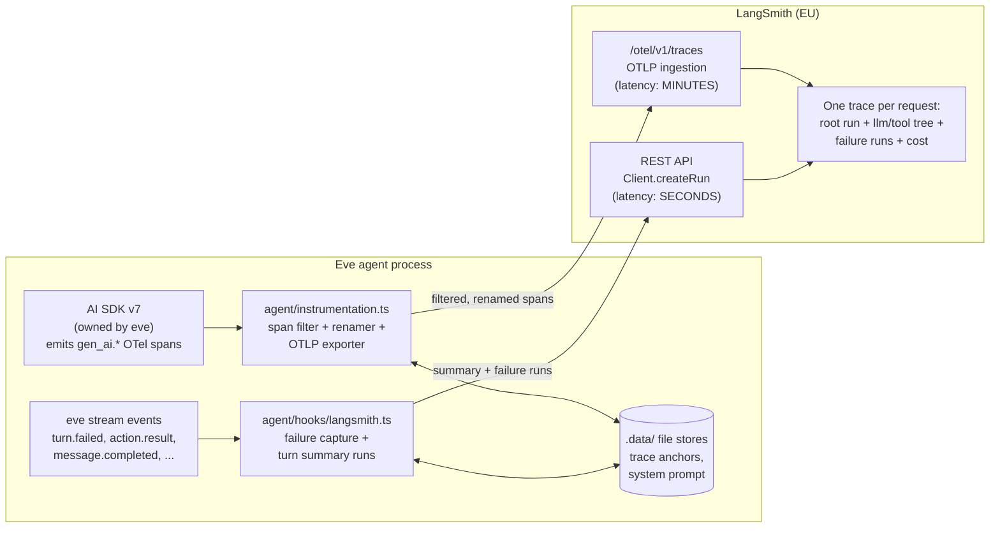
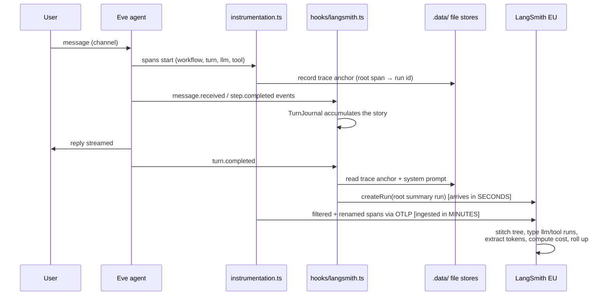
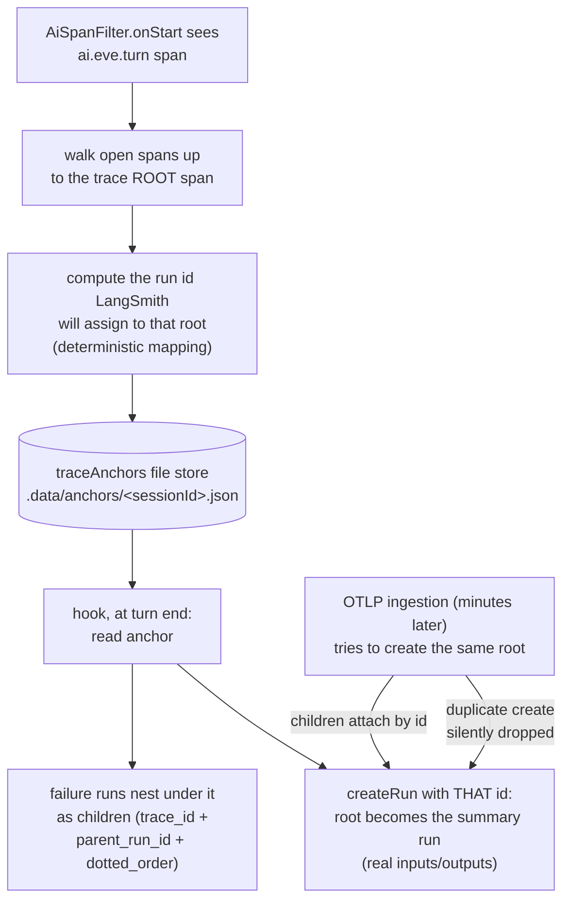
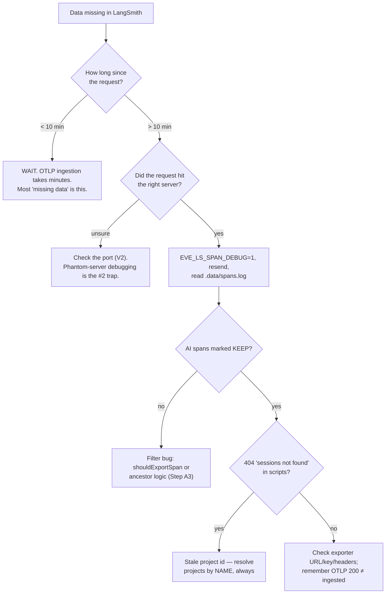

# Eve + LangSmith EU Integration — Tracing Implementation Guide

> **What this document is:** a self-contained, step-by-step walkthrough for wiring a Vercel **eve** agent to **LangSmith** (EU region) for tracing and observability: complete traces, error capture, cost visibility, system-prompt visibility, and human-readable trace trees — implemented, verified, and troubleshot.
>
> **Scope:** integration setup, EU endpoint configuration, tracing implementation, verification, and troubleshooting. Datasets, evaluations, experiments, and feedback loops are **out of scope** and will be documented in separate dedicated guides. The end goal: you finish this guide with a fully working, verified LangSmith EU tracing integration.
>
> **Who it is for:** any developer, with **no prior knowledge of LangSmith or the Vercel AI SDK assumed**. Every step explains *what* to do, *why* it is necessary, *how* it works, and *how to verify* it worked before moving on.
>
> **Sources of truth:** everything here was live-verified in this repository (reference implementations: `example/langsmith-observability-agent/` and `example/kb-agent-langsmith-starter/`) and cross-checked against the official documentation on 2026-07-27:
>
> - LangSmith OpenTelemetry ingestion — <https://docs.langchain.com/langsmith/trace-with-opentelemetry>
> - `@vercel/otel` (`registerOTel`, `OTLPHttpProtoTraceExporter`, `spanProcessors`) — official Vercel OTel docs
> - `langsmith` JS SDK (`Client({ apiUrl })`, `CreateRunParams`) — official LangSmith SDK docs
> - Eve bundled docs (`node_modules/eve/docs/`) — per this repo's rules, the bundled docs are authoritative for the installed eve version (eve.dev may not match)
>
> Verified versions: eve **0.25.3**, `ai` (Vercel AI SDK) **7.0.34**. Re-verify span behavior after major upgrades (see §13).
>
> **Validation status:** on 2026-07-27 this guide was followed from scratch, start to finish, to build the integration in `example/kb-agent-langsmith-starter/` — every §14 checkbox was confirmed live against LangSmith EU (one trace per request, root with real IO, 85,901-char system prompt intact, cost on every llm run, story-form failure run). Corrections discovered during that run are folded in and marked with dates.
>
> **Re-validated 2026-07-31 against `partner-recommendation-agent/` (eve 0.25.2, ai 7.x), and this is the first pass over a codebase that had implemented the guide *incompletely*** — a materially different exercise from building it fresh, and the one that surfaced the guide's own errors. Four independent defects were found and fixed; two of them existed because this document said the wrong thing. **Corrections marked "CORRECTED 2026-07-31" overrule anything earlier in the text.** New material from that pass: §6.1 (turns that ask instead of answering), §7.1 (recognising a missing Part C, and the `app.trace_shape` sentinel), Step 0.2b (gitignore `.data/`), the shared-`recordInputs` warning in Step A2, attribute-level span debugging in Step A3, and Lessons 16–23. Verified end state: 9/9 API checks green on a live turn — one trace, 28,411-char system prompt, 2,318-char reply, 10 llm children all with tokens *and* cost, 3 tool runs with full arguments and results, `total_cost` rolled up onto the root.

---

## Table of Contents

1. [Core Concepts — What You Are Building and Why](#1-core-concepts--what-you-are-building-and-why)
2. [Architecture Overview](#2-architecture-overview)
3. [Prerequisites](#3-prerequisites)
4. [Environment Setup](#4-environment-setup)
5. [Part A: The Trace Pipeline](#5-part-a-the-trace-pipeline)
6. [Part B: Failure Capture and the Turn Summary](#6-part-b-failure-capture-and-the-turn-summary)
7. [Part C: One Trace Per Request (Trace Anchors)](#7-part-c-one-trace-per-request-trace-anchors)
8. [Part D: System Prompt Visibility and Cost Attribution](#8-part-d-system-prompt-visibility-and-cost-attribution)
9. [Trace Quality Standards — Making Traces Readable by Humans](#9-trace-quality-standards--making-traces-readable-by-humans)
10. [Tooling Setup: LangSmith MCP Server and Skills](#10-tooling-setup-langsmith-mcp-server-and-skills)
11. [Verification — Proving the Integration Works](#11-verification--proving-the-integration-works)
12. [Troubleshooting Reference](#12-troubleshooting-reference)
13. [Best Practices and Common Mistakes](#13-best-practices-and-common-mistakes)
14. [Final Verification Checklist](#14-final-verification-checklist)
15. [Lessons Learned](#15-lessons-learned)
16. [Next Steps](#16-next-steps)

---

## 1. Core Concepts — What You Are Building and Why

Before touching code, you need four pieces of background. Skipping these is the number-one cause of broken integrations, because several of eve's behaviors are the *opposite* of what most developers expect.

### 1.1 What eve is

**Eve** is Vercel's filesystem-first framework for durable backend AI agents. An agent is a directory: `instructions/`, `tools/`, `hooks/`, `channels/`, `connections/` are all files that eve discovers, compiles, and runs. Sessions are durable and resumable, built on the Workflow SDK.

The lifecycle of one request:

> A message arrives on a channel → eve normalizes it → assembles the system prompt (instructions + capabilities) → runs the model in **turns** made of **steps** (each step = one model call plus any tool calls) → persists session state → streams events → replies.

Eve internally uses the **Vercel AI SDK** (version 7 in this repo: `ai` 7.0.34 with eve 0.25.3) to make model calls. You never call the AI SDK yourself — eve owns those calls. This matters later: it constrains *how* you can hook into telemetry.

### 1.2 What LangSmith is

**LangSmith** is LangChain's observability and evaluation platform. For the scope of this guide, the part that matters is tracing: LangSmith stores **traces** — trees of **runs**, where each run is one unit of work (an LLM call, a tool execution, a chain step) — and computes token counts and dollar cost on them. It works with any AI application, not just LangChain apps.

Key LangSmith vocabulary used throughout this guide:

| Term | Meaning |
|---|---|
| **Run** | One node in a trace tree. Has a `run_type` (`llm`, `tool`, `chain`, ...), inputs, outputs, timing, metadata. |
| **Trace** | A tree of runs sharing one `trace_id`. The **root run** is what you see in the trace list. |
| **Project** | A named bucket of traces (like a log stream). |
| **Thread** | Traces grouped by a shared `thread_id` metadata value (we use the eve session id). |

### 1.3 The three eve observability surfaces

Eve exposes exactly three observability surfaces (source: `node_modules/eve/docs/guides/instrumentation.md`). Understanding which one does what tells you where every piece of this integration lives:

| Surface | Configurable? | What it is |
|---|---|---|
| **Workflow run tags** (`$eve.*`) | **No** — automatic, framework-owned | Attributes on Vercel Workflow runs (`$eve.type`, `$eve.model`, `$eve.input_tokens`, ...). They power the Vercel **Agent Runs** dashboard. They live on Workflow runs, **not** on OpenTelemetry spans, and your code cannot write to that namespace. **They cannot be exported to LangSmith.** LangSmith and Agent Runs are complementary, not substitutes. |
| **OpenTelemetry export** | **Yes** — via `agent/instrumentation.ts` | `defineInstrumentation({ setup, recordInputs, recordOutputs })`. The `setup({ agentName })` callback runs at server startup; you register an OTel provider there. **The mere presence of the file enables telemetry — there is no `isEnabled` flag.** This is the trace pipe. |
| **Runtime context events** | **Yes** — via `events["step.started"]` in the same file | A callback fired per model-call attempt. It returns `{ runtimeContext }`, whose key/value pairs ride onto the AI SDK spans as attributes. It also receives `modelInput` (including the assembled system prompt). ⚠️ Keys starting with `eve.` are **reserved and silently dropped** — use an `app.` prefix. |

### 1.4 The two facts that shape the whole design

**Fact 1 — eve does not throw.** Agent failures never surface as exceptions. They arrive as stream events: `turn.failed`, `session.failed`, `step.failed`, and tool errors inside `action.result`. Any error-capture design that waits for an exception captures *nothing*, while traces keep flowing and everything *looks* healthy. Consequence: **the integration needs two independent pipes** — an OTel exporter for traces AND a stream-event hook for failures.

**Fact 2 — eve runs as a separate process.** With `withEve()` in a Next.js app, the agent runs in its own process (own dev server locally, own service on Vercel). The web app's root `instrumentation.ts` does **not** instrument the agent — only `agent/instrumentation.ts` does. Furthermore, eve bundles `agent/instrumentation.ts` and `agent/hooks/*.ts` as **separate module instances**: an in-memory variable shared via a `lib/` import is *not* visible across them. Anything that must be shared between the two (you will need this in Part C) has to go through a file-based store.

---

## 2. Architecture Overview

### 2.1 The two pipes

The integration has two independent data paths into LangSmith. They have different latencies and different jobs:



- **Pipe 1 (traces):** eve's AI SDK already emits OpenTelemetry spans in the `gen_ai.*` semantic convention (`invoke_agent`, `chat`, `execute_tool`) — measured in this repo for eve 0.25.3 / ai 7.0.34. LangSmith's generic OTLP endpoint natively maps `gen_ai.*` attributes (`gen_ai.request.model`, `gen_ai.usage.*`, prompt/completion attributes) to typed runs with token counts (confirmed by the official OTel ingestion docs). So the trace pipe is just: point a standard OTLP exporter at LangSmith, filter out infrastructure noise, and optionally rename spans for humans. **No LangSmith SDK is involved on this path.**
- **Pipe 2 (failures + summary):** a hook listens to eve's stream events and writes runs directly to LangSmith's REST API via the `langsmith` SDK `Client`. This is the only path failures can take (Fact 1), and it is also how the trace root gets real inputs/outputs (Part C).

> **Why not use LangSmith's official Vercel AI SDK integration (`LangSmithTelemetry`)?** Three reasons, all verified: (1) eve itself registers the AI SDK v7 telemetry API — stacking a vendor AI integration on top was measured (in this repo's earlier Sentry work) to add zero spans at best and conflict at worst; (2) `LangSmithTelemetry` lives in `langsmith/experimental/vercel`, an explicitly experimental namespace with no API-stability guarantee; (3) the generic OTLP path was verified live end-to-end and uses only stable, documented surfaces on both sides. Use the OTLP path.

### 2.2 Anatomy of one finished trace

When everything in this guide is implemented, one user request produces exactly one LangSmith trace shaped like this:

```text
Customer Request: "divide 10 by 2"          ← root run (created by the HOOK)
│   inputs:  { user_message, system_prompt }
│   outputs: { agent_reply, outcome }
│   tokens + cost = server-side rollup of llm children
├── Agent Run (infrastructure)              ← workflow ancestor (kept for tree integrity)
│   └── Processing Step (infrastructure)
│       └── Agent Turn: Understanding & Responding     ← eve's turn span, renamed
│           ├── Agent Reasoning (gpt-4.1)   ← llm run, tokens + cost
│           ├── calculate_division          ← tool run (named from tool attributes)
│           └── Generating Response (gpt-4.1)  ← llm run, tokens + cost
└── Calculator Tool Failed: Cannot divide by zero   ← failure run (hook), when a tool fails
```

### 2.3 Sequence of one request



> ⚠️ **Burn this in now:** hook runs appear in LangSmith within **seconds**; OTLP spans take **minutes** to become queryable. A trace that shows a root run with no children, or empty Cost/Tokens columns, minutes after a request is **normal** — not data loss. More false alarms were caused by this latency gap than by any actual bug.

---

## 3. Prerequisites

Before starting, make sure you have all of the following. Each item lists how to check it.

| # | Prerequisite | How to verify |
|---|---|---|
| 1 | **Node.js 20+** and npm | `node --version` |
| 2 | **An eve project** (eve ≥ 0.25.x with AI SDK v7, i.e. `ai` ≥ 7.x in the lockfile) | `npm ls eve ai` — this guide's span behavior was verified on eve 0.25.3 / ai 7.0.34 |
| 3 | **A LangSmith account in the EU region** with an API key | Log in at the EU app (`https://eu.smith.langchain.com`); create a key under Settings → API Keys. Keys look like `lsv2_pt_...`. If you use an **org-scoped** key, note your Workspace ID too (see §4). |
| 4 | **A model provider credential** (this repo uses Azure OpenAI: endpoint, API key, deployment name) | You can send one chat completion successfully outside eve |
| 5 | **Git** | `git --version` |
| 6 | Optional but recommended: **uv/uvx** for the LangSmith MCP server (§10) | `uvx --version` |

> **📌 EU region is binding, not a preference.** This project's workspace lives in the EU. Every LangSmith URL — SDK client, OTLP ingestion, REST verification, MCP server — must use `https://eu.api.smith.langchain.com`. The US host (`https://api.smith.langchain.com`) is **every SDK's silent default**, which is exactly why Step A1 defines the EU base as a single constant that everything else derives from. Data sent to the wrong region lands in a workspace you cannot see. (The EU endpoint is officially documented in the LangSmith SDK README; the OTel docs list `eu.api.smith.langchain.com` as the EU regional variant.)

### Reference implementations in this repository

You do not have to start from a blank page. Two working implementations exist:

- **`example/langsmith-observability-agent/`** — the minimal reference: instrumentation, hook, span filter, renaming, trace anchors, four demo tools, live-check script (its library module is named `lib/langsmith-agent.ts`). Note: it predates Part D — it has **no** system-prompt capture.
- **`example/kb-agent-langsmith-starter/`** — the complete implementation produced by following this guide end-to-end (2026-07-27 validation run), including Part D system-prompt capture, the consolidated `lib/langsmith.ts` module, vitest unit tests, and the `scripts/verify-langsmith.ts` API verifier from §11 V4.
- **`partner-recommendation-agent/`** — the **production** implementation, and the most complete one as of 2026-07-31. Read this one when your situation is not greenfield. It is the only reference that shows: LangSmith **coexisting with another OTel backend** (Sentry) on a single shared provider rather than registering its own (see its `agent/instrumentation.ts` header comment for why `registerOTel()` would silently lose); the `app.trace_shape` anchor sentinel (§7.1); `input.requested` capture and the `asked_user` outcome (§6.1); cache-token and finish-reason capture; and a nine-assertion [scripts/verify-langsmith.ts](partner-recommendation-agent/scripts/verify-langsmith.ts) that polls through the ingestion window and exits non-zero.

When in doubt about any code detail below, read the corresponding file in those projects — they are the verified ground truth.

> 📝 **History note:** earlier versions of this guide referenced `example/knowledge-base-agent/` as the production reference. That project has been removed from the repository; `example/kb-agent-langsmith-starter/` now fills that role.

---

## 4. Environment Setup

### Step 0.1 — Create `.env.local`

In your eve project root, create `.env.local` (gitignored — never commit it) with:

```bash
# --- Model provider (Azure OpenAI shown; adapt to yours) ---
AZURE_AI_CHATBOT_OPENAI_ENDPOINT=https://<your-resource>.openai.azure.com
AZURE_AI_CHATBOT_API_KEY=<your-azure-key>
AZURE_AI_CHATBOT_DEPLOYMENT_NAME=gpt-4.1

# --- LangSmith ---
LANGSMITH_API_KEY=<your-langsmith-eu-key>
LANGSMITH_PROJECT=<your-project-name>
LANGSMITH_TRACING=true
LANGSMITH_ENDPOINT=https://eu.api.smith.langchain.com
# Required ONLY if your API key is org-scoped (not workspace-scoped):
# LANGSMITH_WORKSPACE_ID=<your-workspace-id>
# true ships full prompts/completions to LangSmith. Decide deliberately (see below).
LANGSMITH_RECORD_IO=false
```

**Why each variable exists:**

| Variable | Purpose |
|---|---|
| `LANGSMITH_API_KEY` | Authenticates both pipes. **The design rule: a missing key makes every LangSmith surface a silent no-op** — the agent must run credential-free on a fresh clone. |
| `LANGSMITH_PROJECT` | Which LangSmith project traces land in. Routes OTLP spans (via the `Langsmith-Project` header) and hook runs (via `project_name`). Defaults to `default` if unset — set it. |
| `LANGSMITH_TRACING` | Standard LangSmith SDK switch; keep `true`. |
| `LANGSMITH_ENDPOINT` | Points the SDK at the EU host (officially documented: `https://eu.api.smith.langchain.com` for EU-region signups). Belt-and-suspenders alongside the code constant from Step A1. |
| `LANGSMITH_WORKSPACE_ID` | Only needed for **org-scoped** API keys (official SDK docs). Workspace-scoped keys don't need it. |
| `LANGSMITH_RECORD_IO` | **Content-capture posture.** Eve's `recordInputs`/`recordOutputs` default to `true`, which ships full prompts and completions off-box. That must be an explicit choice, not an accident — so the integration gates all content on this variable and defaults it to `false` (private). With it off you still get timing, token counts, tool names, and outcomes; you lose message text, system prompt, and quoted text in run names. Turn it on deliberately for projects where content debugging is needed and permitted. |

### Step 0.2 — Keep `.env.example` current

Mirror the variable *names* (never real values) in a committed `.env.example` so the next developer knows what to configure.

> 🛑 **Never commit a real API key anywhere** — not in markdown, not in `.env.example`, not in MCP config committed to the repo. Placeholders only. If a key does leak into git history, revoke and rotate it in the LangSmith UI immediately; deleting the file afterwards does not un-leak it.

### Step 0.2b — Gitignore `.data/` before you create the file stores

This integration writes two file stores under `.data/` (trace anchors in Part C, the assembled system prompt in Part D) plus the span-debug log. **The prompt store contains the full assembled system prompt, and the stores sit in the agent root where nothing ignores them by default.** Add the rule when you add the first store, not after the first accidental commit:

```gitignore
# Runtime observability state: LangSmith trace anchors and captured system
# prompt (lib/langsmith.ts file stores), span-debug logs, load-test output.
.data/
```

Checked on this repo 2026-07-31: `.gitignore` covered `.eve/` but not `.data/`. Nothing had been committed yet only because the whole agent directory was still untracked — that is luck, not a safeguard.

### Step 0.3 — Install dependencies

```bash
npm install langsmith @vercel/otel @opentelemetry/sdk-trace-base
```

**Why these three:**

- `langsmith` — the SDK whose `Client` the hook uses to create runs via REST (Pipe 2). Nothing on the trace path uses it.
- `@vercel/otel` — provides `registerOTel` (the provider bootstrap) and `OTLPHttpProtoTraceExporter` (the HTTP/protobuf exporter; LangSmith's OTLP endpoint uses the HTTP trace exporter by default per its docs).
- `@opentelemetry/sdk-trace-base` — provides `BatchSpanProcessor` and the `SpanProcessor`/`ReadableSpan` types the custom span filter implements.

**✅ Checkpoint:** `npm run typecheck` (or `npx tsc --noEmit`) still passes and `npm ls langsmith @vercel/otel` shows both packages resolved.

---

## 5. Part A: The Trace Pipeline

Everything in Part A lives in two files: a shared library module and `agent/instrumentation.ts`.

### Step A1 — Create the central LangSmith module (`lib/langsmith.ts`)

**What:** one module that owns *every* LangSmith-related decision: region, endpoints, client construction, enablement gates, metadata. Both runtime entry points (instrumentation and hook) become thin consumers of it.

**Why:** the EU-endpoint requirement is enforceable only if there is exactly one place URLs come from. It also makes the whole integration liftable into the next service as a single file. Reference: [example/kb-agent-langsmith-starter/lib/langsmith.ts](example/kb-agent-langsmith-starter/lib/langsmith.ts).

Create `lib/langsmith.ts`:

```ts
import { Client } from "langsmith";

// The ONE region constant. Every LangSmith URL in the project derives from it.
export const LANGSMITH_EU_API_URL = "https://eu.api.smith.langchain.com";

/** LangSmith's OTLP trace-ingestion endpoint for the EU region.
 *  Per the official OTel docs: the OTLP base is <host>/otel, and /v1/traces
 *  is appended when the exporter sends traces only (ours does). */
export const LANGSMITH_EU_OTEL_TRACES_URL = `${LANGSMITH_EU_API_URL}/otel/v1/traces`;

/** LangSmith is enabled only when an API key is present. Everything in this
 *  module no-ops without it, so a fresh clone runs with zero config. */
export function langsmithEnabled(env: NodeJS.ProcessEnv = process.env): boolean {
  return typeof env.LANGSMITH_API_KEY === "string" && env.LANGSMITH_API_KEY.trim() !== "";
}

export function projectName(env: NodeJS.ProcessEnv = process.env, fallback = "my-agent"): string {
  return env.LANGSMITH_PROJECT?.trim() || fallback;
}

/** `true` ships prompts/completions off-box. Off by default (privacy). */
export function recordIo(env: NodeJS.ProcessEnv = process.env): boolean {
  return env.LANGSMITH_RECORD_IO === "true";
}

/** The one sanctioned way to build a LangSmith SDK client: EU endpoint,
 *  explicit. Returns undefined without a key so callers stay no-op. */
export function createLangsmithClient(env: NodeJS.ProcessEnv = process.env): Client | undefined {
  if (!langsmithEnabled(env)) return undefined;
  return new Client({ apiUrl: LANGSMITH_EU_API_URL, apiKey: env.LANGSMITH_API_KEY });
}

/** Shared metadata block for every run this integration authors. */
export function appMetadata(env: NodeJS.ProcessEnv = process.env): Record<string, string> {
  return {
    "app.model": env.AZURE_AI_CHATBOT_DEPLOYMENT_NAME ?? "unknown",
    "app.version": env.VERCEL_GIT_COMMIT_SHA?.slice(0, 12) ?? "dev",
    "app.environment": env.VERCEL_ENV ?? env.NODE_ENV ?? "development",
  };
}
```

**Reasoning behind the details:**

- **`langsmithEnabled` gate everywhere:** observability must never be a hard dependency. No key → no exporter registered, no client constructed, zero errors. This is why the example agents run out of the box on a fresh clone.
- **`Client({ apiUrl })` is explicit:** the SDK's default is the US host. Passing `apiUrl` from the constant is what makes the EU requirement structural instead of aspirational. (`new Client({ apiKey, apiUrl })` is the documented constructor shape.)
- **`appMetadata`:** model, git sha, and environment on every authored run make traces filterable ("show me only production", "which version produced this?"). Nothing injects these by default.

**✅ Checkpoint:** `npx tsc --noEmit` passes. Nothing observable yet — that's next.

### Step A2 — Create `agent/instrumentation.ts` with a naive exporter (temporarily)

**What:** register an OTel trace provider whose exporter points at LangSmith's EU OTLP endpoint.

**Why this file and not the Next.js root `instrumentation.ts`:** Fact 2 (§1.4) — the agent is a separate process; only `agent/instrumentation.ts` instruments it.

**Why OTLP works with no LangSmith code:** eve's AI SDK v7 already emits spans following the OpenTelemetry `gen_ai.*` **semantic convention** (a standard vocabulary of attribute names for LLM operations: `gen_ai.request.model`, `gen_ai.usage.*`, prompt/completion attributes...). LangSmith's OTLP endpoint natively maps that vocabulary onto its run model: spans become `llm`/`tool`-typed runs, token counts are extracted, trace trees are stitched, and cost is computed. Verified live: model calls arrived as `run_type=llm` with token counts (e.g. 2,464 tokens on a single call), tool executions as `run_type=tool`.

Create `agent/instrumentation.ts`:

```ts
import { BatchSpanProcessor } from "@opentelemetry/sdk-trace-base";
import { OTLPHttpProtoTraceExporter, registerOTel } from "@vercel/otel";
import { defineInstrumentation } from "eve/instrumentation";

import {
  LANGSMITH_EU_OTEL_TRACES_URL,
  langsmithEnabled,
  projectName,
  recordIo,
} from "../lib/langsmith.ts";

const RECORD_IO = recordIo();

export default defineInstrumentation({
  setup: ({ agentName }) => {
    if (!langsmithEnabled()) return; // no key = no exporter, never an error

    registerOTel({
      serviceName: agentName,
      spanProcessors: [
        new BatchSpanProcessor(
          new OTLPHttpProtoTraceExporter({
            url: LANGSMITH_EU_OTEL_TRACES_URL,
            headers: {
              // Auth + project routing per LangSmith's OTel ingestion docs.
              "x-api-key": process.env.LANGSMITH_API_KEY ?? "",
              "Langsmith-Project": projectName(process.env, agentName),
            },
          }),
        ),
      ],
    });
  },

  // Content capture is an explicit choice (see §4). Default private.
  recordInputs: RECORD_IO,
  recordOutputs: RECORD_IO,
});
```

**Reasoning behind the details:**

- **The presence of this file enables eve telemetry.** There is no on/off flag; deleting the file is the off switch. The `langsmithEnabled()` guard inside `setup` means "file present but no key" = telemetry on, exporter absent, spans go nowhere — harmless.
- **`registerOTel({ serviceName, spanProcessors })` with a `BatchSpanProcessor`-wrapped `OTLPHttpProtoTraceExporter({ url, headers })`** is exactly the custom-exporter pattern in the official `@vercel/otel` docs (verified 2026-07-27). `BatchSpanProcessor` batches spans before export — the production-appropriate choice.
- **`/otel/v1/traces` path suffix:** per the official LangSmith OTel docs, the OTLP base is `<host>/otel` and you append `/v1/traces` when the exporter sends traces only — ours does.
- **`x-api-key` and `Langsmith-Project` headers:** the documented auth and project-routing headers. Without the project header, spans land in the `default` project.

> 🛑 **`recordInputs`/`recordOutputs` are ONE eve-wide switch, not a per-backend one (learned the hard way 2026-07-31).** They govern the AI SDK spans that *every* backend on the provider reads. In a project where instrumentation is shared with another vendor (this repo shares it with Sentry), gating them on that other vendor's env var — `SENTRY_RECORD_IO` — silently disables content capture for LangSmith too. The partner agent ran that way for its entire history: `LANGSMITH_RECORD_IO=true` was set, but `SENTRY_RECORD_IO` was not, so eve was told not to record.
>
> **Its diagnostic signature is highly specific, so learn to recognise it:** the **system prompt is present** on the root run while **every llm run has `inputs: {}`** and every tool run has no arguments or results. That combination is *only* possible with this bug, because the system prompt travels the separate file-store path of §8.1 which does not consult `recordInputs` at all. It reads like "LangSmith is dropping messages"; it is really "eve was never asked to emit them". Gate the switch on the union of every backend's opt-in:
>
> ```ts
> const RECORD_IO = process.env.SENTRY_RECORD_IO === "true" || langsmithRecordIo();
> ```
>
> Fast confirmation without waiting for ingestion: run with the span-debug log at attribute level (§Step A3) and check whether the `invoke_agent` span carries `gen_ai.input.messages` / `gen_ai.output.messages`. If those keys are absent from the span, no amount of LangSmith-side configuration will make the content appear.

> ⚠️ **This naive version is deliberately incomplete.** Run it as-is and it *works* — but floods your project with ~20× workflow-infrastructure noise spans (`workflow.stream.flush`, `fetch POST .../workflow-world`, ...). Step A3 fixes that. Do not skip A3, and do not fix it with a naive filter — that fails worse, as explained there.

**✅ Checkpoint (verification ladder — memorize this order):**

1. `npx tsc --noEmit` → exit 0.
2. `npx eve info` → 0 errors. **Note:** `eve info` will *not* list `instrumentation.ts` — instrumentation is not part of the discovery manifest, and its absence there is **normal, not a failure**. Discovery manifests cover tools/hooks/channels only.
3. `npx eve build` → exit 0, and the emitted server bundle contains `@vercel/otel` / `@opentelemetry` chunks. **This** is the proof instrumentation is wired — it can only be in the bundle because your file was compiled in.

### Step A3 — Add the span filter (the part everyone gets wrong)

**What:** a custom `SpanProcessor` that drops workflow-infrastructure noise while **keeping every ancestor of every AI span**.

**Why filtering is needed:** one two-turn conversation produced 363 spans, of which only 16 were AI spans. Unfiltered export drowns the project in `workflow.*` noise.

**Why the *obvious* filter destroys everything:** LangSmith reconstructs trace trees from parent links, and — per its official docs — **"a span whose parent is never sent to LangSmith is dropped."** Buffered children expire if their parent never arrives, causing **silent** data loss: because OTLP returns HTTP 200 *before* processing, you never see an error. Every AI span's ancestor chain runs through the workflow spans; a "keep only AI spans" filter therefore orphans every AI span, and the whole project goes dark while your exporter reports success. This exact failure happened here and took a local span-debug log to diagnose.

**The correct algorithm — filtering is a tree decision, not a per-span decision:**

1. At `onStart`, record every span's parent id.
2. When an **AI span** ends, walk its ancestor chain and mark every ancestor "must export".
3. Because children always end before their parents, each ancestor checks that set when *it* ends and exports itself if marked.

Result verified live: 363 spans → 22 exported (16 AI + 6 ancestors), full tree intact.

Add to `lib/langsmith.ts`:

```ts
/** AI spans carry `ai.` / `gen_ai.` attributes and eve's turn span carries
 *  `eve.`; eve's Workflow-SDK infrastructure spans carry none of those. */
export function shouldExportSpan(name: string, attributeKeys: readonly string[]): boolean {
  if (name.startsWith("ai.")) return true;
  return attributeKeys.some(
    (k) =>
      k.startsWith("ai.") || k.startsWith("gen_ai.") || k.startsWith("eve.") || k.startsWith("app."),
  );
}

/** LangSmith silently DROPS any span whose parent is never ingested — so when
 *  an AI span ends, its whole ancestor chain is marked must-export.
 *  Children end before parents, so ancestors see the mark in time. */
export class SpanFilterState {
  private readonly parents = new Map<string, string | undefined>();
  private readonly mustExport = new Set<string>();

  onStart(spanId: string, parentSpanId: string | undefined): void {
    this.parents.set(spanId, parentSpanId);
  }

  /** Decide whether an ended span is exported. `keep` is the AI-span verdict. */
  onEnd(spanId: string, parentSpanId: string | undefined, keep: boolean): boolean {
    if (keep) {
      // Mark the entire ancestor chain as must-export.
      let cursor = parentSpanId;
      let guard = 0;
      while (cursor && guard++ < 100) {
        this.mustExport.add(cursor);
        cursor = this.parents.get(cursor);
      }
      this.parents.delete(spanId);
      return true;
    }
    const marked = this.mustExport.has(spanId);
    this.mustExport.delete(spanId);
    this.parents.delete(spanId);
    return marked;
  }
}
```

Then wrap the `BatchSpanProcessor` in `agent/instrumentation.ts` with a filtering processor:

```ts
import {
  BatchSpanProcessor,
  type ReadableSpan,
  type Span,
  type SpanProcessor,
} from "@opentelemetry/sdk-trace-base";
import type { Context } from "@opentelemetry/api";
import { appendFileSync, mkdirSync } from "node:fs";

/** OTel JS 1.x exposes `parentSpanId`; 2.x moved it to `parentSpanContext`. */
function parentIdOf(span: Span | ReadableSpan): string | undefined {
  const s = span as { parentSpanId?: string; parentSpanContext?: { spanId?: string } };
  return s.parentSpanId ?? s.parentSpanContext?.spanId;
}

class AiSpanFilter implements SpanProcessor {
  private readonly state = new SpanFilterState();
  constructor(private readonly inner: SpanProcessor) {}

  onStart(span: Span, parentContext: Context): void {
    this.state.onStart(span.spanContext().spanId, parentIdOf(span));
    this.inner.onStart(span, parentContext);
  }

  onEnd(span: ReadableSpan): void {
    const ai = shouldExportSpan(span.name, Object.keys(span.attributes));
    const keep =
      process.env.LANGSMITH_EXPORT_ALL === "true" ||
      this.state.onEnd(span.spanContext().spanId, parentIdOf(span), ai);

    // Local span-debug log: separates "exporter never saw it" from
    // "backend hasn't ingested it yet". Indispensable when debugging.
    if (process.env.EVE_LS_SPAN_DEBUG === "1") {
      try {
        mkdirSync(".data", { recursive: true });
        appendFileSync(
          ".data/spans.log",
          `${keep ? "KEEP" : "DROP"}${ai ? " ai" : ""} | ${span.name}\n`,
        );
      } catch {
        // Diagnostics must never break the agent.
      }
    }

    if (keep) this.inner.onEnd(span);
  }

  forceFlush(): Promise<void> { return this.inner.forceFlush(); }
  shutdown(): Promise<void> { return this.inner.shutdown(); }
}
```

...and change `spanProcessors` to:

```ts
spanProcessors: [
  new AiSpanFilter(
    new BatchSpanProcessor(
      new OTLPHttpProtoTraceExporter({ /* as in Step A2 */ }),
    ),
  ),
],
```

**Reasoning behind the details:**

- **`LANGSMITH_EXPORT_ALL=true` escape hatch:** lets you compare filtered vs unfiltered export when debugging tree problems.
- **`EVE_LS_SPAN_DEBUG=1` local recorder:** writes a KEEP/DROP verdict per span to `.data/spans.log`. This is the tool that distinguishes "my filter dropped it" from "LangSmith hasn't ingested it yet" — the two failure modes that look identical from the UI. Instrument the boundary you control independently of the backend you don't.
- **Add a level 2 that also dumps attribute keys** (added 2026-07-31 — it paid for itself immediately):

  ```ts
  const attrs = spanDebug === "2" ? ` | ${Object.keys(span.attributes).join(",")}` : "";
  appendFileSync(logPath, `${keep ? "KEEP" : "DROP"}${ai ? " ai" : ""} | ${span.name}${attrs}\n`);
  ```

  Attribute keys answer, in seconds and with zero ingestion latency, the three questions that otherwise cost a ten-minute round trip each: *is content capture actually on?* (`gen_ai.input.messages` / `gen_ai.output.messages` present), *can LangSmith compute cost?* (`gen_ai.request.model`, `gen_ai.usage.*` present), and *can the Part C anchor find its key?* (`eve.session.id` on the turn span). Note the shape difference while reading it: eve's own attributes sit bare on the turn span (`eve.session.id`), while runtime-context values arrive on AI spans under an `ai.settings.context.` prefix (`ai.settings.context.eve.session.id`) — do not read the prefixed copy and conclude the bare one is missing.
- **Careful with the `if` guard when adding levels.** `if (process.env.EVE_LS_SPAN_DEBUG === "1")` narrows the type to the literal `"1"`, so a nested `=== "2"` check is a TypeScript error (TS2367), not a runtime bug. Hoist it: `const spanDebug = process.env.EVE_LS_SPAN_DEBUG; if (spanDebug === "1" || spanDebug === "2")`.
- **The `(infrastructure)` ancestor spans that remain** (`workflow.execute` etc.) are *deliberate*: they carry no AI data but removing them would erase the whole trace (orphan rule). They will show `io=--` in LangSmith; token/cost numbers on them are subtree rollups, not their own usage. That's the expected shape.

> 🛑 **Never tighten `shouldExportSpan` to exclude `gen_ai.*`/`ai.*` spans, and never strip or rewrite span *attributes* at export time.** Dropping llm spans (or orphaning them) means no cost ever appears; stripping `gen_ai.*` attributes means LangSmith can't derive the model/provider and shows tokens but no cost. Only span *names* may be rewritten (§9).

**✅ Checkpoint:** typecheck + `eve build` green. Full live verification comes in §11 — but if you want an early smoke: start the dev server with `EVE_LS_SPAN_DEBUG=1`, send one message, and confirm `.data/spans.log` shows a small number of KEEP lines (AI spans + ancestors) among many DROPs.

### Step A4 — Add runtime-context metadata

**What:** attach business metadata to every AI span via the `events["step.started"]` callback.

**Why:** these values ride onto the AI SDK spans as attributes, giving every exported span the business context of its model call. Nothing attaches these by default.

> ⚠️ **Corrected expectation (measured 2026-07-27 on eve 0.25.3 / ai 7.0.34):** runtime-context values arrive on spans under an `ai.settings.context.` prefix (e.g. `ai.settings.context.app.channel.kind` — visible in `.data/spans.log`), and LangSmith does **not** currently expose them as queryable run metadata: llm runs show only `ls_*` and `otel.resource.*` metadata keys. **Searchable `app.*` metadata is guaranteed only on the hook-authored runs (root summary + failure runs)** — which is also why §11 V4 queries by `eve.session.id` metadata match the hook runs, not the OTLP spans. Keep the runtime context (it costs nothing and the attributes are on the spans), but put anything you need to *filter by* into the hook-run metadata (Part B).

Add to the `defineInstrumentation({...})` object:

```ts
events: {
  "step.started"(input) {
    // Keys beginning with `eve.` are RESERVED and silently dropped. Use `app.`.
    return {
      runtimeContext: {
        "app.channel.kind": input.channel.kind ?? "unknown",
        "app.turn.sequence": String(input.turn.sequence),
        "app.step.purpose": "Choosing and executing the next action for the user's request",
        "app.action": "process_user_request",
      },
    };
  },
},
```

> ⚠️ **The `eve.` prefix trap:** keys starting with `eve.` (spans) or `$eve.` (workflow tags) are reserved by the framework. Values you write there are **silently dropped** — no warning, no error. This was discovered the hard way. Always use an `app.` prefix for your own keys. (Eve itself injects `eve.session.id`, `eve.turn.id`, `eve.step.index`, `eve.channel.kind` onto spans — those you get for free and they *do* reach LangSmith.)

**✅ Checkpoint:** typecheck green. After your first live turn (§11), run with `EVE_LS_SPAN_DEBUG=1` and confirm the `ai.settings.context.app.*` keys appear in the attribute lists in `.data/spans.log`. (Do **not** expect them as llm-run metadata in LangSmith — see the corrected expectation above.)

---

## 6. Part B: Failure Capture and the Turn Summary

Because eve never throws (Fact 1), Part A alone captures *zero failures*. Part B adds the hook — the second pipe.

### Step B1 — Understand the hook contract

Hooks live in `agent/hooks/*.ts` and are declared with `defineHook({ events: { "<event>": handler } })` (source: `node_modules/eve/docs/guides/hooks.md`). The rules, all of which shape the code below:

- Handlers are **observe-only** — they cannot inject model context or alter the turn.
- They fire **after** each event is durably recorded.
- **A thrown hook is a real failure:** it surfaces as `turn.failed`, and a throw inside a failure-cascade handler escalates to `session.failed`. The observer can kill the patient. ⇒ **Every handler body must be wrapped in try/catch. No exceptions to this rule, ever.**
- Relevant stream events: `message.received`, `step.completed`, `message.completed`, `action.result` (tool results, including errors), `step.failed`, `turn.completed`, `turn.failed`, `session.failed`.
- Subagent hooks are isolated — parent hooks do not fire for subagent turns.

### Step B2 — Create the failure-payload builder in the library

**What:** a pure function that turns an eve failure event into a LangSmith run payload — written as a **story**, not a stack trace (the full naming rationale is §9).

The payload fields used below (`name`, `run_type`, `inputs`, `error`, `start_time`, `end_time`, `project_name`, `extra`) are all part of the SDK's documented `CreateRunParams` interface (verified 2026-07-27).

Add to `lib/langsmith.ts`:

The payload must satisfy the §9.4 quality bar — per-error `error_type`, `user_friendly_message`, `failed_step`, `user_goal`, and `recommended_action` — so the story table is structured per error, not as one free-form formatter. (Earlier versions of this guide showed a simpler `friendly(raw)` sketch here that could not meet §9.4; the shape below is the live-verified one.)

```ts
export type FailureKind = "tool" | "step" | "turn" | "session";

export interface ToolErrorStory {
  match: RegExp;
  /** Short headline for the run name, e.g. "Cannot divide by zero". */
  headline: string;
  error_type: "invalid_input" | "upstream_unavailable" | "timeout" | "permission_denied" | "unexpected";
  user_friendly_message: string;
  recommended_action: string;
}

export interface ToolStory {
  human: string;      // display name, e.g. "Calculator Tool"
  action: string;     // the business action, stable across renames
  user_goal: string;  // what a user is typically trying to do
  errors: ToolErrorStory[];
}

/** Per-tool story table: extend as you add tools (§9.3). */
export const TOOL_STORIES: Record<string, ToolStory> = {
  calculate_division: {
    human: "Calculator Tool",
    action: "calculate_result",
    user_goal: "Divide two numbers",
    errors: [
      {
        match: /division by zero/i,
        headline: "Cannot divide by zero",
        error_type: "invalid_input",
        user_friendly_message:
          "The calculation could not be completed because the second number was zero.",
        recommended_action: "Ask the user for a non-zero divisor and retry.",
      },
    ],
  },
};

export function toolStory(toolName: string): ToolStory {
  return (
    TOOL_STORIES[toolName] ?? {
      human: `${toolName} Tool`,
      action: toolName,
      user_goal: "unknown",
      errors: [],
    }
  );
}

/** eve failure payloads are `{ code, message }` (step/turn/session events) or
 *  a raw value (a thrown tool's output). Normalize both. */
export function failureMessage(data: unknown, fallback: string): { message: string; code?: string } {
  if (typeof data === "string" && data.trim() !== "") return { message: data };
  const obj = data && typeof data === "object" ? (data as Record<string, unknown>) : undefined;
  return {
    message: typeof obj?.message === "string" ? obj.message : fallback,
    code: typeof obj?.code === "string" ? obj.code : undefined,
  };
}

const KIND_LABEL: Record<FailureKind, string> = {
  tool: "Tool Call",
  step: "Agent Step",
  turn: "Agent Turn",
  session: "Agent Session",
};

export function failureRunPayload(args: {
  kind: FailureKind;
  subject: string;            // tool name, or error code for step/turn/session
  data: unknown;              // the raw event payload — keep it, developers need it
  sessionId: string;
  agentName: string;
  channelKind?: string;
  project: string;
  now: number;
  attach?: TraceAttachment;   // Part C — nests the run inside the request's trace
}): Record<string, unknown> {
  const { message, code } = failureMessage(args.data, `eve ${args.kind} failed`);
  const story = args.kind === "tool" ? toolStory(args.subject) : undefined;
  const errorStory = story?.errors.find((e) => e.match.test(message));
  const humanWho = story ? story.human : `${KIND_LABEL[args.kind]} (${args.subject})`;

  return {
    ...(args.attach ?? {}),
    // Run NAME = the story, readable in the trace list without opening the run.
    name: `${humanWho} Failed: ${errorStory?.headline ?? message}`.slice(0, 140),
    run_type: "chain",
    inputs: { subject: args.subject },
    // `error` keeps the RAW technical message — it stops being the only thing
    // there, but developers still need it.
    error: code ? `[${code}] ${message}` : message,
    start_time: args.now,
    end_time: args.now,
    project_name: args.project,
    extra: {
      metadata: {
        ...appMetadata(),
        action: story?.action ?? `${args.kind}_execution`,
        tool: args.kind === "tool" ? args.subject : "none",
        error_type: errorStory?.error_type ?? "unexpected", // controlled vocabulary — dashboards group by it
        user_friendly_message:
          errorStory?.user_friendly_message ??
          `The agent could not complete this ${KIND_LABEL[args.kind].toLowerCase()}: ${message}`,
        failed_step: args.kind === "tool" ? `Calling ${humanWho}` : KIND_LABEL[args.kind],
        user_goal: story?.user_goal ?? "unknown",
        recommended_action:
          errorStory?.recommended_action ??
          "Inspect the raw error and the surrounding trace, then retry or escalate.",
        "app.agent": args.agentName,
        "app.channel.kind": args.channelKind ?? "unknown",
        "eve.session.id": args.sessionId,
        "failure.kind": args.kind,
        "failure.subject": args.subject,
        thread_id: args.sessionId, // LangSmith groups traces into threads by this
      },
    },
  };
}
```

(`TraceAttachment` is defined in Part C; until you reach it, omit the `attach` field — the payload works standalone.)

### Step B3 — Create the TurnJournal

**What:** an accumulator that watches the stream events of a turn and, at turn end, produces **one summary run** carrying what the OTLP trace root never can: the user's message, the agent's reply, outcome, duration, token totals, and tools used.

**Why:** the OTLP trace root is a workflow-infrastructure span; no OTel attribute you control can put conversation IO on it. Without this run, every row in the LangSmith trace list reads "No inputs / No outputs" — useless to a human scanning the list. (In Part C this summary run will *become* the root of the request's one trace.)

Add to `lib/langsmith.ts` (shape verified live; see the full version in [example/kb-agent-langsmith-starter/lib/langsmith.ts](example/kb-agent-langsmith-starter/lib/langsmith.ts)):

```ts
interface TurnState {
  userMessage?: string;
  reply?: string;          // from message.completed
  streamedReply?: string;  // from message.appended — fallback for a null `message`
  question?: string;       // from input.requested — the turn asked instead of answering (§6.1)
  startedAt?: number;
  inputTokens: number;
  outputTokens: number;
  cacheReadTokens: number;   // often the MAJORITY of input on a long-prompt agent
  cacheWriteTokens: number;
  modelSteps: number;
  toolsUsed: string[];
  toolErrors: number;
  finishReason?: string;     // the fastest triage field there is — see Lesson 22
}

/** One place to construct it, so adding a counter can't silently skip a
 *  reset site. There are two: `stateFor` and the `message.received` reset. */
function emptyTurnState(): TurnState {
  return {
    inputTokens: 0, outputTokens: 0, cacheReadTokens: 0, cacheWriteTokens: 0,
    modelSteps: 0, toolsUsed: [], toolErrors: 0,
  };
}

export class TurnJournal {
  private readonly sessions = new Map<string, TurnState>();

  private stateFor(sessionId: string): TurnState {
    let s = this.sessions.get(sessionId);
    if (!s) {
      s = emptyTurnState();
      this.sessions.set(sessionId, s);
    }
    return s;
  }

  record(sessionId: string, event: string, data: Record<string, unknown> | undefined, now: number): void {
    const s = this.stateFor(sessionId);
    if (event === "message.received") {
      // ⚠️ A new user message must RESET this session's state — sessions are
      // multi-turn, and without the reset tokens/steps/tools accumulate
      // across turns and every later summary is wrong.
      const fresh = emptyTurnState();
      fresh.userMessage = typeof data?.message === "string" ? data.message : undefined;
      fresh.startedAt = now;
      this.sessions.set(sessionId, fresh);
    } else if (event === "step.completed") {
      const usage = (data as { usage?: { inputTokens?: number; outputTokens?: number } })?.usage;
      s.inputTokens += usage?.inputTokens ?? 0;
      s.outputTokens += usage?.outputTokens ?? 0;
      s.modelSteps += 1;
    } else if (event === "message.appended") {
      // Cumulative text of the current block. Kept as the fallback for a
      // `null` message.completed (see the corrected note below).
      const soFar = (data as { messageSoFar?: unknown })?.messageSoFar;
      if (typeof soFar === "string" && soFar.trim() !== "") s.streamedReply = soFar;
    } else if (event === "message.completed") {
      // ⚠️ CORRECTED 2026-07-31 — the field is `message`, NOT `text`.
      // Earlier versions of this guide asserted `text` here; the eve protocol
      // types are unambiguous (node_modules/eve/dist/src/protocol/message.d.ts:
      // `MessageCompletedStreamEvent.data.message: string | null`). The old
      // ordering only ever worked because `message` was the second fallback.
      // Note the `| null`: read it FIRST but never assume it is populated.
      const text = (data?.message ?? data?.text ?? data?.content) as unknown;
      if (typeof text === "string" && text.trim() !== "") s.reply = text;
    } else if (event === "input.requested") {
      // ⚠️ A turn can end by ASKING instead of answering — see §6.1 below.
      // Such a turn emits NO assistant text block at all.
      const first = (data as { requests?: ReadonlyArray<Record<string, unknown>> })?.requests?.[0];
      if (typeof first?.prompt === "string" && first.prompt.trim() !== "") s.question = first.prompt;
    } else if (event === "action.result") {
      const r = (data as { result?: { toolName?: string; isError?: boolean } })?.result;
      if (r?.toolName) s.toolsUsed.push(r.toolName);
      if (r?.isError) s.toolErrors += 1;
    }
  }

  /** Emit the summary-run payload for a finished turn, then reset the session. */
  finalize(args: {
    sessionId: string;
    outcome: "answered" | "failed";
    agentName: string;
    channelKind?: string;
    project: string;
    recordContent: boolean;
    now: number;
  }): Record<string, unknown> | undefined {
    const s = this.sessions.get(args.sessionId);
    if (!s) return undefined;
    this.sessions.delete(args.sessionId);

    const title = args.recordContent && s.userMessage
      ? `Customer Request: "${s.userMessage.slice(0, 80)}"`
      : "Customer Request";

    return {
      name: title,
      run_type: "chain",
      inputs: args.recordContent ? { user_message: s.userMessage } : {},
      outputs: args.recordContent
        ? { agent_reply: s.reply, outcome: args.outcome }
        : { outcome: args.outcome },
      start_time: s.startedAt ?? args.now,
      end_time: args.now,
      project_name: args.project,
      extra: {
        metadata: {
          ...appMetadata(),
          "eve.session.id": args.sessionId,
          thread_id: args.sessionId,
          "app.outcome": args.outcome,
          "app.duration_ms": args.now - (s.startedAt ?? args.now),
          "app.model_steps": s.modelSteps,
          "app.tools_used": s.toolsUsed.join(","),
          "app.tool_errors": s.toolErrors,
          "app.tokens.input": s.inputTokens,
          "app.tokens.output": s.outputTokens,
          "app.tokens.total": s.inputTokens + s.outputTokens,
        },
      },
    };
  }
}
```

**Semantics to get right:**

- A turn where a tool failed but the agent recovered and answered is `outcome: "answered"` with `app.tool_errors: 1` — the tool failure still gets its own story-form failure run. Only `turn.failed` marks the summary itself failed.
- Token counts come from `step.completed.data.usage`. The full field set on eve 0.25.x is `inputTokens`, `outputTokens`, `cacheReadTokens`, `cacheWriteTokens`, `costUsd` — the last three were missing from earlier versions of this guide. Capture them: `cacheReadTokens` is often the majority of a long-prompt agent's input (measured here: 45,696 of 51,375), and a summary that ignores it makes cache behaviour invisible. `step.completed.data.finishReason` is worth recording too — it is what distinguishes a turn that replied from one that ended on a tool call.

### 6.1 The turn that asks instead of answering (added 2026-07-31)

> 🛑 **A turn can end with no assistant text at all.** When the agent calls eve's built-in `ask_question` tool, the question is delivered on the **`input.requested`** stream event — not `message.completed`, not `message.appended`. A TurnJournal that listens only for assistant text files that turn with an **empty output** and, worse, labels it `outcome: "answered"`.

This was live on the partner agent for its whole history and read as an intermittent bug ("sometimes `agent_reply` is missing"). It is not intermittent — it is deterministic for every clarifying-question turn. The tell in the trace: `app.model_steps: 1`, `app.tools_used: ""`, and `app.finish_reason: "tool-calls"` with no tool run anywhere in the trace. `ask_question` produces no `action.result` until the user answers, which is why it leaves no other trace.

The payload (`node_modules/eve/dist/src/runtime/input/types.d.ts`) is worth capturing in full — `requests[0].prompt` is the question text and `requests[0].options[].label` are the offered choices:

```ts
"input.requested": guard(async (e, ctx) =>
  journal.record(ctx.session.id, "input.requested", e.data, now()),
),
```

...and in `finalize`, let it drive a truthful outcome rather than fabricating an answer:

```ts
const reply = s.reply ?? s.streamedReply;
const outcome = args.outcome === "answered" && !reply && s.question ? "asked_user" : args.outcome;
outputs = { agent_reply: reply ?? s.question, agent_question: s.question, outcome };
```

Add `asked_user` to your outcome vocabulary. Without it, "the agent asked for a city" and "the agent answered" are the same row in every dashboard you will ever build on this data — and the eval datasets in the follow-on guides inherit the same blind spot.

**Related trap:** the same event makes the session park in `session.waiting`, which hangs a naive `live-check.ts` that only breaks on `turn.completed`. Wrap live-check calls in `timeout 180` rather than debugging a "hung agent".
- With `recordContent` off, IO is redacted but timing/token/tool numbers remain — the privacy gate degrades gracefully instead of all-or-nothing.
- ⚠️ **Do not** set LangSmith's native usage fields on this chain-type run to "show cost faster" — cost rolls up from the OTLP llm children on its own (§8.2); manual values risk double counting. The `app.tokens.*` metadata is the sanctioned immediate-visibility channel.

### Step B4 — Create the hook (`agent/hooks/langsmith.ts`)

**What:** the file that subscribes to the stream events, feeds the journal, and writes failure + summary runs.

```ts
// ERROR CAPTURE. Eve emits failures as stream events, never exceptions, so
// this hook is the only path from an agent failure to a LangSmith run. Traces
// (agent/instrumentation.ts) keep flowing even if this file is deleted — which
// would silently hide every failure. Do not delete it.
//
// IRON RULE: never throw. A thrown hook becomes turn.failed; a throw in a
// failure-cascade handler becomes session.failed. Every handler is guarded.
import { defineHook } from "eve/hooks";

import {
  createLangsmithClient,
  failureRunPayload,
  projectName,
  recordIo,
  TurnJournal,
  type FailureKind,
} from "../../lib/langsmith.ts";

/** The one Client method the hook needs, injectable for tests. */
export interface LangSmithLike {
  createRun(payload: Record<string, unknown>): Promise<unknown>;
}

type HookHandler = (event: { data?: Record<string, unknown> }, ctx: HookCtx) => Promise<void>;
interface HookCtx {
  agent: { name: string };
  channel?: { kind?: string };
  session: { id: string };
}

const guard =
  (fn: HookHandler): HookHandler =>
  async (event, ctx) => {
    try {
      await fn(event, ctx);
    } catch {
      // Observability must never break the agent.
    }
  };

export function handlersFor(
  client: LangSmithLike | undefined,
  project: string,
  journal: TurnJournal = new TurnJournal(),
  opts: { recordContent?: boolean; now?: () => number } = {},
): Record<string, HookHandler> {
  const now = opts.now ?? Date.now;
  const recordContent = opts.recordContent ?? recordIo();

  async function finalizeTurn(outcome: "answered" | "failed", ctx: HookCtx) {
    if (!client) return; // no key = no-op
    const payload = journal.finalize({
      sessionId: ctx.session.id,
      outcome,
      agentName: ctx.agent?.name ?? "unknown",
      channelKind: ctx.channel?.kind,
      project,
      recordContent,
      now: now(),
    });
    if (payload) await client.createRun(payload);
  }

  async function capture(kind: FailureKind, subject: string, data: unknown, ctx: HookCtx) {
    if (!client) return;
    await client.createRun(
      failureRunPayload({
        kind,
        subject,
        data,
        sessionId: ctx.session.id,
        agentName: ctx.agent?.name ?? "unknown",
        channelKind: ctx.channel?.kind,
        project,
        now: now(),
      }),
    );
  }

  return {
    // --- Turn journal: accumulate the story of the current turn -----------
    "message.received": guard(async (e, ctx) => journal.record(ctx.session.id, "message.received", e.data, now())),
    "step.completed":   guard(async (e, ctx) => journal.record(ctx.session.id, "step.completed", e.data, now())),
    "message.completed":guard(async (e, ctx) => journal.record(ctx.session.id, "message.completed", e.data, now())),
    "turn.completed":   guard(async (_e, ctx) => finalizeTurn("answered", ctx)),

    // --- Failure capture ---------------------------------------------------
    "action.result": guard(async (e, ctx) => {
      journal.record(ctx.session.id, "action.result", e.data, now());
      const result = e.data?.result as { isError?: boolean; toolName?: string; output?: unknown } | undefined;
      if (!result?.isError) return; // successes are already on the OTel trace
      await capture("tool", result.toolName ?? "unknown_tool", result.output, ctx);
    }),
    "step.failed":    guard(async (e, ctx) => capture("step", String(e.data?.code ?? "step_error"), e.data, ctx)),
    "turn.failed":    guard(async (e, ctx) => {
      await capture("turn", String(e.data?.code ?? "turn_error"), e.data, ctx);
      await finalizeTurn("failed", ctx);
    }),
    "session.failed": guard(async (e, ctx) => capture("session", String(e.data?.code ?? "session_error"), e.data, ctx)),
  };
}

const client = createLangsmithClient();
export default defineHook({
  events: handlersFor(client, projectName()),
});
```

**Reasoning behind the details:**

- **`handlersFor` is a factory taking an injectable client:** so unit tests can pass a fake client and assert exact payloads without any network. The reference project's tests prove: failed tool → one run with `error` + metadata; successful tool → no run; a *throwing* client and a *missing* client both never escape the guard.
- **`guard` wraps every handler:** the iron rule made structural. One unguarded handler is one production incident waiting.
- **Only failed tool results create runs:** successful tool calls are already on the OTel trace as `execute_tool` spans; duplicating them as REST runs would be noise.

**✅ Checkpoint:**

1. Typecheck green.
2. `npx eve info` → the hook **is** listed in discovery (unlike instrumentation).
3. Write the unit tests described above (fake client; assert payload shape; assert never-throws). All green.
4. Live proof comes in §11: a deliberately failing tool call (e.g. "divide 1 by 0") must produce a failure run in LangSmith **within seconds**, with `status=error` and your metadata.

---

## 7. Part C: One Trace Per Request (Trace Anchors)

### The problem

After Parts A and B you have *two* LangSmith entries per request: the hook's summary run (its own tiny trace, arriving in seconds) and the OTLP span tree (arriving minutes later). The trace list is confusing and the OTLP tree's root still shows "No inputs / No outputs".

### The three discoveries that make the fix possible (all verified live)

1. **The span→run id mapping is deterministic.** LangSmith converts an OTLP span into a run whose id is derived from the span id: `00000000-0000-0000-<spanId first 4 hex>-<spanId last 12 hex>`. The root run's `trace_id` equals its own run id. You can therefore compute, *inside your process*, the exact run id LangSmith will assign to the trace root.
2. **REST-created runs can join an OTLP trace** by setting `trace_id` + `parent_run_id` + `dotted_order` (all documented fields of `CreateRunParams`). ⚠️ `dotted_order` (LangSmith's tree-ordering key) is **required** whenever `trace_id` is set — the API returns 400 without it. A segment has the form `YYYYMMDDTHHMMSS<microseconds-6-digits>Z<runId>` and is reconstructable locally from the span's high-resolution start time.
3. **First writer wins.** A run accepts exactly one create and one update; a second update is rejected (409). Post-hoc *enrichment* of an ingested OTLP run is impossible — but **pre-creating** the run the OTLP pipe will later try to create works perfectly: the later duplicate create is silently dropped, and children still attach by id.

### The design



The hook **pre-creates the trace root itself** — named `Customer Request: "..."` with real inputs/outputs — using the exact id the OTLP pipe would use. Minutes later the OTLP tree arrives and slots in underneath; its own redundant root create is dropped as the duplicate. Failure runs are created as children of the same root. Result, verified live: **one trace per request**, root showing user message, reply, and the server-side token/cost rollup, with the full renamed span tree nested below and failure runs inside the same tree.

### Why a *file-based* store

Eve bundles instrumentation and hooks as **separate module instances** (Fact 2): a shared in-memory `Map` in `lib/` is invisible across them — this was tried first and silently fell back to standalone runs. The bridge must be a file: `.data/anchors/<sessionId>.json`, written by the span filter, read (and deleted) by the hook.

### Implementation sketch

Add to `lib/langsmith.ts` (full working code: [example/kb-agent-langsmith-starter/lib/langsmith.ts](example/kb-agent-langsmith-starter/lib/langsmith.ts)):

```ts
import { mkdirSync, readFileSync, unlinkSync, writeFileSync } from "node:fs";

export interface TraceAnchor {
  rootRunId: string;   // run id LangSmith will derive from the root span
  rootDotted: string;  // dotted_order segment of the root
  rootStartMs: number;
}

/** LangSmith's deterministic OTLP spanId → runId mapping (verified live). */
export function otelRunId(spanId: string): string {
  return `00000000-0000-0000-${spanId.slice(0, 4)}-${spanId.slice(4)}`;
}

/** dotted_order stamp from an OTel hrTime: YYYYMMDDTHHMMSS<micro6>Z */
export function dottedStampFromHr(sec: number, nanos: number): string {
  const d = new Date(sec * 1000);
  const p = (n: number, w: number) => String(n).padStart(w, "0");
  return (
    `${d.getUTCFullYear()}${p(d.getUTCMonth() + 1, 2)}${p(d.getUTCDate(), 2)}T` +
    `${p(d.getUTCHours(), 2)}${p(d.getUTCMinutes(), 2)}${p(d.getUTCSeconds(), 2)}` +
    `${p(Math.floor(nanos / 1000) % 1_000_000, 6)}Z`
  );
}

/** Cross-bundle bridge: instrumentation and hooks are SEPARATE module
 *  instances (verified), so the anchor must go through the filesystem. */
export const traceAnchors = {
  dir: ".data/anchors",
  set(sessionId: string, anchor: TraceAnchor): void {
    try {
      mkdirSync(this.dir, { recursive: true });
      writeFileSync(`${this.dir}/${sessionId}.json`, JSON.stringify(anchor));
    } catch { /* observability never breaks the agent */ }
  },
  get(sessionId: string): TraceAnchor | undefined {
    try {
      return JSON.parse(readFileSync(`${this.dir}/${sessionId}.json`, "utf8"));
    } catch { return undefined; }
  },
  delete(sessionId: string): void {
    try { unlinkSync(`${this.dir}/${sessionId}.json`); } catch { /* ok */ }
  },
};
```

In `AiSpanFilter.onStart` (instrumentation side): when the span named `ai.eve.turn` starts, read `eve.session.id` from its attributes, walk the currently-open spans up to the trace root, and publish the anchor:

```ts
// inside onStart, after this.state.onStart(...):
const [sec, nanos] = span.startTime;
this.open.set(id, { parent, sec, nanos });          // open: Map<spanId, {parent?, sec, nanos}>
if (span.name === "eve.turn" || span.name === "ai.eve.turn") {   // BOTH — see §9.1
  const sessionId = span.attributes["eve.session.id"];           // confirmed present on this span
  if (typeof sessionId === "string") {
    let rootId = id, guard = 0;
    for (let e = this.open.get(rootId); e?.parent && guard++ < 100; e = this.open.get(rootId)) {
      if (!this.open.has(e.parent)) break;
      rootId = e.parent;
    }
    const root = this.open.get(rootId);
    if (root) {
      const runId = otelRunId(rootId);
      traceAnchors.set(sessionId, {
        rootRunId: runId,
        rootDotted: `${dottedStampFromHr(root.sec, root.nanos)}${runId}`,
        rootStartMs: root.sec * 1000 + Math.floor(root.nanos / 1e6),
      });
    }
  }
}
```

Hook side: `finalizeTurn` reads (and deletes) the anchor and passes it into `journal.finalize`, which then sets on the summary payload:

```ts
id: anchor.rootRunId,
trace_id: anchor.rootRunId,
dotted_order: anchor.rootDotted,
start_time: anchor.rootStartMs,
```

Failure runs get `trace_id: anchor.rootRunId`, `parent_run_id: anchor.rootRunId`, and their own `dotted_order` = root segment + `.` + own segment. When no anchor exists (spans disabled, or the write failed), both **fall back to standalone runs** — degraded but never broken.

> ⚠️ **Known edge case (accepted, never observed):** if a hook fired *after* OTLP ingestion completed (extreme lag inversion), the pre-create would be rejected and that turn's root would fall back to the bare OTLP root — children still form a tree. In practice OTLP lags by minutes and the hook fires in seconds, so the hook always wins the race.

**✅ Checkpoint:** after a live turn (§11), the LangSmith trace list shows **one** row per request, whose root is `Customer Request: "..."` with real inputs/outputs immediately; the llm/tool children appear under the *same* trace minutes later. If you instead see two rows (summary + separate OTLP tree), the anchor bridge is broken — check that `.data/anchors/` files appear during a turn and that the hook runs in the same working directory.

### 7.1 Recognising "Part C was never implemented" (added 2026-07-31)

Skipping Part C does not look like a broken integration. It looks like a **working integration that is mysteriously missing half its data**, and which half depends on which row you happen to click. That ambiguity is the whole problem, so learn the fingerprint — a single API query over root runs shows it:

| Row in the trace list | Has | Missing |
|---|---|---|
| `Customer Request: "…"` (hook, REST) | system prompt, user message, agent reply | `total_cost: null`, `total_tokens: 0`, **no children** |
| `Agent Run (infrastructure)` (OTLP) | tokens, dollar cost, the full llm/tool tree | `inputs: {}`, `outputs: null` everywhere |

Two root runs, seconds apart, same request. Measured on the partner agent before the fix: run `e406c5f2…` held the conversation, run `00000000-0000-0000-5aa1-f8b8562d7ee8` held the $0.216. Anyone looking at the first concludes "cost tracking is broken"; anyone looking at the second concludes "prompts and outputs are broken". Both are the same missing bridge.

**Make the regression queryable, not visual.** Put a sentinel on the summary run that states whether the graft happened:

```ts
"app.trace_shape": args.anchor ? "anchored" : "standalone",
```

Now "did Part C fire?" is one filter (`app.trace_shape = standalone`) instead of an eyeball comparison of the trace list, and any future change that breaks the bridge — an eve upgrade renaming the turn span, a working-directory change, a file-store permission failure — shows up as a metadata value rather than as a slow drift back into two rows. Every degradation path in Part C is deliberately silent, so this is the only cheap alarm.

**Two implementation details worth getting right the first time:**

- **The summary run must adopt the anchor's `start_time`** (`rootStartMs`), not the hook's own first-event timestamp. The root's `dotted_order` stamp is derived from the root *span's* start; a `start_time` that disagrees with it produces a run whose displayed duration excludes the request's first ~600 ms of workflow setup.
- **Sanitise the session id before using it as a filename.** Both file stores key on it, and while eve's ids (`wrun_01K…`) are path-safe today, a store that concatenates an external id straight into a path is one id-format change away from writing outside its directory. `sessionId.replace(/[^A-Za-z0-9._-]/g, "_").slice(0, 128)` costs nothing.

---

## 8. Part D: System Prompt Visibility and Cost Attribution

Two gaps remain even after Parts A–C. Both were discovered by inspecting live traces, and both have precise fixes.

### 8.1 The system prompt never reaches spans — capture it explicitly

**The gap:** with `recordInputs: true` you would expect llm runs to show the full model input. They do not. Inspected live: the llm runs' `inputs.messages` contained **only user/assistant/tool roles — no system message** (re-confirmed 2026-07-27: the `invoke_agent` span *does* carry a `gen_ai.system_instructions` attribute when content capture is on, but LangSmith does not map it into the run's `inputs.messages`, and OTel attribute-size limits would truncate a large prompt anyway). Eve passes the system prompt to the AI SDK as a separate `instructions` parameter. Your biggest debugging asset — the assembled persona + rules + knowledge — is invisible on the llm runs.

**The fix (verified live twice: 40,285 chars, and 85,901 chars on the 2026-07-27 validation run — both landed intact):**

1. `events["step.started"]` receives `modelInput.instructions` — the final assembled system prompt.
2. The instrumentation stashes the full text in a file-backed `systemPromptStore` keyed by session id (same cross-bundle bridge pattern as `traceAnchors` — same reason).
3. The hook, when creating the root summary run, reads it and writes `inputs.system_prompt` alongside `user_message`.

Why route it through the *hook* instead of a span attribute: REST runs have no OTel attribute-size limits, so the prompt lands **untruncated**. Gate it on `LANGSMITH_RECORD_IO` like all content.

```ts
// instrumentation side, inside events["step.started"]:
const instructions = (input as { modelInput?: { instructions?: string } }).modelInput?.instructions;
if (RECORD_IO && typeof instructions === "string") {
  systemPromptStore.set(input.session.id, instructions);  // file-backed, like traceAnchors
}
```

### 8.2 Cost tracking — how it works and how it silently breaks

> 🛑 **Standing requirement in this repo: every trace MUST end up showing dollar cost.** A trace that permanently lacks cost is a bug, not a nice-to-have gap — cost is how per-request spend is monitored.

**How LangSmith computes cost (all verified live):** cost is computed **only** on `run_type=llm` runs that LangSmith can match to its pricing table via two metadata fields: `ls_model_name` and `ls_provider`. Trace-level cost/token columns are **server-side rollups** from those llm runs. Chain runs (your root, infrastructure spans, hook runs) never carry their own cost.

- **OTLP-ingested spans:** `ls_model_name`/`ls_provider` are **auto-derived** from the `gen_ai.*` attributes (observed: `gpt-4.1`/`openai` → ~$0.04 per turn computed automatically). This is why attributes must never be touched at export time.
- **Hand-authored llm runs** (created via `traceable()` or REST — e.g. in CLI or verification tools): **nothing derives them.** A run with perfect token counts still shows `total_cost=null` until you add the metadata yourself:

```ts
const tracedModelCall = traceable(
  async (messages) => { /* call the model, return result incl. usage_metadata */ },
  {
    run_type: "llm",
    name: "azure_openai_chat",
    metadata: { ls_model_name: "gpt-4.1", ls_provider: "openai" }, // ← without this: tokens, no cost
  },
);
```

**The cost failure-prevention table** — read before changing *anything* in the trace pipeline:

| Failure mode | Prevention |
|---|---|
| **False alarm:** Cost column empty right after a request | The hook root arrives in seconds; the llm runs carrying cost ingest via OTLP **minutes later**. Wait, then verify via the API (`total_cost != null` on llm runs). Never "fix" cost during the ingestion window. |
| Span filter drops llm spans → no cost ever | Never tighten the filter to exclude `gen_ai.*`/`ai.*` spans; keep the ancestor logic intact (orphaned llm spans are silently discarded). |
| `gen_ai.*` attributes stripped/rewritten at export → tokens but no cost | Only span **names** may be rewritten (§9). Attributes pass through untouched. |
| Hand-authored llm runs show `total_cost=null` | Always set `metadata: { ls_model_name, ls_provider }` on them. |
| Model swap to one missing from LangSmith's pricing table → cost silently disappears repo-wide | After any model change, run one request and confirm `total_cost != null` before shipping. |
| Trace wipe recreated the project under a **new project id** → hardcoded ids 404 ("sessions not found") and look like data loss | Resolve projects **by name** at runtime, never by stored id. |
| Manually setting usage fields on the chain root "to show cost faster" | Don't — the rollup fills them once llm runs ingest; manual values risk double counting. `app.tokens.*` metadata is the immediate-visibility channel. |

> ⚠️ **Known inflation (now observed on every verified run, 2026-07-27 included):** the nested `invoke_agent` llm span reports **exactly 2×** the `chat` span's usage (e.g. 40,254 vs 20,127 prompt tokens; $0.0808 vs $0.0404), and LangSmith's rollup sums both — displayed trace cost is ~3× the single billed call (1× chat + 2× invoke_agent). Treat LangSmith cost as a *relative* per-request signal; verify against your provider's billed tokens before using it for budget accounting.

> 🛑 **Second inflation factor, and it is the bigger one: LangSmith ignores prompt-cache discounts (measured 2026-07-31).** It prices every input token at the model's full list rate. On a long-system-prompt agent the cache-read share is enormous — measured **93%** on the partner agent — and providers bill cached input at ~25% of list. Combined with the `invoke_agent` double-count, LangSmith reported **$0.217** for a request that truly cost **$0.026**: an **~8× overstatement**.
>
> This is not an academic discrepancy. An 8× error in the headline cost metric is enough to trigger a re-architecture of a system that was never expensive, and to hide the thing that *is* wrong (on that agent, 18–60 s latency that nobody was looking at because the investigation was framed around cost).
>
> **The true cost of a turn is computable from data you already capture** — `step.completed.data.usage` carries `inputTokens`, `cacheReadTokens`, and `outputTokens` per step (Part B3). Compute it yourself and put it on the summary run:
>
> ```ts
> const fresh = inputTokens - cacheReadTokens;
> const trueCost = fresh * RATE_IN + cacheReadTokens * RATE_CACHED + outputTokens * RATE_OUT;
> ```
>
> Publish it as `app.cost.true_usd` next to `app.tokens.*`. Then the dashboard everyone reads carries a number that survives contact with the invoice, and LangSmith's own column becomes what it should always have been: a relative regression signal.
>
> **Also monitor the cache-read share itself** (`app.tokens.cache_read_pct`). On a stable-prefix agent it should sit above 85%. It is the highest-leverage cost metric there is — anything that makes the system prompt vary per request (an injected timestamp, a user name, rotating content in the prefix) silently multiplies the bill by up to 4×, and no token-count alarm will fire because the token count does not change.

### The complete-visibility checklist

Every row below was individually observed to be **missing without its fix**. This is the definition of "fully integrated":

| Goal | What delivers it |
|---|---|
| User/assistant messages on llm runs, and tool arguments/results on tool runs | `recordInputs`/`recordOutputs: true` — gated on the **union** of every backend's opt-in, not one backend's alone (Step A2) |
| The agent's clarifying question, when a turn asks instead of answers | `input.requested` capture + the `asked_user` outcome (§6.1) |
| Proof the trace was assembled correctly, rather than hope | `app.trace_shape` sentinel on the summary run (§7.1) |
| Cache-token and finish-reason visibility | `step.completed.data.usage.cacheReadTokens`/`cacheWriteTokens` and `.finishReason` (Part B3) |
| System prompt visible | `step.started` → file store → hook writes `inputs.system_prompt` on the root (§8.1) |
| Cost on every llm run | OTLP: automatic from `gen_ai.*`. Hand-authored: explicit `ls_model_name` + `ls_provider` (§8.2) |
| Root run with real IO + rollups | TurnJournal summary run as trace root via the anchor mechanism (Parts B + C) |
| Failures as error runs | The hook — eve never throws (Part B) |
| Model / git sha / environment / thread on every trace | `appMetadata()` + `thread_id = session id` on hook runs; `app.*` runtimeContext on spans |
| EU region everywhere | The single `LANGSMITH_EU_API_URL` constant (Step A1) |
| Tree survives filtering | `SpanFilterState` ancestor-chain tracking (Step A3) |

---

## 9. Trace Quality Standards — Making Traces Readable by Humans

> **The bar:** a non-technical person looking at the LangSmith project must be able to answer, from the trace list alone: (1) What was the agent trying to do? (2) What step is it performing? (3) Why was a tool called? (4) Where exactly did a failure happen? (5) What was the final outcome? **A trace that fails this bar is a bug, even when the data is technically complete.** Raw framework names (`workflow.route.flow`, `invoke_agent gpt-4.1`, `step.execute turnStep`) are an execution log, not a story.

### 9.1 Know which layer produces each name — the fix differs per layer

| Name seen in LangSmith | Producer | Renameable? |
|---|---|---|
| `workflow.route.flow`, `fetch POST ...` | Workflow SDK infrastructure spans (kept only as tree ancestors) | Not at source — **export-time rewrite only** |
| `ai.eve.turn` **and** `eve.turn` | eve framework | Export-time rewrite only |
| `invoke_agent gpt-4.1`, `chat gpt-4.1`, `generate_content gpt-4.1`, `step 1` | AI SDK v7 native spans (eve owns these calls) | Export-time rewrite only |

> ⚠️ **CORRECTED 2026-07-31 — match BOTH turn-span spellings.** Both `eve.turn` and `ai.eve.turn` were observed in `.data/*-spans.log` on eve 0.25.2, so a rule anchored on `/^ai\.eve\.turn$/` alone silently fails to rename (and, worse, a Part C anchor keyed on that exact string silently never fires — see §7). Match `/^(ai\.)?eve\.turn$/` everywhere the turn span is identified. Two further names the original rules table missed: `generate_content <model>` (a third llm-span shape) and the AI SDK's bare `step 1`, `step 2`, … — the latter are meaningless in a trace list and deserve a rule of their own.
| Tool run named after your tool | **Your tool file's name** | **Yes — at source. Fix the source.** |
| Failure/summary runs | **Your hook code** | **Yes — fully yours.** |

### 9.2 Export-time span renaming (verified safe)

Renaming span **names** just before export does **not** break LangSmith: run typing (`llm`/`tool`), token extraction, and tree stitching all key off **attributes**, not names — verified live. One exception: LangSmith names **tool** runs from the `gen_ai` tool attributes, *overriding* your span-name rewrite — which is why tool names must be fixed at the source (§9.3).

Implementation: a pure `humanSpanName(name)` mapping table plus a `Proxy` that overrides only `name` (everything else forwarded, methods bound to the target). Apply in `AiSpanFilter.onEnd` just before delegating to the exporter; opt-out via `LANGSMITH_HUMAN_NAMES=false` for A/B comparison:

```ts
/** Rules table, e.g.:
 *  invoke_agent gpt-4.1   → Agent Reasoning (gpt-4.1)
 *  chat gpt-4.1           → Generating Response (gpt-4.1)
 *  ai.eve.turn            → Agent Turn: Understanding & Responding
 *  workflow.execute       → Agent Run (infrastructure)
 *  step.execute turnStep  → Processing Step (infrastructure)
 */
export function humanSpanName(name: string): string { /* mapping table */ return name; }

function withHumanName(span: ReadableSpan): ReadableSpan {
  const name = humanSpanName(span.name);
  if (name === span.name) return span;
  return new Proxy(span, {
    get(target, prop) {
      if (prop === "name") return name;
      const v = Reflect.get(target, prop, target);
      return typeof v === "function" ? v.bind(target) : v;
    },
  });
}
```

(See the exact rules table in [example/langsmith-observability-agent/agent/instrumentation.ts](example/langsmith-observability-agent/agent/instrumentation.ts) and its `lib/langsmith-agent.ts`.)

**Naming rules:**

- **Root:** `<Actor/Domain>: <What is being accomplished>`, Title Case, business intent — `Customer Request Processing`, never an entry-point function name. With content capture on, quote the request (`Answering: "divide 10 by 2"`); with it off, use category labels — **names must not leak user text when `LANGSMITH_RECORD_IO=false`**.
- **Spans:** gerund/noun-phrase action — `Searching Knowledge Base`, `Generating Response (gpt-4.1)`. Model id as a parenthesized suffix, not the headline. One vocabulary across the tree.
- **Infrastructure ancestors:** honest and quiet — `Agent Run (infrastructure)`.

### 9.3 Tool naming — fix at the source

- Tool name = **verb + object** in business vocabulary: `calculate_division`, `search_knowledge_base`, `fetch_exchange_rate`. Never a bare noun (`divide`), abbreviation, or class name — LangSmith derives the tool run's name from it and your rename layer cannot override it.
- The tool **description** must say what the tool does for the user and when to call it — LangSmith displays it, and it doubles as model guidance.
- Maintain the `TOOL_STORIES` table (Step B2) — human display name + per-error friendly messages — next to your tools.

### 9.4 Failure runs are stories

Every failure record documents: what the user was trying to do, which step failed, why, and the recommended next action.

Bad (real early output): `eve.tool.failed` — `error: "division by zero"`.

Good (current standard, live-verified):

> **`Calculator Tool Failed: Cannot divide by zero`**
> metadata: `action`, `error_type` (controlled vocabulary: `invalid_input | upstream_unavailable | timeout | permission_denied | unexpected` — dashboards group by it), `user_friendly_message` (written for a support person), `failed_step`, `user_goal`, `recommended_action`. The raw technical message stays in the `error` field — it just stops being the *only* thing there. A failure record without a recommended action is half a record.

---

## 10. Tooling Setup: LangSmith MCP Server and Skills

These give your AI coding assistant (and you) direct access to LangSmith data during development. Required by this repo's integration rules.

### 10.1 MCP server (with the EU endpoint)

Add to your MCP configuration (e.g. `.mcp.json` — path of `uvx` per your machine):

```json
"langsmith": {
  "type": "stdio",
  "command": "uvx",
  "args": ["langsmith-mcp-server"],
  "env": {
    "LANGSMITH_API_KEY": "<YOUR_KEY>",
    "LANGSMITH_ENDPOINT": "https://eu.api.smith.langchain.com"
  }
}
```

⚠️ The `LANGSMITH_ENDPOINT` env var here is what keeps the MCP server off the US default — same rule, fourth surface (SDK, OTLP, REST, MCP). Real keys live only in your local MCP config / `.env.local`, never in committed files. Official docs: <http://docs.langchain.com/langsmith/langsmith-mcp-server>

**✅ Checkpoint:** the MCP server's tools (e.g. `list_projects`, `fetch_runs`) respond and list *your* EU projects.

### 10.2 LangSmith skills

If the `langsmith-trace` skill (and its siblings) are not installed, install them under `.claude/skills/` in the project. They encode the correct workflows for working with LangSmith tracing from a coding assistant.

---

## 11. Verification — Proving the Integration Works

Follow this exact sequence for a fresh setup or after any pipeline change. It encodes every false-alarm trap discovered live.

### Step V1 — Static verification ladder

```bash
npm install && npm run typecheck && npm test   # all green before anything live
npx eve info                                    # 0 errors; hook + tools listed (instrumentation absent = NORMAL)
npx eve build                                   # exit 0; bundle contains langsmith/@vercel/otel chunks
```

Each rung proves something the previous cannot: `tsc` (types) → tests (hook logic, never-throw, payload shapes) → `eve info` (discovery of tools/hooks) → `eve build` (instrumentation actually compiled in) → live turn (spans actually exported).

### Step V2 — Start the agent and confirm WHICH server you're talking to

```bash
npm run dev
```

🛑 **Read the actual port from the log line** `server listening at http://127.0.0.1:<port>` — **never assume 3000.** The founding incident: a stale dev server from a *sibling example project* was squatting port 3000, had a similar tool, and answered convincingly — an entire debugging session went into a phantom while the real app sat on 3001 (Next.js relocates silently on port conflict). On the 2026-07-27 validation run `eve dev` chose port **2000** while an unrelated node process held 3000. If ports may be contested, kill stale listeners first. All test scripts must take the host explicitly (`EVE_HOST=http://127.0.0.1:<port>`).

🛑 **Kill any dev server that predates your integration.** `eve dev` refuses to start a second instance — it prints `A dev server is already running for this eve agent` with the existing URL and exits. That existing process was started **before** `agent/instrumentation.ts` existed, and instrumentation registers **only at server startup** (hot reload does not re-run `setup`), so every turn you send it produces zero spans while looking perfectly healthy. Kill the process listening on that port (and remove `.eve/dev-server-state.v1.json` if it lingers), then start fresh. Verified the hard way on 2026-07-27.

### Step V3 — Send one clean turn and one failing turn

```bash
EVE_HOST=http://127.0.0.1:<port> npx tsx scripts/live-check.ts "Use the calculator tool to divide 10 by 2"
EVE_HOST=http://127.0.0.1:<port> npx tsx scripts/live-check.ts "Call the calculate_division tool with a=1 and b=0 and tell me exactly what the tool returns. Do not answer from your own knowledge - I am testing the tool's error handling and need you to actually invoke it."
```

(Write a small `scripts/live-check.ts` that POSTs a message to the agent's HTTP channel and prints the reply plus the session id — see the reference project's version.) Note the printed session ids.

> ⚠️ **The model may refuse to call a failing tool.** Verified live 2026-07-27: prompted with a plain "divide 1 by 0", gpt-4.1 answered from its own knowledge ("division by zero is impossible") **without calling the tool at all** — one model step, no tool call, no `action.result`, and therefore *correctly* no failure run. The verification then looks broken while nothing failed. Two consequences: (1) the failing-turn prompt must explicitly demand the tool call, as above; (2) when a failure run seems missing, first check the turn's summary-run metadata — `app.model_steps` and `app.tools_used` tell you whether a tool was even invoked. This is also why "no failure captured" and "no failure happened" must never be conflated.

### Step V4 — Verify in LangSmith, respecting the two latencies

Expected timeline:

| When | What appears |
|---|---|
| **Seconds** after the turn | The root summary run (`Customer Request: "..."`) with inputs/outputs; the failure run (`... Failed: ...`) for the divide-by-zero turn, `status=error` |
| **Minutes** after the turn (observed range: under one minute to ~10 — plan for the worst) | The llm/tool children under the same trace; token counts; the Cost column fills in |

Verify **via the API, not by eyeballing the UI** — a small `scripts/verify-langsmith.ts` (working version: [example/kb-agent-langsmith-starter/scripts/verify-langsmith.ts](example/kb-agent-langsmith-starter/scripts/verify-langsmith.ts), built on the SDK's `client.listRuns({ projectName, filter })` / `listRuns({ projectName, traceId })`) should poll with generous windows and assert:

> 📌 **Query-scope fact (measured):** the `eve.session.id` metadata filter matches **only the hook-authored runs** — OTLP-ingested spans do not surface their span attributes as queryable metadata (§Step A4). The working pattern is two-stage: find the hook root by session metadata, take its `trace_id`, then list the full trace by `traceId`. Resolve the project by **name**, never by stored id.

1. Exactly **one trace** for the session (root run id = trace id, and `app.trace_shape = anchored`).
2. Root has `inputs.user_message` (+ `inputs.system_prompt` if `LANGSMITH_RECORD_IO=true`) and `outputs.agent_reply`.
3. ≥1 child with `run_type=llm`, non-zero token counts, and — after ingestion — `total_cost != null`.
4. The tool run appears with `run_type=tool` and your verb+object name.
4b. **llm children actually carry content** (`Object.keys(run.inputs).length > 0`) and tool runs carry arguments/results. Assert this separately from "the llm run exists" — the shared-`recordInputs` bug of Step A2 passes checks 1–4 and fails only this one.
4c. **Trace-level cost rolled up onto the root** (`total_cost > 0` on the root run). This is the single check that proves Part C worked end to end: it can only be true if the summary run and the llm subtree are in the same trace.
5. The failing session additionally has the story-form failure run with `status=error` and full metadata.

**Working implementation:** [partner-recommendation-agent/scripts/verify-langsmith.ts](partner-recommendation-agent/scripts/verify-langsmith.ts) implements all of the above as nine polling assertions and exits non-zero on failure, so it drops straight into CI or a pre-ship check. Run it as `npx tsx scripts/verify-langsmith.ts <sessionId>`, or with no argument to check the project's most recent `Customer Request` trace.

Two things that will bite when writing your own:

- **Scripts do not inherit the agent's env.** `eve dev` loads `.env.local`; a bare `npx tsx` does not, and the script then reports "LANGSMITH_API_KEY is not set" while the agent beside it is happily tracing. Import the project's env loader first (`import "../lib/load-env";`) before anything that reads `process.env`.
- **`total_cost` / `total_tokens` are absent from the SDK's `Run` type.** They are server-computed rollups the API returns but the TypeScript interface does not declare, so `client.readRun()` needs a widening cast. Do not conclude the fields do not exist because `tsc` says so.

**If something is missing**, branch on the evidence — in this order:



**✅ This section's exit criterion:** every row of the complete-visibility checklist (§8) observed true on a live trace.

---

## 12. Troubleshooting Reference

| Symptom | Most likely cause | Fix |
|---|---|---|
| Nothing appears in LangSmith at all | Wrong server: a stale sibling dev server answered your test request | Read the port from the eve log line; pass `EVE_HOST` explicitly; kill stale listeners |
| Nothing appears, credentials fine | Traces went to the **US** endpoint (some SDK/exporter defaulted) | Grep for `api.smith.langchain.com` — every URL must derive from the EU constant (Step A1) |
| Trace root arrived, no llm/tool children yet | **OTLP ingestion latency — minutes. Normal.** | Wait ≥10 min, verify via `/api/v1/runs/query`, not the UI |
| No traces ever, exporter "succeeds" | Naive span filter orphaned every AI span (LangSmith drops children of missing parents, silently, after a 200) | Ancestor-chain filtering (Step A3); `EVE_LS_SPAN_DEBUG=1` to prove what left the process |
| Traces flooded with `workflow.*` noise | No filter | Step A3 |
| Failures never appear | You expected exceptions — eve never throws | The hook is the only failure path (Part B) |
| Hook run missing; agent turn suddenly `turn.failed` | A hook handler threw | Guard every handler; never let observability break the agent |
| Custom span attributes silently missing | Keys prefixed `eve.` — reserved namespace, dropped without warning | Use `app.` prefix |
| Instrumentation absent from `eve info` / discovery manifest | **Normal** — discovery covers tools/hooks/channels, not instrumentation | Verify via `eve build` bundle contents instead |
| Web-app instrumentation shows nothing for the agent | Two processes; root `instrumentation.ts` ≠ `agent/instrumentation.ts` | Configure each runtime separately |
| 401/403 from LangSmith with an org-scoped key | Missing workspace context | Set `LANGSMITH_WORKSPACE_ID` (org-scoped keys require it per the SDK docs) |
| Cost column empty right after a request | Ingestion window (cost rides the OTLP llm runs) | Wait; verify `total_cost != null` via API; never "fix" during the window |
| Tokens present, cost permanently null (hand-authored run) | Missing `ls_model_name`/`ls_provider` metadata | Add them (§8.2) |
| Cost disappeared repo-wide after a model swap | New model not in LangSmith's pricing table | One request + API check after every model change |
| Scripts 404 "sessions not found" | Stale hardcoded project id (trace wipes recreate projects under new ids) | Resolve projects by **name**, always |
| Two trace-list rows per request | Anchor bridge broken (hook didn't find the anchor file) | Confirm `.data/anchors/` writes during a turn; same working directory for both bundles |
| Creating a run with `trace_id` returns 400 | `dotted_order` missing — it is required whenever `trace_id` is set | Reconstruct it from the span's hrTime (Part C) |
| System prompt not on llm runs despite `recordInputs: true` | gen_ai spans record only user messages | Explicit capture via `step.started` → file store → root run (§8.1) |
| Renamed spans lost their `llm` typing or tokens | Attributes were modified along with the name | Rename **names only**; attributes must pass through untouched (§9.2) |
| Tool run ignores your renamed span name | LangSmith names tool runs from `gen_ai` tool attributes | Fix the tool's name at the source — verb+object (§9.3) |
| No spans despite everything looking wired | A dev server from **before** the integration is still running — `eve dev` reuses it and instrumentation only registers at startup | Kill the old process (eve prints its URL when refusing to start a second instance), delete `.eve/dev-server-state.v1.json`, restart |
| Failure run missing for the "failing" turn, everything else fine | The model never called the tool — it answered "impossible" from its own knowledge, so nothing failed | Check the summary run's `app.model_steps` / `app.tools_used`; re-test with a prompt that explicitly demands the tool call (§11 V3) |
| `app.*` runtime-context keys absent from llm-run metadata | Expected on this version: runtime context lands as `ai.settings.context.*` span attributes, which LangSmith does not expose as metadata | Filterable metadata belongs on hook-authored runs; verify span attributes via `.data/spans.log` (Step A4) |
| `eve build` fails with `EPERM: operation not permitted, rename '.output' ...` (Windows) | A process (previous preview/dev, editor, indexer) holds a lock on `.output` | Delete `.output` and any `.output.eve-backup-*` directories, rebuild |
| Rolldown warns `Use of direct eval` in `@vercel/otel` during `eve dev`/`eve build` | Upstream `@vercel/otel` bundling artifact | Benign — ignore |
| `live-check` prints `status=waiting` although the reply is complete | eve client result status observed as `waiting` on eve 0.25.3 even for finished turns | Judge by the reply text and the LangSmith runs, not this status string |
| **System prompt present on the root, but every llm run has `inputs: {}` and tool runs have no args/results** | `recordInputs`/`recordOutputs` gated on another backend's env var (`SENTRY_RECORD_IO`) that isn't set — eve was never asked to record. The prompt still appears because it uses the separate file-store path of §8.1 | Gate on the union of all backends' opt-ins (Step A2). Confirm at the span level: no `gen_ai.input.messages` key ⇒ the problem is upstream of LangSmith |
| **Two root runs per request: one with IO and `total_cost: null`, one named `Agent Run (infrastructure)` with the cost and no IO** | Part C never implemented (not "broken") | Implement trace anchors (§7); add the `app.trace_shape` sentinel (§7.1) so the regression stays queryable |
| Anchor never written; `.data/anchors/` stays empty during a turn | The anchor trigger is keyed on `span.name === "ai.eve.turn"` but eve emitted `eve.turn` | Match both spellings (§9.1). Verify with `EVE_LS_SPAN_DEBUG=2` that the turn span carries `eve.session.id` |
| `agent_reply` missing on *some* turns, present on others — looks intermittent | Not intermittent: those turns ended by **asking the user** via `ask_question`, which emits no assistant text, only `input.requested` | Subscribe to `input.requested`; record the question and set `outcome: "asked_user"` (§6.1) |
| `agent_reply` missing and the agent definitely replied | `message.completed.data.message` is typed `string \| null`, and earlier guide versions read a non-existent `text` field first | Read `message` first; keep `message.appended.data.messageSoFar` as the fallback (§B3) |
| `live-check.ts` hangs forever on a turn that asked a question | The session parked in `session.waiting`; a loop that only breaks on `turn.completed` never exits | Wrap in `timeout 180`; treat `session.waiting` as terminal |
| Summary run's duration is shorter than the request really took | Summary used the hook's first-event time instead of the anchor's `rootStartMs` | Adopt `anchor.rootStartMs` as `start_time` (§7.1) |
| `tsc` TS2367 "types '\"1\"' and '\"2\"' have no overlap" in the span-debug block | The outer `=== "1"` guard narrowed `process.env.X` to that literal | Hoist to a local before comparing (§Step A3) |
| Verification script reports no API key while the agent traces fine | `npx tsx` does not load `.env.local`; only the eve runtime does | `import "../lib/load-env";` at the top of the script |
| `tsc` says `total_cost` does not exist on `Run` | Server-computed rollup fields are returned by the API but undeclared in the SDK type | Widening cast on the `readRun` result; the data is there |
| Restarted `eve dev` and the old `EVE_HOST` stops working | eve picks a **new free port on every start** (observed 2002 → 2003 → 2004 in one session); `.eve/dev-server-state.v1.json` can also point at a dead port | Re-read the `server listening at` line after *every* restart; delete the stale state file |

---

## 13. Best Practices and Common Mistakes

**Do:**

- ✅ Define the EU base URL **once** and derive every URL from it — SDK, OTLP, REST, MCP.
- ✅ Build both pipes: instrumentation for traces **and** a hook for failures. Either alone is half an integration.
- ✅ Make every observability path a silent no-op without credentials, and every hook handler unable to throw.
- ✅ Copy the proven reference implementation instead of inventing a new shape — it got typecheck/tests/build green on the first run precisely because it reused a battle-tested structure.
- ✅ Verify claims with the API and with local instrumentation (`.data/spans.log`), never by eyeballing the UI inside the ingestion window.
- ✅ Decide the content-capture posture (`LANGSMITH_RECORD_IO`) up front; default private.
- ✅ Name for humans: business-intent roots, action-phrase spans, verb+object tools, story-form failures.
- ✅ Re-measure span behavior after every eve / AI SDK / vendor-SDK upgrade — the "AI SDK v7 emits gen_ai spans natively" fact is version-specific (measured on eve 0.25.3 / ai 7.0.34).
- ✅ Verify each configuration against the current official docs before relying on it — this guide was checked against the LangSmith OTel ingestion docs, the `@vercel/otel` docs, and the `langsmith` JS SDK docs on 2026-07-27.
- ✅ **Read eve's protocol types, not this guide, for event payload field names.** `node_modules/eve/dist/src/protocol/message.d.ts` is the ground truth and takes thirty seconds to check. Two field-name claims in earlier versions of this guide were wrong, and both produced *silently incomplete* runs rather than errors.
- ✅ **Give every silent degradation path a queryable sentinel.** `app.trace_shape`, `app.model_steps`, `app.tools_used`, `app.finish_reason` each turn "did the pipeline do its job?" into a metadata filter. This integration has no loud failures by design — that safety is only affordable if the quiet failures are still visible.
- ✅ **Enumerate how a turn can END, not just how it succeeds.** Answered, failed, and *asked the user a question* are three different terminal shapes; a journal built for the first two mislabels the third.


**Don't:**

- ❌ Don't use `LangSmithTelemetry()` / vendor AI integrations on top of eve without measuring span counts first — eve already registers AI SDK telemetry; stacking was measured to be redundant-to-conflicting, and the API lives in an experimental namespace.
- ❌ Don't filter spans per-span. Filtering is a **tree** decision (orphans are silently dropped).
- ❌ Don't touch span **attributes** at export time — names only. Attributes carry the typing, tokens, and cost.
- ❌ Don't write `eve.`/`$eve.` -prefixed keys — reserved, silently dropped.
- ❌ Don't share state between instrumentation and hooks via module memory — separate bundles; use file stores.
- ❌ Don't hardcode LangSmith project ids anywhere.
- ❌ Don't quote LangSmith cost figures for billing without checking the provider's numbers (known potential ~2× rollup inflation, §8.2).
- ❌ Don't commit real API keys anywhere — including `.env.example` and MCP config files.
- ❌ Don't gate a **shared** eve setting (`recordInputs`/`recordOutputs`) on one backend's private env var — it disables the others without saying so.
- ❌ Don't treat Parts C and D as optional polish. Skipping Part C does not degrade the integration evenly; it splits every request into two half-traces and leaves whoever reads them convinced that a *different* feature is broken.
- ❌ Don't diagnose from the LangSmith UI when a two-line API query answers it. "Missing cost" and "missing prompts" were the same bug here, and only a query over root runs made that visible.

---

## 14. Final Verification Checklist

Work through every line. The integration is complete only when all boxes check.

**Static:**
- [ ] `npx tsc --noEmit` exit 0; unit tests green (hook payloads, never-throw guard, no-key no-op, filter logic)
- [ ] `npx eve info`: 0 errors; hook + tools listed (instrumentation absent = expected)
- [ ] `npx eve build` exit 0; server bundle contains `langsmith`, `@vercel/otel`, `@opentelemetry` chunks
- [ ] `.env.example` lists every variable with placeholders; **no real key committed anywhere**
- [ ] Grep the repo for `api.smith.langchain.com` — every hit is the EU host or derives from the single constant

**Live trace (one clean turn + one failing turn):**
- [ ] Request served by the **correct port** (read from the eve log line)
- [ ] Within seconds: root summary run with real inputs/outputs; failure run (`status=error`, story-form name, full metadata) for the failing turn
- [ ] Within minutes: llm + tool children **in the same trace** (one trace per request); human-readable span names; tool run typed `tool` with verb+object name
- [ ] `total_cost != null` on every llm run after ingestion; trace row shows the cost rollup
- [ ] **`total_cost > 0` on the ROOT run** — proves the summary run and the llm subtree share one trace (Part C worked)
- [ ] **`app.trace_shape = anchored`** on the summary run (not `standalone`)
- [ ] With `LANGSMITH_RECORD_IO=true`: `inputs.system_prompt` on the root, full length
- [ ] **With `LANGSMITH_RECORD_IO=true`: llm runs have non-empty `inputs`, and tool runs show arguments *and* results** — separate box from the one above; the shared-`recordInputs` bug passes that one and fails this one
- [ ] `app.*` metadata (model, version, environment, outcome, tokens) present; `thread_id` = session id
- [ ] **A clarifying-question turn** (send a request with a detail deliberately missing) records `outcome: asked_user` with the question text — not an empty `answered`
- [ ] The five §9 questions answerable from the trace list alone

**Tooling:**
- [ ] LangSmith MCP server configured with `LANGSMITH_ENDPOINT` = EU; responds with your projects
- [ ] LangSmith skills installed under `.claude/skills/`

---

## 15. Lessons Learned

The distilled insights from building and verifying this integration — the things that cost real debugging time, so you don't pay for them again.

1. **Eve does not throw.** Failures are stream events. Trace export and error capture are two separate mechanisms; every observability integration needs both an instrumentation file and a hook. Designs that wait for exceptions capture nothing while looking healthy.
2. **Two processes, and even two bundles.** The agent is not instrumented by the web app's instrumentation, and instrumentation + hooks can't share module memory. Cross-cutting state goes through the filesystem.
3. **Don't stack vendor AI integrations on eve — measure.** Eve already registers AI SDK telemetry. The generic OTLP path with zero LangSmith SDK on the trace path was the stable, verified choice.
4. **Span filtering is a tree decision.** Any backend that reconstructs traces from parent links silently drops children of missing parents — and OTLP's 200-before-processing guarantees you never see an error. Keep every ancestor of every span you keep.
5. **The two pipes have very different latencies.** Hook runs: seconds. OTLP spans: minutes. Most "data loss" during verification was impatience. Instrument the boundary you control (a local span log) separately from the backend you don't.
6. **Verify which server you're talking to.** In a repo with many similar example apps, a stale server on the expected port produces plausible answers and a perfectly convincing phantom debugging session.
7. **Verification has a ladder** — typecheck → unit tests → `eve info` → `eve build` → live turn — and each rung proves something the others can't. Notably, instrumentation never appears in discovery manifests; only the build proves it's wired.
8. **Reserved namespaces are silent.** `eve.`-prefixed custom keys vanish without a warning. Use `app.*`.
9. **Hooks that throw take the agent down.** The observer must never kill the patient: guard every handler, fail silent, no-op without credentials.
10. **Content capture is an explicit choice.** Defaults ship full prompts off-box; decide the posture per project and gate everything — including run names — on it.
11. **Cost has exactly one source:** `run_type=llm` runs matching the pricing table via `ls_model_name`/`ls_provider`. Everything else is a rollup. Every "missing cost" incident was one of: ingestion window, filtered spans, stripped attributes, missing metadata on hand-authored runs, unknown model, or a stale project id.
12. **Traces are for humans.** Renaming spans at export time is safe (typing/tokens/stitching key off attributes) — but tool names must be fixed at the source, roots must state business intent, and failures must be stories with a recommended action. A technically complete trace that a support person can't read is still a bug.
13. **"No failure captured" and "no failure happened" look identical — distinguish them with data.** (2026-07-27 validation run.) A "divide 1 by 0" test prompt produced no failure run because the model *refused to call the tool* and answered from knowledge. The summary run's `app.model_steps`/`app.tools_used` metadata settled it in one query. Failure tests must force the tool call explicitly, and missing-failure debugging starts at the summary run, not the exporter.
14. **Restart the dev server after adding instrumentation.** `eve dev` reuses an already-running instance (it refuses to start a second one), and `setup` runs only at startup — a pre-integration server produces zero spans forever while looking healthy.
15. **Where metadata is queryable is part of the design.** Runtime-context values ride on spans as `ai.settings.context.*` attributes but are not queryable metadata in LangSmith; the hook-authored runs are the only place `app.*`/`eve.session.id`/`thread_id` are guaranteed filterable. Anything a dashboard or verification script must filter by belongs on the hook runs.

### Added 2026-07-31 — from debugging the partner agent's "incomplete monitoring"

The reported symptom was one vague sentence: *traces are missing the system prompt, inputs, outputs, cost, and token usage.* It turned out to be **four independent defects** whose symptoms overlapped into a single fog. That is the meta-lesson, and the rest follow from it.

16. **"Observability is incomplete" is a symptom, never a diagnosis — enumerate before fixing.** Four separate causes were live simultaneously here: a mis-gated content switch, an unimplemented Part C, stale span-name rules, and an unhandled turn shape. Any one of them alone explains *some* of the complaint, so the first plausible fix feels like the answer and leaves three defects in place. The discipline that worked: query the actual runs first, tabulate exactly which fields are present and absent on which run types, and only then start attributing. The table in §7.1 was worth more than any amount of code reading.
17. **Partial data is more misleading than no data.** Nothing was erroring. Every pipe reported success, and both halves of every request were present *somewhere* in LangSmith. Whoever opened the summary run concluded "cost tracking is broken"; whoever opened the OTLP root concluded "prompts and replies are broken". Two correct observations, one cause, and no way to reconcile them without looking at both rows side by side. When a report says feature X is missing, check whether X exists on a *different* run than the reporter was looking at before assuming X was never produced.
18. **A skipped step in a guide is invisible later; a sentinel makes it loud.** Nothing in the running system said "Part C was never implemented" — the code simply lacked functions no one remembered were supposed to exist. Cheap fix, applied everywhere now: emit metadata that names the shape you achieved (`app.trace_shape: anchored | standalone`). Absence of a feature is undetectable; a field that says `standalone` is a query.
19. **Span names are a version-dependent API — never hardcode one.** `eve.turn` vs `ai.eve.turn` cost real time here, and the failure mode is severe out of proportion to the typo: a rename rule that misses is cosmetic, but the Part C anchor keyed on the same string silently produces *no anchor at all*, which is the difference between one trace and two. Match tolerantly (`/^(ai\.)?eve\.turn$/`) and re-measure after every eve upgrade.
20. **The framework's type declarations outrank the guide.** Both wrong claims in this document (`message.completed.data.text`; `ai.eve.turn` as the sole spelling) were disproved in under a minute by `node_modules/eve/dist/src/protocol/message.d.ts` and by a span log. Reading `.d.ts` files also *found* capability nobody had asked for: `cacheReadTokens` (45,696 of 51,375 input tokens on a real turn — cache behaviour that was completely invisible before), `costUsd`, `finishReason`, and the `input.requested` payload that fixed defect #4.
21. **Test the boring turn, not just the impressive one.** The long multi-tool "find yoga studios in Dortmund" request exercised every code path and passed. The two-word "best yoga studio" request — the one a real user actually sends — hit the clarifying-question path and exposed a defect the rich turn could not reach. Verification prompts must include the short, underspecified, and interrupted cases.
22. **`app.finish_reason` is the fastest triage field there is.** `finish_reason: "tool-calls"` together with an empty `app.tools_used` says, in one glance, "the model called something that produced no tool run" — which is precisely the `ask_question` signature. It cost one line to record and immediately explained a defect that had read as random.
23. **Cost inflation re-confirmed (2026-07-31, eve 0.25.2 / ai 7.0.34).** The nested `invoke_agent` llm span still reports ~2× the `chat` span's usage and the rollup still sums both — a real turn billed as ~1× showed `total_cost = $0.217` across 104,500 rolled-up tokens. Unchanged from the 2026-07-27 measurement, so treat it as a standing property of this pipeline rather than a transient bug: fine as a relative per-request signal, never as a billing figure.

### Added 2026-07-31 (second pass) — from the cost/latency optimization of the partner agent

Full analysis: [partner-recommendation-agent/reports/markdown/Cost-And-Latency-Optimization-Report.md](partner-recommendation-agent/reports/markdown/Cost-And-Latency-Optimization-Report.md).

24. **An 8× wrong cost metric sends you to the wrong problem.** The brief was "cost is $0.20/request and unsustainable." True cost was **$0.026** (§8.2: double-count × ignored cache discount). Meanwhile the agent was taking **18–60 seconds per request** and no one had raised it, because the dashboard showed dollars and nobody had put latency next to them. Before optimizing against an observability number, spend ten minutes reconciling it with ground truth — the reconciliation *is* the first finding, and here it changed which problem was worth solving.
25. **🛑 A cost optimization that reduces work looks identical to one that skips work.** The most dangerous moment of this project: a `find_partners` refactor measured **$0.0106/request, −58% cost, −84% latency** — better than the correct version on every efficiency metric. It was hallucinating. Across 6 requests only **1** database search ran; the agent invented five yoga studios with details attributed to "laut Profil" and never queried anything. **Never accept an efficiency win without a work-actually-performed assertion in the same measurement.** Here the honest metric was free and already in the log: the count of resolution events vs the count of city requests. Pair every cost graph with one.
26. **Count the model calls you did not write.** The tool chain looked like 4 model steps; it was 5. `extract_city` called `generateObject` *inside the tool* to parse a city out of text the orchestrating model had already read — invisible in `step.completed` (not a turn step), visible only as a `generate_content` span in the OTLP trace. It cost ~180 tokens and **6.7–14.5 seconds**. Grep the codebase for direct `generateText`/`generateObject`/`streamText` calls before profiling; each is a model round-trip your step counts do not show.
27. **Steps that emit 20 output tokens are a message bus, not reasoning.** Steps 1–3 of the baseline produced 17–82 output tokens each — pure tool-call relay between three tools that always ran in the same fixed order, each re-sending the full ~11k-token prefix. **~33k of 51k input tokens per request existed only to let the model pass data between deterministic functions.** When a tool sequence is fixed, compose it server-side and let the model make one call. Read `app.tokens.output` per step: near-zero on a non-final step means that step bought you nothing.
28. **Audit the advertised tool list — it is prompt you pay for on every call.** This agent shipped **17 tools**, 7 of them eve built-ins (`bash`, `read_file`, `write_file`, `glob`, `grep`, `todo`, `agent`) that a Supabase-backed recommender can never use: **1,469 tokens on every model call**, plus a `bash`/`write_file` RCE surface reachable by prompt injection through chat text. `export default disableTool()` in `agent/tools/<slug>.ts` removes each one. Cheapest win available and it improves the security posture.
29. **Negative instructions leak past their scope.** "Do not chain tools to do this" — meant narrowly, to stop the model re-calling the three tools `find_partners` had replaced — is the likeliest cause of the model deciding not to call tools *at all* (#25). A long-range `Never invent partners` rule 130 lines away did not counteract it. State the mandate positively and at the point of use: *"You have no partner data of your own; you have never heard of any partner this tool did not return."*
30. **Instructions can mandate work that never happens.** `instructions.md` requires delegating every shortlist to the `partner-curator` subagent "exactly once". Traces show it is called **zero** times, in every configuration. Nothing errors, nothing warns, and the mandate reads as satisfied to anyone reading the source. Assert instruction compliance from traces (`app.tools_used`) rather than assuming the prompt is obeyed — and note that a mandate silently ignored may be *load-bearing for cost*: honouring this one would add a whole subagent turn.

---

## 16. Next Steps

With tracing verified end-to-end, the following topics build on this foundation and will be covered in **separate dedicated guides**:

- **Datasets** — building a golden dataset from real traces, versioned in git.
- **Evaluators and evaluations** — code checks and LLM-as-judge metrics over the dataset.
- **Experiments** — measuring every prompt/KB/model change against a pinned baseline before shipping.
- **Feedback loops** — user feedback capture, annotation queues, and the continuous-improvement cycle.

Do not start those until every box in §14 is checked — they all consume the traces this guide produces, and gaps here (missing cost, missing system prompt, unreadable names) become their gaps too.
