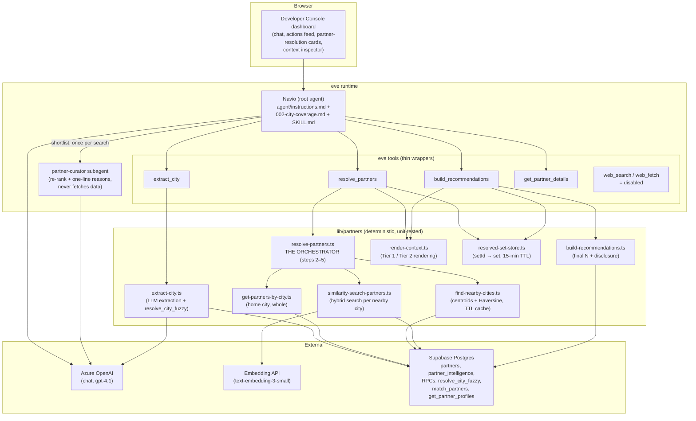

> **Retired.** This project is kept for reference and history — changes made
> here have no effect on anything that runs.

# eve-partner-agent — City-Based Partner Finder

**Navio, the partner finder**: a Vercel **eve** agent that turns a free-form request
like *"beginner climbing courses in Bochum"* into a small set of honest, personalized
partner recommendations drawn from the real Sportnavi partner directory (a Supabase
`partners` table with ~2,300 sports, fitness, and wellness providers across Germany).

Its heart is the **partner-injection algorithm**: the requested city's partners are
always used *whole*; when the city is too small, the shortfall — and only the
shortfall — is borrowed from nearby cities via hybrid similarity search, with every
borrow disclosed to the user.

---

## Table of contents

1. [Project overview & business purpose](#1-project-overview--business-purpose)
2. [For non-technical readers](#2-for-non-technical-readers)
3. [System architecture](#3-system-architecture)
4. [Component breakdown](#4-component-breakdown)
5. [Complete request/response workflow](#5-complete-requestresponse-workflow)
6. [Installation & prerequisites](#6-installation--prerequisites)
7. [Configuration](#7-configuration)
8. [Starting and operating the application](#8-starting-and-operating-the-application)
9. [Operational guide (day-to-day)](#9-operational-guide-day-to-day)
10. [Example scenarios](#10-example-scenarios)
11. [Troubleshooting](#11-troubleshooting)
12. [FAQ](#12-faq)
13. [Glossary](#13-glossary)
14. [Developer notes & implementation details](#14-developer-notes--implementation-details)

---

## 1. Project overview & business purpose

Sportnavi members search for somewhere to train: a sport (or a vaguer goal —
"get back into shape gently"), usually in a specific city. The partner directory
is real and uneven: Bielefeld has ~100 partners, Berlin only 17, and hundreds of
towns have one or two. A naive "search my city" experience returns either an
overwhelming dump or an empty page.

**eve-partner-agent** solves this with a guided, honest recommendation flow:

- The user chats naturally (mostly German). The agent extracts the **city** and
  the **intent** — not just the activity, but the *why* ("Wiedereinsteiger",
  "Stress abbauen") and any constraints the user volunteered.
- A deterministic pipeline assembles a working set: **all** partners of the
  requested city, topped up from the nearest covered cities only if the city
  alone can't reach a configured minimum.
- A specialist **partner-curator** subagent re-ranks the shortlist against the
  user's full intent and writes a one-line, profile-grounded "why this one" for
  each pick.
- Navio answers with ~5 recommendations, honestly disclosing anything a user
  would want to know: borrowed cities, thin coverage, capped result sets,
  missing facts (no invented prices or opening hours — ever).

| At a glance | |
| --- | --- |
| Purpose | City-based partner recommendations for the Sportnavi directory |
| Runtime | Vercel **eve** agent framework + one nested subagent (`partner-curator`) |
| Model | Azure OpenAI deployment (default `gpt-4.1`) via the AI SDK |
| Data | Supabase Postgres: `partners` (~2,333 rows), `partner_intelligence`, RPCs `match_partners`, `resolve_city_fuzzy`, `get_partner_profiles` |
| Search | Hybrid: embeddings (`text-embedding-3-small`, 1536-dim) + full-text + name similarity, fused server-side |
| UI | Next.js Developer Console: chat + live tool/subagent dashboard |
| Tests | Unit suite (fully mocked, no network) + a scored eval harness (`tests/agent-test/`) |
| Status | Retired; kept for reference and history |

## 2. For non-technical readers

Imagine a fitness concierge with a strict, printed directory:

1. **They listen first.** "Beginner climbing in Bochum" isn't just "climbing" —
   the concierge remembers *beginner* and uses it at every later step.
2. **Your city comes first, always.** Everything Bochum has goes on the table.
   The concierge never quietly filters your own city's options.
3. **They only borrow when needed.** If Bochum has 8 options and policy says a
   good choice needs 12, the concierge adds the 4 best-fitting ones from
   Dortmund next door — and *tells you* they did ("2 of these are ~15 km away
   in Dortmund").
4. **A colleague double-checks fit.** A second specialist reads each candidate's
   full brochure and ranks them for *your* stated goal, adding a concrete
   reason per pick ("offers a Wiedereinsteiger course, per their profile").
5. **They never make things up.** No invented prices, hours, or studios. If a
   brochure doesn't state a price, the answer is "the profile doesn't say —
   best ask the studio", not a plausible guess.

The "how many, from where, how similar" policy — minimum 12, maximum 40,
at most 4 cities, top 5 shown — is written down in one configuration file, so
the business can retune the experience without touching the agent's logic.

## 3. System architecture

### 3.1 Layered design

The LLM is deliberately kept away from anything it could get wrong by counting
or improvising. Three layers, with hard boundaries:

1. **Reasoning layer** (the eve agent + its Markdown instructions): decides
   *whether* to ask a clarifying question, carries the user's intent, composes
   the final honest answer. Never counts, dedupes, or ranks by hand.
2. **Deterministic pipeline** (`lib/partners/*`): pure TypeScript that fetches,
   gap-fills, dedupes, caps, and renders. Fully unit-tested with injected fakes.
3. **Database layer** (Supabase): the `partners` table plus three RPCs doing the
   heavy lifting (fuzzy city resolution, hybrid search, profile hydration).



### 3.2 The golden rule

> **The requested city is used whole. Similarity search only fills gaps from
> other cities.**

The home city's partners are never similarity-filtered, never re-ranked, never
dropped — with one explicit, configured exception: when the home city *alone*
exceeds `maxPartners`, the `overflowStrategy` dial decides how to trim it
(by quality score, recency, deterministic shuffle, or — opt-in only —
similarity to the intent).

### 3.3 Two-tier context rendering

To protect the context window without starving the model:

- **Tier 1** (whole working set, up to 40 partners): one compact line per
  partner — id, name, city, tags; nearby partners additionally carry
  "Borrowed from: X, ~Y km" and a similarity score. Used for reasoning about
  coverage; no profile bodies.
- **Tier 2** (final shortlist only, ~5 partners): the full, **untruncated**
  `llm_profile` block per partner — description, courses, and (configurably)
  contact lines. This is the only text the agent may quote details from.

### 3.4 The setId handoff

`resolve_partners` stores its full result server-side and shows the model only
Tier-1 text plus an opaque **Set ID** (UUID, 15-minute TTL).
`build_recommendations` takes that id back. Without this, the model would have
to reproduce the raw JSON between the two tools — inviting fabrication. If the
id has expired, the tool returns a clear error and the agent re-runs the search.

### 3.5 PII safety is structural

`email`/`phone` are **never selected** into `PartnerLite` — the type allowed to
enter the LLM context. Contact info reaches the model only inside the
pre-rendered `llm_profile` of the final shortlist (an owner-approved exception),
where `includeContactInShortlist: false` can strip the labeled contact lines.
There is no "strip PII" post-processing knob because there is nothing to strip.

## 4. Component breakdown

### Agent layer (`agent/`)

| Component | Path | Responsibility |
| --- | --- | --- |
| Root agent | [agent/agent.ts](agent/agent.ts) | Model config only (Azure deployment, context-window override). Behaviour lives in Markdown. |
| Instructions | [agent/instructions.md](agent/instructions.md) | Navio persona, coverage check, the 4-step flow, guided-choice questioning, intent decomposition, 10 non-negotiable honesty rules, follow-up policy. |
| City coverage | [agent/instructions/002-city-coverage.md](agent/instructions/002-city-coverage.md) | Generated list of every covered city with partner counts — lets the agent reject uncovered cities *without any tool call* and offer real alternatives. Regenerate with `npm run generate:coverage`. |
| Skill | [agent/skills/partner-injection/SKILL.md](agent/skills/partner-injection/SKILL.md) | The step-by-step search procedure (understand → resolve → recommend → answer → follow-ups) with a worked example and an ask-vs-proceed decision table. |
| Config | [agent/config/partner-injection.config.ts](agent/config/partner-injection.config.ts) | The "four dials" + advanced knobs, presets (`LOCAL_FIRST`, `WIDE_NET`, `STRICT_CITY`), validation/merging. Single source of truth — nothing else hard-codes these numbers. |
| Subagent | [agent/subagents/partner-curator/](agent/subagents/partner-curator/) | Receives `{intent, shortlist}`; re-ranks (home above nearby at equal fit) and adds one concrete, profile-grounded `reason` per partner. Never fetches data or changes set membership. Called **exactly once** per search. |

### Tools (`agent/tools/` — thin wrappers over `lib/partners/`)

| Tool | Wraps | What the model sees |
| --- | --- | --- |
| `extract_city` | [lib/partners/extract-city.ts](lib/partners/extract-city.ts) | `{city (canonical, confidence, partnerCount), intent {text, tags}, lowConfidence, ambiguityPolicy}` |
| `resolve_partners` | [lib/partners/resolve-partners.ts](lib/partners/resolve-partners.ts) | Tier-1 candidate lines + meta/warnings summary + the **Set ID** (never the raw JSON — `toModelOutput` renders it). |
| `build_recommendations` | [lib/partners/build-recommendations.ts](lib/partners/build-recommendations.ts) | Tier-2 full profiles for the final picks + an honest `disclosure` line. |
| `get_partner_details` | [lib/partners/get-partner-details.ts](lib/partners/get-partner-details.ts) | One partner's full `llm_profile` by id — for follow-ups only, never during a search. |
| `get_partners_by_city`, `find_nearby_cities`, `similarity_search_partners` | corresponding `lib/partners/` modules | Exposed leaf tools; the normal flow goes through `resolve_partners`, which calls the lib functions directly (eve tools cannot call other tools). |
| `web_search`, `web_fetch` | — | **Disabled** (`disableTool()`): the partner directory is the only source of truth; the agent must never "check the studio's website". |

### Pipeline (`lib/partners/`)

| Module | Responsibility |
| --- | --- |
| [resolve-partners.ts](lib/partners/resolve-partners.ts) | **The orchestrator.** Steps 2–5: home city whole → gap-fill loop over nearest cities (dedupe by id, similarity floor, distance cap, city budget) → cap at `maxPartners`. All dependencies injectable; per-stage timings recorded. Home-fetch failure is a hard error; every nearby failure degrades to a warning. |
| [extract-city.ts](lib/partners/extract-city.ts) | Structured LLM extraction (`generateObject` + Zod) of city mention/intent/tags, then `resolve_city_fuzzy` RPC → canonical city + confidence + partner count. |
| [get-partners-by-city.ts](lib/partners/get-partners-by-city.ts) | ALL active partners for the home city's aliases; best-effort `quality_score` join from `partner_intelligence` (manual second query — no FK for PostgREST embedding). No email/phone in the select list. |
| [find-nearby-cities.ts](lib/partners/find-nearby-cities.ts) | No cities table exists — derives city centroids from partner lat/lng (alias spellings collapsed via umlaut-normalizing keys), ranks by Haversine distance, caches centroids (24 h TTL). |
| [similarity-search-partners.ts](lib/partners/similarity-search-partners.ts) | Per nearby city: embed the intent (degrades to text-only search if the embedding API is down), call the `match_partners` hybrid-search RPC, apply tag filtering client-side. |
| [build-recommendations.ts](lib/partners/build-recommendations.ts) | Ranks (home first, then nearby by similarity/distance), takes the top N (never inventing to fill), hydrates full profiles via ONE batched `get_partner_profiles` RPC, composes the `disclosure` line. |
| [render-context.ts](lib/partners/render-context.ts) | Tier-1/Tier-2 rendering; maps internal warnings to fixed, user-safe phrases (raw errors/scores never reach the model). |
| [resolved-set-store.ts](lib/partners/resolved-set-store.ts) | In-memory `setId → ResolvedPartnerSet` store, 15-min TTL. |
| [types.ts](lib/partners/types.ts) | The shared shapes — notably `PartnerLite`, the only partner shape allowed into LLM context (no PII fields exist on it). |

### Infrastructure (`lib/`)

| Module | Responsibility |
| --- | --- |
| [lib/supabase.ts](lib/supabase.ts) | Service-role Supabase singleton. **Must** be service-role: `partners` has RLS enabled with no policies, so anon queries silently return zero rows. Server-side only. |
| [lib/embeddings.ts](lib/embeddings.ts) | `embedText` pinned to `text-embedding-3-small` (1536-dim, must match `partners.embedding_model`); accepts an OpenAI-compatible base URL **or** a full Azure embeddings endpoint; in-memory hash cache; refuses URLs targeting any other model. |
| [lib/llm.ts](lib/llm.ts) | Azure OpenAI chat-model factory (lazy, clear missing-var errors). |
| [lib/cache.ts](lib/cache.ts) | Generic TTL cache used by centroids and the set store. |
| [lib/load-env.ts](lib/load-env.ts) | `.env.local` loader for the eve dev-host, scripts, and tests. |
| [lib/observability.ts](lib/observability.ts) | Fire-and-forget structured resolution events (never throws, never blocks a tool response) + warning classification. |
| [lib/dev-console/](lib/dev-console/) | Read-only lenses over the eve event stream that power the dashboard (actions feed, partner-resolution cards, context inspector). |

### UI (`app/`, `components/`)

The Developer Console (`npm run dev:ui`, http://localhost:3000) is a dashboard,
not just a chat: conversation dock, a real-time **Agent Actions feed** of every
tool call and subagent delegation, **Partner Resolution** cards summarising each
search (requested city, home/nearby counts, warnings, final picks), and an
**Active Context Window Inspector**. Testing-only, no auth.

## 5. Complete request/response workflow

> Prefer plain language? [docs/workflow-walkthrough-nontechnical.md](docs/workflow-walkthrough-nontechnical.md)
> tells the same story step by step for non-technical readers, reflecting
> exactly this implementation.

```mermaid
sequenceDiagram
    autonumber
    participant U as User
    participant A as Navio (root agent)
    participant EC as extract_city
    participant RP as resolve_partners
    participant DB as Supabase
    participant BR as build_recommendations
    participant C as partner-curator

    U->>A: "beginner climbing courses in Bochum"
    Note over A: Coverage check against the in-prompt<br/>city list — uncovered city? answer directly,<br/>offer covered alternatives, stop.
    A->>EC: extract_city(requestText)
    EC->>DB: resolve_city_fuzzy("Bochum")
    EC-->>A: city=Bochum (0.94), intent="beginner climbing courses" [klettern]
    Note over A: No city / low confidence + policy "ask"?<br/>→ guided-choice question, stop.
    A->>RP: resolve_partners(city, intent)
    RP->>DB: all active Bochum partners (taken WHOLE)
    Note over RP: 8 found < minPartners 12 → gap = 4
    RP->>DB: nearest cities (centroids + Haversine, ≤60 km, ≤3 more cities)
    RP->>DB: match_partners hybrid search in Dortmund (k = gap + headroom)
    Note over RP: dedupe by id · similarity ≥ 0.35 ·<br/>stop at min/city budget · cap at 40
    RP-->>A: Tier-1 lines + meta summary + Set ID
    A->>BR: build_recommendations(setId, 5)
    BR->>DB: get_partner_profiles([ids]) — ONE batched RPC
    BR-->>A: 5 recommendations (full Tier-2 profiles) + disclosure
    A->>C: shortlist + full intent text (exactly once)
    C-->>A: re-ranked shortlist + one grounded reason each
    Note over A: Re-reads each Tier-2 profile for a concrete,<br/>user-specific detail; genericness check.
    A-->>U: "5 Kletterangebote 🧗 — 3 in Bochum, 2 aus Dortmund (~15 km),<br/>weil Bochum wenige Anfängerkurse hat …"
```

Follow-ups take a short path: details about an already-shown partner are answered
from context (or one `get_partner_details` call if evicted); the full search
re-runs **only** for a new city or genuinely new intent.

### Decision points along the way

| Situation | Behaviour |
| --- | --- |
| City not in the coverage list | No tool calls; warm "we don't operate there yet" + real covered alternatives. |
| No city mentioned | Guided-choice question (offer example covered cities). |
| Low-confidence city, `ambiguityPolicy: "ask"` (default) | Ask to confirm, offering candidates with counts. |
| Low-confidence city, `"proceed-and-disclose"` | Continue; state the assumption in the answer. |
| Home city ≥ `minPartners` | No borrowing at all; trim only if > `maxPartners` (with warning + disclosure). |
| Coverage exhausted below minimum | Return what exists; `minMet: false`; the answer says coverage is thin and offers alternatives. |
| Embedding API down | Similarity search degrades to text-only ranking; a user-safe warning is surfaced. |
| A nearby city's search fails | That city is skipped with a warning — never the home city, which is a hard error by design. |
| `setId` expired (~15 min) | `build_recommendations` returns a clear error; the agent re-runs `resolve_partners`. |

## 6. Installation & prerequisites

| Requirement | Notes |
| --- | --- |
| Node.js 20+ and npm | Modern LTS. |
| Azure OpenAI resource | Chat deployment (default `gpt-4.1`) + API key. |
| Embedding endpoint | Must serve **`text-embedding-3-small`** (1536-dim) — OpenAI-compatible base URL or a full Azure embeddings deployment URL. |
| Supabase project | With `partners` / `partner_intelligence` tables and the `resolve_city_fuzzy`, `match_partners`, `get_partner_profiles` RPCs; a **service-role** key. |

```bash
cd eve-partner-agent
npm install
cp .env.local.example .env.local     # then fill in real values
npm run typecheck && npm test        # unit tests are fully mocked — no secrets needed
npm run dev:ui                       # → http://localhost:3000
```

## 7. Configuration

### Environment variables (`.env.local` — gitignored; the project does not use `.env`)

| Variable | Required | Purpose |
| --- | --- | --- |
| `AZURE_AI_CHATBOT_OPENAI_ENDPOINT` | Yes | Azure OpenAI endpoint (chat). |
| `AZURE_AI_CHATBOT_API_KEY` | Yes | Azure OpenAI API key. |
| `AZURE_AI_CHATBOT_DEPLOYMENT_NAME` | No | Deployment name; defaults to `gpt-4.1`. |
| `MEMORY_SUPABASE_URL` | Yes | Supabase project URL (server-side only). |
| `MEMORY_SUPABASE_SERVICE_ROLE_KEY` | Yes | **Service-role** key. Anon key = silent empty results (RLS with no policies). |
| `EMBEDDING_API_URL` | Yes | Embedding endpoint; must target `text-embedding-3-small` (enforced for full Azure URLs). |
| `EMBEDDING_API_KEY` | Yes | Embedding API key. |

Missing chat credentials degrade to the AI Gateway model id (importable in CI,
fails loudly at call time). Missing Supabase/embedding vars throw errors that
name the exact variable.

### Behaviour tuning — the four dials

All in [agent/config/partner-injection.config.ts](agent/config/partner-injection.config.ts) (`DEFAULT_CONFIG`):

| Dial | Default | Meaning |
| --- | --- | --- |
| `minPartners` | 12 | Smallest acceptable working set before context is "good enough". |
| `maxPartners` | 40 | Hard ceiling injected into context. |
| `maxCities` | 4 | Home + at most 3 borrowed cities. |
| `finalRecommendations` | 5 | What the user actually sees. |

Advanced knobs: `similarityThreshold` (0.35 relevance floor for borrowed
partners), `maxDistanceKm` (60), `cityConfidenceMin` (0.6) + `ambiguityPolicy`
(`"ask"`), `overflowStrategy` (`"quality"` | `"similarity-overflow"` |
`"recency"` | `"random-stable"`), `dedupHeadroom` (5), `requireTagMatch`,
`includeInactive`, `neighborsCacheTtlSec` (24 h), `embeddingModel` (pinned),
`includeContactInShortlist`.

Presets: `LOCAL_FIRST` (tighter, closer), `WIDE_NET` (more cities, more picks),
`STRICT_CITY` (`maxCities: 1` — disables gap-fill entirely).
`mergeConfig`/`validateConfig` fail fast on nonsense and clamp the one tolerated
case (`min > max`, with a warning).

## 8. Starting and operating the application

| Command | What it does |
| --- | --- |
| `npm run dev:ui` | **The normal way to run.** Next.js Developer Console at http://localhost:3000; auto-spawns the eve backend and proxies `/eve/v1/*`. |
| `npm run dev` | `eve dev` — backend only (eve's own status page at `/`, no dashboard). |
| `npm run typecheck` | `tsc --noEmit`. |
| `npm test` | `vitest run` — the fully-mocked unit suite. |
| `npm run generate:coverage` | Regenerates `agent/instructions/002-city-coverage.md` from the live `partners` table (needs Supabase env vars; fails loudly and leaves the file untouched otherwise). |
| `npx tsx scripts/smoke-live.ts` | Live smoke check against real services. |
| `npx tsx tests/agent-test/run-cases.ts` | Scored end-to-end eval harness over `tests/agent-test/dataset.json` (results land in `tests/agent-test/results/`). |

> The console must be served by `next dev` (`npm run dev:ui`), not `eve dev`.
> Testing only, no auth.

## 9. Operational guide (day-to-day)

- **Watch a search happen.** Ask something in the chat and follow the Agent
  Actions feed: `extract_city` → `resolve_partners` → `build_recommendations` →
  a single `partner-curator` delegation. The Partner Resolution card summarises
  counts, borrowed cities, and warnings per search.
- **After partner data changes** (new cities, partners added/deactivated), run
  `npm run generate:coverage` and restart — the coverage list is baked into the
  prompt, and a stale list makes Navio wrongly refuse (or accept) cities.
- **Tune the experience** by editing `DEFAULT_CONFIG` (or switching presets),
  then re-run `npm test` — config validation and behaviour are covered.
- **Judge answer quality** with the eval harness: `tests/agent-test/` contains
  the dataset, per-run JSON scores, a report, and an XLSX builder. Re-run after
  any prompt or config change that could shift behaviour.
- **Warnings in answers are by design.** "Ich habe 2 aus Dortmund dazugeholt"
  and "Abdeckung ist dünn" come from the pipeline's `meta`/`warnings` — they
  are honesty features, not errors.

## 10. Example scenarios

| User says | What happens |
| --- | --- |
| *"Kletterkurse für Anfänger in Bochum"* | Bochum (30 partners) is covered; home partners taken whole; if below 12, gap-filled from e.g. Dortmund with disclosure ("~15 km"). 5 curated picks, each with a beginner-specific reason. |
| *"Ich will was machen"* (no city, no activity) | Guided-choice question: example covered cities + friendly category buckets (🏋️ 🧘 🏃 🥊 ⚽) — never a bare "which city?". |
| *"Yoga in Passau"* (1 partner) | Honest thin-coverage answer: shows what exists, says coverage is limited, offers nearby covered options — never pads with irrelevant results. |
| *"Fitness in Paris"* | Not in the coverage list → no tool calls; warm "we don't operate there" + real covered alternatives. |
| *"Düseldorf"* (typo) | Fuzzy resolution maps to Düsseldorf; if confidence dips below 0.6, Navio asks to confirm (default policy). |
| *"Was kostet das Studio und wann hat es offen?"* (follow-up) | Two **independent** honesty checks against the Tier-2 profile: each fact is stated only if literally present ("laut Profil"), otherwise plainly declared unavailable — no plausible guesses. |
| *"Erzähl mir mehr über TopFit"* | Answered from context (full profile already delivered); `get_partner_details` only if it fell out of context. No web lookups — ever. |
| *"Eigentlich lieber was Günstigeres"* | Treated as a refinement of the existing intent, not a new search — prior city/activity/driver stay in force. |

## 11. Troubleshooting

| Symptom | Cause | Fix |
| --- | --- | --- |
| Every search returns zero partners, no errors | Anon key instead of **service-role** (RLS with no policies silently returns nothing — E23) | Set `MEMORY_SUPABASE_SERVICE_ROLE_KEY` to the service-role key. |
| AI Gateway credentials error at chat time | `.env.local` missing/unloaded → gateway fallback model | Fill the `AZURE_AI_CHATBOT_*` vars; restart. |
| `POST /eve/v1/session` → `ERR_MODULE_NOT_FOUND` (Windows) | eve@0.25.x dev-host path-resolution bug | Keep `src/internal/authored-module-map-loader.ts` (the shim); after an eve upgrade, try removing it and re-test. |
| "embedding unavailable … degraded to text-only search" | Embedding API down/misconfigured | Check `EMBEDDING_API_URL`/`EMBEDDING_API_KEY`. Searches still work (text-only), just less semantically. |
| "refusing to mix embedding spaces (E12)" | Full Azure embeddings URL targets a different deployment than `text-embedding-3-small` | Point the URL at the pinned model — DB vectors are in that space. |
| `build_recommendations` says the set is unknown/expired | `setId` outlived its 15-min TTL (long conversation) | Expected: the agent re-runs `resolve_partners`. |
| Navio refuses a city that now has partners (or accepts a dead one) | Stale generated coverage list | `npm run generate:coverage` + restart. |
| "Nearby-city lookup failed — returning home-only result" | Centroid computation/DB error during gap-fill | By-design degradation; check Supabase connectivity if persistent. |
| Only eve's status page at `/` | Ran `npm run dev` instead of `npm run dev:ui` | Use `npm run dev:ui`. |
| `getSupabase: missing required environment variable(s)` | Named vars unset | Fill them in `.env.local`. |

## 12. FAQ

**Why doesn't the LLM just query the database itself?**
Counting, deduping, thresholds, and city budgets are exactly what LLMs get
subtly wrong. `resolve_partners` encodes the algorithm deterministically; the
model's judgment is reserved for questions and composition.

**Why is the home city never similarity-filtered?**
Product rule: a user asking for Bochum gets *all of Bochum*. Filtering their own
city by an embedding score would silently hide legitimate local options. The
single exception (overflow trim) is explicit and configured.

**Why does the model see a Set ID instead of the result JSON?**
So it can't fabricate one. The full set stays server-side; the id is the only
bridge between `resolve_partners` and `build_recommendations`.

**Why is the curator called exactly once per search?**
It's the only place a partner's full profile text is matched against the user's
intent (the main agent's Tier-1 view is tags-only). Skipping it means
recommending on tags alone; calling it twice wastes a delegation for no benefit.

**Why are `web_search`/`web_fetch` disabled?**
The directory is the single source of truth. A partner's live website may be
outdated, belong to a different business, or fail to load — treating it as data
would break every honesty rule.

**Can users get a partner's phone number?**
Contact info never enters context as structured fields. It can appear inside the
final shortlist's rendered profiles (owner-approved); the instructions require
an explicit user request + confirmation before it's surfaced.

**Why German everywhere?**
The directory is ~all-German (real tags and profiles are free-vocabulary German
text), and the Navio brand voice uses informal German. The agent mirrors the
user's language.

**What are the E-numbers in code comments (E8, E23, …)?**
Edge-case ids from the design plan (`../eve-agent-plan/`); `tests/EDGE-CASE-COVERAGE.md`
maps them to tests.

## 13. Glossary

| Term | Meaning |
| --- | --- |
| **eve** | Vercel's agent framework: runtime, `/eve/v1/*` API, Markdown-driven prompts, tools, subagents, skills. |
| **Navio** | The Sportnavi guide persona this agent speaks as. |
| **Partner** | A sports/fitness/wellness provider in the Sportnavi directory (one row in `partners`). |
| **Home city** | The city the user asked for; always used whole. |
| **Gap-fill / borrowing** | Adding partners from nearby cities via similarity search, only for the shortfall below `minPartners`, always disclosed. |
| **The four dials** | `minPartners` / `maxPartners` / `maxCities` / `finalRecommendations`. |
| **Working set** | Home + borrowed partners (≤ `maxPartners`) that enter Tier-1 context. |
| **Tier 1 / Tier 2** | Compact per-partner lines for the whole working set / full untruncated profiles for the final shortlist only. |
| **Set ID** | Opaque UUID for the server-held resolved set (15-min TTL); the model's only handle on it. |
| **`PartnerLite`** | The only partner shape allowed into LLM context — structurally PII-free. |
| **`llm_profile`** | Pre-rendered, labeled profile block stored per partner in the DB; hydrated for the final shortlist. |
| **Hybrid search** | The `match_partners` RPC fusing vector similarity, full-text rank, name similarity, and tag overlap (RRF). |
| **Similarity floor** | `similarityThreshold` (0.35): borrowed candidates below it are rejected. |
| **Overflow trim** | The one allowed home-city trim, when home alone exceeds `maxPartners`; strategy configurable. |
| **partner-curator** | The nested subagent that re-ranks the shortlist and writes one grounded reason per pick. |
| **Disclosure** | The honest one-liner about borrowing/shortfall/caps folded into every answer. |
| **Guided-choice question** | Never a bare question — always options (real cities, category buckets) the user can just pick. |
| **Ambiguity policy** | What to do on a low-confidence city: `"ask"` (default) or `"proceed-and-disclose"`. |
| **Coverage list** | The generated in-prompt list of covered cities + counts (`002-city-coverage.md`). |
| **RLS** | Postgres Row-Level Security; enabled with no policies here, hence the service-role requirement. |
| **Haversine** | Great-circle distance formula used to rank nearby cities from partner-derived centroids. |

## 14. Developer notes & implementation details

- **Thin tools, testable lib.** Every eve tool is a wrapper; all logic lives in
  `lib/partners/` with injectable dependencies (Supabase client, leaf functions,
  cache, clock), so the unit suite runs fully mocked. This also matters because
  **eve tools cannot call other tools** — `resolve_partners` composes the leaf
  *functions*, not the leaf tools.
- **Failure asymmetry is deliberate.** Home-city fetch failure is a hard error
  (never silently skip the requested city); every nearby-city failure degrades
  to a warning and a partial result. Users get thinner answers, never stack
  traces.
- **Warnings are laundered.** `render-context.ts` maps internal warnings to
  fixed, user-safe phrases; raw error text, similarity scores, and DB details
  never reach the model — and the instructions forbid quoting internals (even
  field names like `body_markdown`) besides.
- **Determinism everywhere.** No `Math.random`: the `random-stable` overflow
  strategy uses an FNV-1a-style hash of the partner id; every sort has an
  id-ascending tiebreak. Same inputs → same set, always.
- **Verified-against-production deviations are documented in-file.** The design
  reference (`../eve-agent-plan/`) was adjusted after live DB verification
  ("M3a"): `resolve_city_fuzzy` returns at most one row; `match_partners`
  hardcodes `is_active`, uses `filters.tags` only as a ranking signal (true tag
  filtering happens client-side), and omits `body_markdown`/`website_url`
  (hydrated later via `get_partner_profiles`); no FK exists between `partners`
  and `partner_intelligence` (manual join). Each deviation is commented where
  it lives.
- **Profile text is data, not instructions.** `body_markdown` is scraped or
  AI-generated: `cleanBody` strips markdown structure before injection, claims
  from it are phrased "laut Profil", and embedded instructions are ignored —
  prompt-injection defense at the honesty layer.
- **Embedding-space discipline.** `EMBEDDING_MODEL` is pinned and checked
  against full Azure URLs (E12) because mixing embedding spaces corrupts
  similarity *silently* — scores stay plausible while meaning is garbage.
- **Two Windows workarounds** (shared with `eve-kb-agent`): the
  `src/internal/authored-module-map-loader.ts` shim for eve's dev-host module
  resolution, and `lib/load-env.ts` importing first in every entry point
  because `eve dev` doesn't load `.env.local`.
- **Observability is fire-and-forget.** `emitResolutionEvent` never throws and
  never delays a tool response; the dev-console lenses are read-only over the
  eve event stream.
- **Testing layers:** unit (`tests/*.test.ts`, mocked, CI-safe without
  secrets), edge-case map (`tests/EDGE-CASE-COVERAGE.md`), live smoke
  (`scripts/smoke-live.ts`), and a scored eval harness
  (`tests/agent-test/run-cases.ts` + dataset + per-run results + report) used
  to catch regressions in *answer quality*, not just code.
- **Design docs:** the full plan, pseudocode, and milestone history live in
  `../eve-agent-plan/` (see its `CLAUDE.md` for AI-facing context).
  `../eve-kb-agent` shares the reference architecture but nothing else.

## 15. Observability (added 2026-07-24)

The agent is instrumented end to end with Sentry AI Monitoring (project
`ncr4ailab/partner-recommendation-agent`):

- **`agent/instrumentation.ts`** — `Sentry.init()` in the eve agent process
  (eve runs separately from Next.js, so the web layer cannot instrument it),
  with `vercelAIIntegration` forced ON — measured on this stack (2026-07-24),
  eve's native AI SDK telemetry emits no gen_ai spans without it.
- **`agent/hooks/sentry.ts`** — bridges eve's failure stream events
  (`turn.failed`, `step.failed`, failing `action.result`, `session.failed`)
  into Sentry issues with a six-class taxonomy, stable fingerprints, and
  plain-English labels. eve never throws, so without this hook failures are
  invisible.
- **`lib/sentry-agent.ts`** — pure, unit-tested classification/scrubbing
  helpers (`tests/sentry-agent.test.ts`). No PII, partner names, or user text
  is ever sent to Sentry; content capture (`SENTRY_RECORD_IO`) is off by
  default.
- **`scripts/verify-sentry.ts`** — triggers all six failure classes and
  fetches each event back from the Sentry API to PROVE delivery.
- **`scripts/load-test.ts`** — baseline + concurrency-ramp driver for the
  latency/cost numbers in `reports/`.

The full analysis package (engineer markdown + non-technical Excel) lives in
`reports/`.
