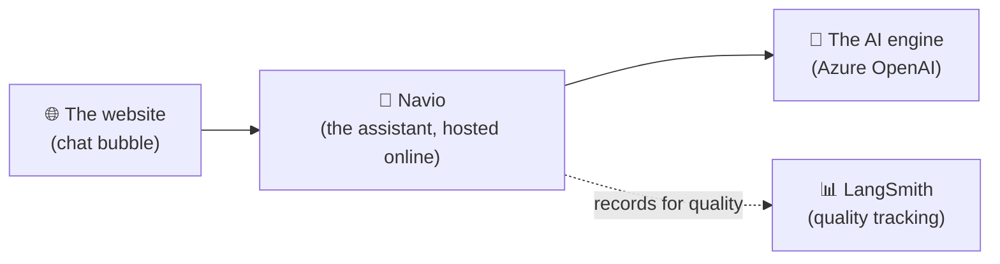
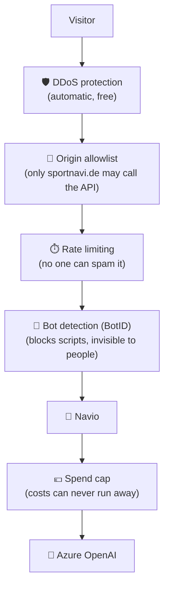
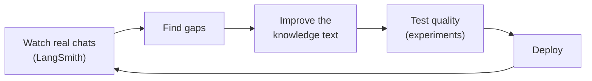

# Navio Chatbot — Complete Guide

**A plain-language handbook for everyone on the team.**

This is the single source of truth for the Navio chatbot. It explains — in everyday
language — what the project is, how it works, how to put it online, how to keep it safe,
how to add it to a website, and how to keep it healthy over time. You do **not** need a
technical background to follow it.

> 💡 **How to read this:** Sections 1–3 explain *what Navio is*. Sections 4–7 are the
> *hands-on steps* (deploy, secure, embed, test). Sections 8–10 cover *day-to-day use and
> improvement*. Sections 11–14 are *quick reference* (FAQ, troubleshooting, checklist,
> roadmap). When a technical word appears, it's explained right there in simple terms.

---

## Table of contents
1. [Project overview](#1-project-overview)
2. [How the chatbot works](#2-how-the-chatbot-works)
3. [Project components](#3-project-components)
4. [Deploying the project on Vercel](#4-deploying-the-project-on-vercel)
5. [Securing the deployment](#5-securing-the-deployment)
6. [Embedding the chatbot widget](#6-embedding-the-chatbot-widget)
7. [Testing the widget](#7-testing-the-widget)
8. [Using the chatbot on a website](#8-using-the-chatbot-on-a-website)
9. [Updating the knowledge](#9-updating-the-knowledge)
10. [Running experiments](#10-running-experiments)
11. [Common questions (FAQ)](#11-common-questions-faq)
12. [Troubleshooting](#12-troubleshooting)
13. [Deployment checklist](#13-deployment-checklist)
14. [Future improvements](#14-future-improvements)

---

## 1. Project overview

### What this project is
**Navio** is a friendly chat assistant for the **Sportnavi** website. It appears as a small
chat bubble in the corner of the page. Visitors click it, ask a question in their own words
("How do I cancel my membership?", "What is Firmenfitness?"), and get an instant, reliable
answer — in the language they wrote in.

### What problem it solves
People visiting Sportnavi have questions, and searching a website or waiting for an email
reply is slow. Navio answers common questions **immediately, 24/7**, so visitors get help
right away and the support team gets fewer repetitive emails.

### Why it was built
- To give members, companies, and partners **fast, always-available answers**.
- To answer **only with official Sportnavi information** — Navio never makes things up.
- To be **easy to add to any website** and **cheap and safe to run**.

### Who should use it
| Audience | How they use it |
|---|---|
| **Website visitors** | Click the bubble and ask questions. |
| **Marketing / web team** | Add one line of code to a page to show the widget. |
| **Internal dev team** | Deploy it, keep it secure, and improve its answers. |
| **Business stakeholders** | Understand what it does, its costs, and its roadmap. |

### The overall architecture, in simple terms
Think of Navio as three parts working together:



- **The bubble** lives on the website and is what visitors see.
- **Navio** is the "brain" that receives the question, applies Sportnavi's rules and
  knowledge, and asks the AI for wording.
- **The AI engine** (Azure OpenAI) generates the natural-sounding reply.
- Everything is hosted on **Vercel** (a service that runs websites and apps online).

The important idea: **the website never holds any secret keys or talks to the AI directly.**
It only talks to Navio, and Navio safely handles the rest.

---

## 2. How the chatbot works

Here is the full journey of a single question, in plain steps:

```
Visitor opens the website
        ↓
Clicks the Navio chat bubble
        ↓
Types a question
        ↓
The question is securely sent to Navio (our backend)
        ↓
Navio checks it's a real visitor and applies Sportnavi's knowledge + rules
        ↓
Navio asks the AI engine to phrase the answer
        ↓
The chatbot streams the answer back into the chat window
```

**What each step means:**

1. **Opens the website** — a normal visit to sportnavi.de.
2. **Clicks the bubble** — a small floating button opens the chat window.
3. **Types a question** — in any language; Navio replies in the same language.
4. **Securely sent to Navio** — the message travels over an encrypted connection to our
   hosted assistant. No secret keys are ever exposed to the visitor's browser.
5. **Checks + applies knowledge** — Navio confirms the request is legitimate (not a bot or
   another website abusing it), then looks at the official Sportnavi information it was given.
6. **Asks the AI engine** — Navio sends the question plus the approved knowledge to Azure
   OpenAI, which writes a clear, human-sounding answer.
7. **Streams the answer back** — words appear live in the chat window, like someone typing.

> 🔒 **Key point:** the AI only answers from the **approved Sportnavi knowledge**, and all
> the sensitive parts (keys, the AI connection) happen on our secure servers — never in the
> visitor's browser.

---

## 3. Project components

Navio is made of several pieces. Here's what each one is and **why it exists**:

| Component | In plain words | Why it exists |
|---|---|---|
| **Website widget** | The chat bubble + chat window visitors see. Added with one line of code. | So any website can offer the chatbot without rebuilding anything. |
| **Backend** | The hosted "brain" that receives questions and returns answers. | To keep all logic and secrets safely on the server, away from visitors. |
| **Vercel** | The hosting service that runs Navio online. | So the app is always available, scales automatically, and deploys easily. |
| **EVE Agent** | The framework Navio is built on; manages conversations reliably. | Handles chat sessions, streaming replies, and durability (a chat survives interruptions). |
| **System prompt** | Navio's "instruction sheet" — its personality, rules, and knowledge, all in one text. | It's the product. Changing behavior means editing this text, not code. |
| **Knowledge base** | The official Sportnavi FAQ content baked into the system prompt. | So answers come **only** from approved information — no guessing. |
| **LangSmith** | A quality dashboard that records conversations and runs tests. | To measure answer quality and safely improve Navio over time. |
| **Azure OpenAI** | The AI engine that writes the actual wording, hosted in the EU. | Provides natural language; EU hosting keeps data handling GDPR-friendly. |

> 🧩 **The one big idea:** Navio has **no separate database and no live web search**. Its
> knowledge is written directly into its instruction sheet (the system prompt). This is
> simple, fast, and predictable — and it can grow into a bigger "search-based" system later
> (see [Section 14](#14-future-improvements)).

---

## 4. Deploying the project on Vercel

> ⚠️ **Superseded — use the canonical guide for deployment and security.** The exact, current,
> two-service deploy + Vercel-security walkthrough (firewall rules, bot protection, rate limits,
> secrets, the shared-secret partner lock, cost caps, monitoring) now lives in **one** place:
> [`../deployment/VERCEL-DASHBOARD-GUIDE.md`](../deployment/VERCEL-DASHBOARD-GUIDE.md). Sections 4
> and 5 below are kept for background only and are **not** maintained — do not follow their
> firewall-rule details.

"Deploying" simply means **putting the project online** so it has a real web address.

### Prerequisites (what you need first)
- [ ] A **Vercel account** (free "Hobby" plan works to start; "Pro" unlocks stronger security).
- [ ] A **GitHub account** (GitHub stores the project's code online).
- [ ] The **Azure OpenAI details** (three values — an address, a key, and a deployment name).
- [ ] **GitHub Desktop** installed (a click-based app, so you don't need the command line).

### Step 1 — Protect your secrets first ⚠️
The project has a file (`.mcp.json`) that may contain sensitive keys. Before putting code
online, make sure a `.gitignore` file lists the files to **keep private** (`.mcp.json`,
`.env.local`). This prevents accidentally publishing secrets. *(Your dev team can confirm
this is in place.)*

### Step 2 — Put the code on GitHub
1. Open **GitHub Desktop** → `File → Add local repository` → choose the project folder.
2. Click **Create a repository** → **Commit to main** → **Publish repository** → set it
   **Private**.

> 📸 *Screenshot placeholder: GitHub Desktop "Publish repository" dialog.*

### Step 3 — Create the Vercel project
1. Go to **vercel.com** → **Add New… → Project**.
2. Find your GitHub repository → **Import**.
3. **Very important:** set **Root Directory** to `kb-agent-langsmith-starter`.
   *(Skipping this causes every page to show "404 – Not Found".)*

> 📸 *Screenshot placeholder: Vercel import screen with Root Directory set.*

### Step 4 — Configure environment variables
"Environment variables" are just **saved settings** (like keys and options) that the app
reads. Add these under **Vercel → Settings → Environment Variables** (tick **Production**):

| Setting | What it is | Needed now? |
|---|---|---|
| `AZURE_AI_CHATBOT_OPENAI_ENDPOINT` | The address of your AI engine | ✅ Yes |
| `AZURE_AI_CHATBOT_API_KEY` | The secret key for the AI engine | ✅ Yes |
| `AZURE_AI_CHATBOT_DEPLOYMENT_NAME` | Which AI model to use (e.g. `gpt-4.1`) | ✅ Yes |
| `AI_GATEWAY_MODEL` | Turns on the spend-safety gateway (see §5) | Later |
| `BOTID_ENABLED` / `NEXT_PUBLIC_BOTID_ENABLED` | Turns on bot protection | Later |
| `WIDGET_FRAME_ANCESTORS` | Which websites may show the widget | Optional |
| `LANGSMITH_*` | Quality tracking (EU) | Optional |

> 📸 *Screenshot placeholder: Vercel Environment Variables page.*

### Step 5 — Deploy
Click **Deploy** and wait a minute or two. Vercel builds the project and gives you a live
address like `https://your-project.vercel.app`.

### Step 6 — Verify the deployment
Open these in your browser:
- `https://your-project.vercel.app/eve/v1/health` → should show `{"ok":true, ...}` ✅
- `https://your-project.vercel.app/widget` → should show the chat window ✅

> ✅ **Done!** The chatbot is now online. If the health check works but the chat says it can't
> find credentials, re-check the three Azure settings in Step 4 and **Redeploy**.

---

## 5. Securing the deployment

> ⚠️ **The authoritative firewall rules and security steps are in
> [`../deployment/VERCEL-DASHBOARD-GUIDE.md`](../deployment/VERCEL-DASHBOARD-GUIDE.md) §3–§8.**
> This section is an older, single-project summary (no Partner-agent proxy, no shared secret, no
> Rule E) kept for background. Follow the canonical guide for anything you actually configure.

### Why security matters
Navio is **public** — anyone can use it, no login. That's great for visitors, but it means
we must stop misuse: bots hammering it, other websites stealing it, and — most importantly —
**runaway costs** (every answer costs a little money). Security here is a **stack of simple
filters**, each blocking a different kind of misuse.



### The layers, in plain words
| Layer | What it does | Where it's set |
|---|---|---|
| **API keys are protected** | The secret AI key stays on our server; the browser never sees it. | Built into the design |
| **DDoS protection** | Absorbs flood attacks automatically. | On by default (free) |
| **Firewall — origin allowlist** | Blocks *other* websites from calling our API. | Vercel Firewall (Rule A) |
| **Rate limiting** | Stops any single user from spamming requests. | Vercel Firewall (Rule B) |
| **Bot protection (BotID)** | Blocks automated scripts; real people see nothing. | Vercel BotID (needs Pro for full power) |
| **AI Gateway / spend cap** | Sets a hard money limit — past it, spending stops. | AI Gateway budget **or** Azure token limit |
| **Budget alerts** | Emails you before costs get high. | Gateway / Azure settings |
| **Monitoring & logging** | Records traffic, blocks, and answer quality so you can spot problems. | Vercel dashboards + LangSmith |

> 💶 **The most important one:** the **spend cap**. Even if everything else failed, this
> guarantees you can never get a surprise bill. Set it before going public.

### The exact rules configured in Vercel (for the record)
You don't need to memorize these — this is a plain-language record of the specific settings
the dev team turns on in the Vercel dashboard to protect Navio.

**Vercel → Firewall → Custom Rules** (each is added in "Log" mode first to watch real traffic,
then switched to actively block):

| Rule | What it looks at | What it does |
|---|---|---|
| **Rule A — Origin allowlist** | Any API call whose website is **not** sportnavi.de | **Blocks it** — stops other websites' code from using our chatbot's API |
| **Rule B — Rate limit (chat start)** | Starting a chat, counted per visitor | **Throttles** anyone sending too many requests too fast (e.g. ~20–30/min) |
| **Rule C — Rate limit (messages)** *(Pro only)* | Follow-up messages in a chat | A higher limit for normal back-and-forth |
| **Rule D — Rate limit (stream)** *(Pro only)* | Listening for the reply | A light limit (reconnecting is normal) |

> ℹ️ On the free **Hobby** plan you get **one** rate-limit rule, so we use **Rule A** (origin
> lock) + **Rule B** (chat-start limit). Rules **C–D** require the **Pro** plan.

**Vercel → Bot protection (BotID):** an **invisible** check on the chat-start route that blocks
automated scripts (bots) while real people see nothing — no puzzles, no "click the traffic
lights." It's switched on with two settings (`BOTID_ENABLED` and `NEXT_PUBLIC_BOTID_ENABLED`,
both `true`); the strongest "Deep Analysis" mode needs the **Pro** plan.

**Spend cap (AI Gateway budget, or an Azure token limit):** a **hard money ceiling**. Once
reached, the system politely stops spending instead of running up a bill — plus an **alert
email** before you get close. This is the guaranteed backstop.

**Embedding lock (`frame-ancestors`):** set so that **only sportnavi.de** may display the
widget. This is controlled by the **`WIDGET_FRAME_ANCESTORS`** setting — any website not on
that list simply cannot show the chat window (see [Section 6](#6-embedding-the-chatbot-widget)).

**Always on, nothing to configure:** Vercel's automatic **DDoS protection** absorbs flood
attacks on every plan, and you are **never billed** for traffic it blocks.

### Deployment security checklist
- [ ] Secret keys are only in Vercel settings (never in the code or the browser).
- [ ] Firewall **origin allowlist** limits API calls to sportnavi.de.
- [ ] Firewall **rate limit** on the chat-start route.
- [ ] **Spend cap** set (AI Gateway budget or Azure token-per-minute limit) + alert email.
- [ ] **Bot protection** enabled (on Pro) — optional for a quiet launch, recommended once busy.
- [ ] **`frame-ancestors`** limits which websites may embed the widget (sportnavi.de only).
- [ ] Monitoring in place: watch Firewall blocks and Gateway 429/402 alerts.
- [ ] Old committed keys (in `.mcp.json`) rotated and moved to settings.

---

## 6. Embedding the chatbot widget

This is the best part: adding Navio to a website is **one line of code**.

### How to obtain the widget
There's nothing to download or install. The widget is served from our deployment. You just
point a `<script>` tag at it.

### How to embed it — example HTML snippet
Paste this once on any page (ideally just before the closing `</body>` tag):

```html
<script src="https://cortex-kit.vercel.app/launcher.js" async></script>
```

That's the entire integration. It adds the floating chat bubble; clicking it opens Navio.
*(Once the custom domain is set up, you'd use `https://chat.sportnavi.de/launcher.js`
instead.)*

### Does it work on any website?
Yes. Because it's a simple `<script>` + a self-contained chat window (an "iframe"), it works
the same on:

| Website type | Works? |
|---|---|
| Plain HTML | ✅ |
| React / Next.js | ✅ |
| Vue / Angular | ✅ |
| WordPress & other CMS | ✅ (paste the line in a "custom HTML" block) |

The widget is **fully isolated**, so it never clashes with the host website's design or code.

### Allowing a website to show it
By default only **sportnavi.de** is allowed to display the widget (a safety setting called
`WIDGET_FRAME_ANCESTORS`). To allow another site (e.g. a partner), add that site's address to
that setting in Vercel and redeploy. Everything else needs no change.

### Colors and settings
Navio's look (Sportnavi green, fonts, rounded style) is defined centrally and documented in
`WIDGET-DESIGN-GUIDELINES.md`. It's consistent everywhere by design. To change the look, the
dev team updates it once and every website updates automatically.

### How updates work
When the team improves Navio and redeploys, **every website that embedded it updates
instantly** — no one needs to change their page. One place to update, everywhere benefits.

### Is the chat page (`/widget`) public? Yes — and why that's safe
The chat window lives at a public web address (e.g. `https://cortex-kit.vercel.app/widget`, later
`https://chat.sportnavi.de/widget`). **Anyone who has that link can open it directly and chat.**
That is intentional, not a leak.

**Why it has to be public:** `/widget` *is* the chat window that gets loaded **inside the
iframe** on sportnavi.de. For the embedded widget to appear, the browser must be able to reach
that address. It's like an embedded YouTube video — the player on a blog is the same public
video URL; it has to be reachable for the embed to work.

**Why that's safe:** opening `/widget` directly just means using the public chatbot on its own,
without the sportnavi.de page around it. It answers the same public FAQ information — there is
no login, no private data, and no secret key on that page. Crucially, **all the real
protections live on the backend (the API), not the page**, so they apply whether Navio is
embedded or opened directly:

| Protection | Applies when `/widget` is opened directly? |
|---|---|
| Rate limiting (no spamming) | ✅ Yes |
| Bot detection (BotID) | ✅ Yes |
| Spend cap (no runaway cost) | ✅ Yes |

> 🔎 **Important distinction:** the embedding lock (`frame-ancestors`) stops *other websites*
> from **displaying** the widget on their pages. It does **not** block someone from **visiting**
> the `/widget` page directly — and it isn't meant to. Direct visits are harmless; they're just
> the public chatbot in full-page form.

**Optional:** if you'd prefer the standalone `/widget` page not to appear in Google search
results, the dev team can add a small "don't index this page" instruction (`X-Robots-Tag:
noindex`). This has **no effect on embedding** — it only keeps the bare page out of search
engines.

---

## 7. Testing the widget

### Test it locally (on your own computer, before going live)
1. In the project folder, run the local preview server (your dev team can do this):
   `npm run dev:ui -- -p 3001`
2. Open **`http://localhost:3001/widget`** in a browser.
3. Click through: greeting → **"Zustimmen"** (accept privacy) → type a question → get an answer.

To see it as an actual **bubble on a test page**, open the included `embed-test` page (a
plain HTML page with the one-line snippet) and click the bubble.

### Test it after deployment
1. Open your live address `/widget` (e.g. `https://cortex-kit.vercel.app/widget`).
2. Ask a real Sportnavi question (e.g. *"Was ist Firmenfitness?"*).
3. Confirm it answers correctly and in your language.

### How to verify responses work
- The answer should appear **word by word** (streaming).
- It should only use **Sportnavi facts** — if it doesn't know, it says so and points to support.

### How to check logs
- **Vercel dashboard → your project → Logs / Observability** — see requests and errors.
- **Vercel → Firewall → Traffic** — see what's being blocked or rate-limited.
- **LangSmith (EU)** — see full conversations and quality scores.

### Troubleshoot quickly
See [Section 12](#12-troubleshooting) for the common problems and fixes.

---

## 8. Using the chatbot on a website

### How visitors interact with it
- A floating **💬 bubble** sits in the bottom corner.
- Click it → a small chat window opens (full-screen on phones).
- Type a question, press Enter, read the answer. That's it — no login, no forms.

### What it can answer
Navio answers questions covered by the **official Sportnavi knowledge**, such as:
- Memberships, pricing, cancellation, and pauses.
- Firmenfitness (corporate fitness) for companies.
- Partner topics (check-ins, payouts, contracts).
- How the app and check-in work.

### Current limitations (be transparent)
- It answers **only** from its provided knowledge — it won't invent facts or browse the web.
- It **can't** take personal actions (book appointments, change your contract, take payment).
- It's a **preview** product; wording and knowledge keep improving.

### How future improvements will work
The team reviews real conversations, fixes gaps in the knowledge, and re-tests quality — so
Navio gets more accurate and more helpful over time (see Sections [9](#9-updating-the-knowledge),
[10](#10-running-experiments), and [14](#14-future-improvements)).

---

## 9. Updating the knowledge

### Where the chatbot's knowledge comes from
All of Navio's knowledge lives in **one text file** — its instruction sheet
(`agent/instructions.md`). This includes the official Sportnavi FAQ content and the rules
Navio follows. **There is no separate database to manage.**

### How the internal team improves it
1. Edit the knowledge text in `agent/instructions.md`.
2. Save, commit, and redeploy (the same push that updates the app).
3. Every website using Navio gets the new knowledge instantly.

> ✍️ **In short:** improving Navio's answers = editing its instruction sheet. No coding
> required for content changes — it's writing, reviewed by the team.

### How feedback is collected
- Real conversations are recorded in **LangSmith** (with privacy safeguards).
- The team reviews where Navio struggled or gave weak answers.
- Those findings become edits to the knowledge and new test cases.

### How new information is added
When Sportnavi launches something new (a new tariff, a policy change), the team adds that
information to the instruction sheet and redeploys. Navio can then answer about it.

### How the chatbot becomes smarter over time
It's a loop: **watch real chats → find gaps → improve the knowledge → test quality → deploy →
repeat.** Each cycle makes Navio more accurate and more helpful.



---

## 10. Running experiments

### Why we run experiments
Before changing how Navio answers, we want proof the change is actually **better**, not just
different. Experiments let us compare versions safely, using real questions.

### How LangSmith helps
**LangSmith** is a quality dashboard. It lets the team:
- Keep a **set of real test questions** with expected good answers.
- Run different versions of Navio's instruction sheet against those questions.
- **Compare** the results side by side.

### How quality is measured
Automated "judges" (and the team's own review) score answers on things like:
- **Correctness** — is the fact right?
- **No hallucination** — did it avoid making things up?
- **Relevance** — did it answer the actual question?
- **Tone & language** — friendly, and in the visitor's language?

### Why experiments improve the chatbot
Instead of guessing, the team can say *"version B scores higher on correctness with no new
mistakes"* — and deploy it with confidence. This is how Navio improves **without regressions**
(without accidentally breaking things that used to work).

---

## 11. Common questions (FAQ)

**How do I deploy the chatbot?**
Follow [Section 4](#4-deploying-the-project-on-vercel): put the code on GitHub, import it into
Vercel, set the Root Directory to `kb-agent-langsmith-starter`, add the Azure settings, and
click Deploy.

**How do I update it?**
Change what you need (knowledge text or code), commit + push in GitHub Desktop. Vercel
redeploys automatically, and every website updates instantly.

**How do I embed it on another website?**
Paste one line — `<script src="https://cortex-kit.vercel.app/launcher.js" async></script>` —
on the page, and make sure that website's address is allowed in `WIDGET_FRAME_ANCESTORS`.

**Can anyone open the `/widget` page directly? Is that a problem?**
Yes, it's a public page, and no, it's not a problem. `/widget` is the chat window that the
embedded iframe loads, so it *must* be reachable. Opening it directly is just using the public
chatbot on its own — no login, no private data, no secret keys — and the real protections (rate
limiting, bot detection, spend cap) apply either way. The embedding lock only stops *other
sites* from displaying the widget, not people from visiting the page. See
[Section 6](#6-embedding-the-chatbot-widget) → *"Is the chat page public?"*.

**How do I know if it's working?**
Open `/health` (should say `ok`) and `/widget` (should chat). See [Section 7](#7-testing-the-widget).

**How do I secure it?**
Use the [security checklist](#5-securing-the-deployment): firewall rules, a spend cap, bot
protection, and the embedding restriction. The spend cap is the must-have.

**What happens if the AI gives a wrong answer?**
The conversation is recorded in LangSmith. The team reviews it, fixes the knowledge, and
re-tests. Navio is designed to say "I don't know, contact support" rather than guess — but if
a wrong answer slips through, the fix is a knowledge edit, not a rebuild.

**How do I update the knowledge?**
Edit the instruction sheet (`agent/instructions.md`) and redeploy. See [Section 9](#9-updating-the-knowledge).

---

## 12. Troubleshooting

| Problem | Likely cause | Fix |
|---|---|---|
| **Widget bubble doesn't appear** | The `<script>` line isn't on the page, or the site isn't allowed to embed it. | Confirm the snippet is present; add the site to `WIDGET_FRAME_ANCESTORS` and redeploy. |
| **Chat window is blank / "refused to connect"** | The website isn't in the allowed-embed list (`frame-ancestors`), or you didn't redeploy after changing it. | Add the site's address to `WIDGET_FRAME_ANCESTORS` in Vercel → **Redeploy**. |
| **"Origin not allowed" in the chat** | The website calling the API isn't allowed. | For the real widget this shouldn't happen; ensure you're on the correct deployment and the widget is served from the same address. |
| **Chatbot doesn't respond** | Missing/incorrect Azure settings, or you didn't accept the privacy consent. | Click **"Zustimmen"** first; then check the three `AZURE_...` settings and redeploy. |
| **Every page shows "404 – Not Found"** | Root Directory not set to `kb-agent-langsmith-starter`. | Vercel → Settings → Build & Deployment → set Root Directory → Redeploy. |
| **Deployment failed** | A build error or missing setting. | Open Vercel's build logs to see the error; usually a missing environment variable. |
| **Environment variables missing** | Added to the wrong environment, or not redeployed. | Add them to **Production**, then Redeploy. |
| **Rate limit reached (429)** | Too many requests too fast (often a script). | Expected protection. If real users hit it, raise the limit in the Firewall rule. |
| **Costs climbing** | No spend cap, or a spike in usage. | Set/lower the spend cap (§5); check LangSmith for unusual traffic. |

> 🆘 **Golden rule when stuck:** check the **Vercel build logs** (for deploy problems) and the
> **browser's network tab** (for widget problems) — they almost always name the exact issue.

---

## 13. Deployment checklist

Print this and tick it before going live. 🚀

- [ ] **Repository connected** to Vercel (GitHub imported).
- [ ] **Root Directory** set to `kb-agent-langsmith-starter`.
- [ ] **Environment variables** configured (Azure keys at minimum), for Production.
- [ ] **Deployment successful** — `/health` returns `ok` and `/widget` chats.
- [ ] **Security enabled** — firewall origin rule + rate limit.
- [ ] **Spend cap configured** — hard limit + alert email (the non-negotiable one).
- [ ] **Bot protection** decided (on for busy sites; optional for a quiet launch).
- [ ] **Embedding locked** to sportnavi.de (`WIDGET_FRAME_ANCESTORS`), test entries removed.
- [ ] **Widget tested** — bubble appears, answers correctly, works on mobile.
- [ ] **Knowledge base reviewed** — content is current and correct.
- [ ] **Monitoring enabled** — Vercel logs + LangSmith + alerts.
- [ ] **Old secrets rotated** (the keys in `.mcp.json`).
- [ ] **Embed line handed to the web team** — the one `<script>` snippet.

---

## 14. Future improvements

Navio is built to **grow without a rebuild**. The roadmap, in simple terms:

| Improvement | What it means |
|---|---|
| **More knowledge** | Add more Sportnavi topics so Navio can answer more questions. |
| **Better answers** | Ongoing tuning and experiments (Section 10) raise quality. |
| **Search-based knowledge (RAG)** | As the knowledge grows too big to fit in one instruction sheet, Navio can *look things up* on demand. |
| **Mobile app support** | The same Navio can power future iOS/Android apps through the same secure connection. |
| **More integrations** | Partner sites, internal tools, and future products can reuse Navio. |
| **Better analytics** | Deeper insight into what visitors ask and where answers can improve. |

### Today vs. tomorrow (the important architectural note)
- **Today:** Navio uses **system-prompt engineering with a curated knowledge base** — all its
  knowledge is written into its instruction sheet. This is simple, fast, predictable, and
  perfect for a focused FAQ.
- **Tomorrow:** as the knowledge base expands, the architecture can evolve toward a **RAG
  (Retrieval-Augmented Generation)** solution — meaning Navio would *search* a knowledge
  library and pull in the most relevant pieces for each question, instead of carrying
  everything at once.

> 🌱 **Why this matters:** moving to RAG later is an **upgrade, not a redo**. The website
> widget, the security layers, and the hosting all stay the same — only *how Navio finds its
> knowledge* changes behind the scenes. Nothing anyone embedded will need to change.

---

*This guide is the single source of truth for the Navio chatbot. Companion documents for the
technical team (see [`../README.md`](../README.md) for the full index): `deployment/PUBLIC-WIDGET-DEPLOYMENT.md`,
`deployment/VERCEL-DASHBOARD-GUIDE.md`, `design/WIDGET-DESIGN-GUIDELINES.md`, and
`design/NAVIO_WIDGET_SPEC.md`. Keep this document updated as Navio evolves.*
